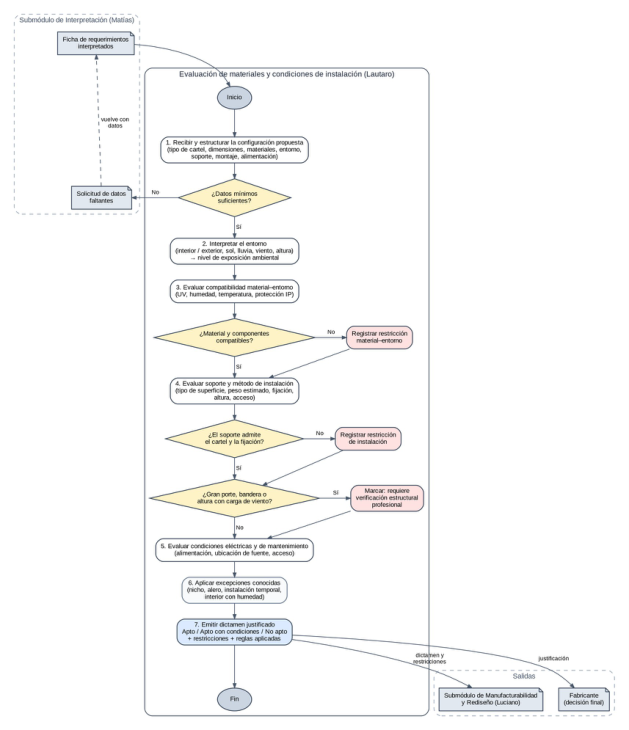

# ACTIVIDAD PI1

### INTELIGENCIA ARTIFICIAL

Integrante: Lautaro Quiros

Profesores: Ing. Matilde Inés Césari — Ing. María Eugenia Stefanoni

## **b) Descripción del submódulo**

**Nombre del submódulo:** Evaluación de materiales y condiciones de instalación.

Este submódulo recibe un pedido que ya fue interpretado y lo analiza desde el punto de vista físico: si la combinación de tipo de cartel, materiales, dimensiones, entorno y forma de instalación es técnicamente apropiada para el lugar donde va a quedar colocado. Su problema experto no es entender qué quiere el cliente (eso lo resuelve el submódulo de interpretación) ni proponer cómo rediseñar el cartel (eso lo resuelve el submódulo de manufacturabilidad), sino decidir si lo que se propone va a funcionar y durar en ese entorno y sobre ese soporte, y detectar qué restricciones aparecen.

**Problema específico que resuelve:** determinar si los materiales y componentes elegidos son adecuados para el entorno de instalación (interior o exterior, sol, lluvia, viento, humedad), si el soporte y el método de fijación admiten el cartel propuesto, y qué casos requieren una verificación adicional antes de fabricarse.

**Usuario principal:** fabricante, técnico instalador o proyectista de cartelería que necesita saber si una configuración es apropiada antes de pasar a fabricación.

**Responsable actual de la decisión:** hoy esta evaluación la hace el fabricante con experiencia, que a partir de una foto del lugar, las medidas y lo que conoce de los materiales decide si "eso aguanta" y qué hay que cambiar. Gran parte de ese criterio no está escrito y se aprendió con trabajos anteriores y con errores en obra.

### **Interacción con los demás submódulos**

- Recibe del submódulo de Matías Zarandon la ficha de requerimientos interpretados: tipo de cartel, dimensiones, materiales o tecnología deseada, entorno, soporte, forma de montaje y restricciones del cliente.

- Cuando falta un dato necesario para la evaluación (por ejemplo, la superficie donde se fija o si el cartel queda expuesto a la lluvia), devuelve una solicitud de datos faltantes al submódulo de interpretación en lugar de suponerlo.

- Entrega al submódulo de Luciano Marquesini el dictamen de adecuación (apto, apto con condiciones o no apto) junto con las restricciones detectadas y su causa, para que evalúe la manufacturabilidad y, si hace falta, las alternativas de rediseño.

- Entrega al fabricante la justificación de cada restricción y las situaciones que requieren intervención de un profesional (por ejemplo, verificación estructural).

### **Conocimiento preliminar identificado**

A partir de PG0 y de las primeras charlas con Luciano se identifica que el experto trabaja con tres grupos de conocimiento: (1) cómo se comporta cada material y componente frente al entorno (radiación solar, agua, temperatura, polvo); (2) qué soporte y qué sistema de fijación son adecuados según el peso, el tamaño y la superficie; y (3) qué excepciones cambian una regla general, como un cartel exterior que queda protegido bajo un alero. Los valores concretos (espesores, pesos admisibles, grados de protección exigidos) todavía no están validados y se registran como pendientes.

**Límite del submódulo.** Lautaro no interpreta el pedido del cliente ni propone rediseños o cambios de geometría. Tampoco reemplaza un cálculo estructural ni una instalación eléctrica certificada: cuando un caso lo requiere, el submódulo lo marca y lo deriva a un profesional.

## **c) Definición de la Tarea Experta**

**Tarea experta principal:** Evaluación.

**Tareas expertas secundarias:** interpretación (de las condiciones del entorno) y diagnóstico (de la causa de una incompatibilidad).

La clasificación principal es Evaluación porque el núcleo del razonamiento consiste en contrastar una configuración propuesta (la "alternativa") contra un conjunto de criterios: algunos excluyentes, como que un componente eléctrico sin protección no puede quedar expuesto a la lluvia, y otros graduales, como la exposición al sol o la dificultad de montaje. El resultado es un dictamen del tipo apto / apto con condiciones / no apto, justificado con los criterios que se cumplieron o no. Esto coincide con el patrón de evaluación visto en la Unidad 1: definir alternativa → verificar excluyentes → evaluar criterios → ponderar contexto → emitir dictamen.

La interpretación aparece como tarea secundaria porque, antes de evaluar, el experto transforma datos crudos en estados con significado. Por ejemplo, "frente orientado al norte, 6 m de altura, sin alero" no se evalúa directamente, sino que primero se interpreta como "exposición ambiental alta". Separar esta capa evita saltar de un dato suelto a una conclusión.

El diagnóstico también es secundario: cuando la configuración no resulta apta, el experto no se limita a rechazarla, sino que identifica la causa (el material, el soporte, la fijación o la exposición) para que el submódulo de rediseño sepa sobre qué actuar. No se clasifica como recomendación porque la búsqueda de alternativas corresponde al submódulo de Luciano.

### **Preguntas expertas que debe responder**

**1.** ¿Qué datos del cartel y del lugar son necesarios para poder evaluar la instalación?

**2.** ¿Qué nivel de exposición ambiental tiene el lugar donde va a quedar el cartel?

**3.** ¿Los materiales y componentes elegidos son adecuados para esa exposición?

**4.** ¿La superficie o estructura de soporte admite el peso y el tamaño del cartel con la fijación prevista?

**5.** ¿El método de instalación es compatible con la altura, el acceso y el tipo de cartel?

**6.** ¿Qué condiciones eléctricas y de mantenimiento hay que asegurar (alimentación, ubicación de la fuente, acceso para reparar)?

**7.** ¿El caso supera lo que el fabricante puede resolver por experiencia y requiere verificación de un profesional?

**8.** ¿Qué excepción hace que una regla general deje de aplicarse en este caso particular?

### **Entradas y salidas**

**Entradas:** ficha de requerimientos interpretados (tipo de cartel: Neón LED, corpóreo o retroiluminado; dimensiones aproximadas; materiales o tecnología propuestos; entorno interior o exterior; orientación y protección del lugar; altura de colocación; tipo de superficie o

estructura de soporte; forma de montaje: adosado, bandera, colgado o sobre estructura; disponibilidad de alimentación eléctrica; restricciones del cliente).

**Salidas:** nivel de exposición ambiental interpretado, dictamen de adecuación (apto / apto con condiciones / no apto), lista de restricciones detectadas con su causa, condiciones que deben cumplirse para que la instalación sea apropiada, advertencias de verificación profesional y las reglas o criterios que justifican cada conclusión. Esta salida alimenta al submódulo de manufacturabilidad y rediseño.

## **d) Diagrama de Procesos**

El diagrama representa el proceso experto preliminar del submódulo. Se modeló como un flujo de evaluación con verificaciones sucesivas: cuando un criterio no se cumple, la restricción se registra y el análisis continúa, de modo que el dictamen final reúna todas las restricciones del caso y no solo la primera que aparece.

> *Texto del diagrama (OCR):*
Fichacolde requerinsertos ' Evaluacien le maeralesy condiciones de indaledion (laura) i “Rear sinha i cotignscin Op ‘ yy ' Sonam ne ; a moe at er Foy Peas Seer :US eng —-—a ‘ia aaa cn aa, —— peas ‘=z=e, Gamrie s ) eee) Saas | Soe) |7 Sar ana a a ‘Subméduloea)de Manufacturablidad RonnFatrcarce  *) 

_Figura 1. Proceso experto preliminar para evaluar materiales y condiciones de instalación._

## **e) Descripción del Flujo**

**Análisis inicial del experto:** lo primero que mira el fabricante es dónde va a quedar el cartel. Antes de pensar en el material, pregunta si es interior o exterior, si le da el sol o la lluvia, a qué altura va y sobre qué pared o estructura se fija. Con eso ya descarta combinaciones que sabe que no funcionan y recién después entra en el detalle de materiales, peso y fijación.

|**Etapa**|**Entrada**|**Razonamiento experto preliminar**|**Salida**|
|---|---|---|---|
|1. Recepción y estructuración|Ficha de requerimientos interpretados.|Ordenar la configuración propuesta: qué cartel, con qué materiales, dónde y cómo se fija.|Configuración estructurada para evaluar.|
|2. Control de datos mínimos|Configuración estructurada.|Verificar que estén los datos sin los cuales no se puede evaluar (entorno, soporte, dimensiones). No se completan huecos por suposición.|Caso habilitado o solicitud de datos faltantes.|
|3. Interpretación del entorno|Entorno, orientación, protección, altura.|Traducir datos del lugar a un nivel de exposición (baja, media, alta). Es una evaluación gradual, no binaria.|Nivel de exposición ambiental.|
|4. Compatibilidad material–entorno|Materiales, componentes y nivel de exposición.|Contrastar cada material y componente con la exposición: resistencia UV, agua, temperatura y grado de protección de lo eléctrico.|Materiales compatibles o restricción material– entorno.|
|5. Evaluación de soporte e instalación|Dimensiones, peso estimado, superficie, montaje, altura.|Verificar que la superficie y la fijación admitan el cartel. Detectar casos de gran porte, bandera o viento que exceden el criterio empírico.|Instalación adecuada, restricción de instalación o derivación a verificación profesional.|
|6. Condiciones eléctricas y de mantenimiento|Alimentación disponible, ubicación de fuente, acceso.|Revisar que la fuente quede protegida y accesible y que el cartel pueda mantenerse sin desmontarlo entero.|Condiciones a cumplir o restricción.|
|7. Aplicación de excepciones|Restricciones detectadas y contexto.|Revisar si alguna condición particular (nicho, alero, instalación temporal) relaja o endurece una regla general.|Restricciones confirmadas o ajustadas.|
|8. Dictamen y justificación|Resultado de todas las verificaciones.|Emitir el dictamen con la causa de cada restricción y las reglas aplicadas.|Dictamen para el submódulo de rediseño y el fabricante.|

### **Puntos de decisión y excepciones**

- **¿Los datos mínimos son suficientes?** Si falta un dato bloqueante (por ejemplo, no se sabe si la pared es de mampostería o de placa de yeso), se devuelve la consulta al submódulo de interpretación y el caso no avanza.

- **¿Material y componentes son compatibles con el entorno?** Si no lo son, se registra la restricción con su causa y se continúa evaluando el resto, para que el dictamen muestre todas las restricciones juntas.

- **¿El soporte admite el cartel y la fijación?** Si la superficie no soporta la carga o el tipo de fijación no es apropiado, se registra una restricción de instalación.

- **¿Es un caso de gran porte, bandera o altura con carga de viento?** Si lo es, el sistema no decide por su cuenta: marca que requiere verificación estructural por un profesional.

- **Excepción:** un cartel exterior colocado bajo un alero o dentro de un nicho puede tratarse con una exposición menor a la de uno totalmente expuesto. La magnitud de esa reducción debe validarse con el experto.

- **Excepción:** un interior con humedad alta (cocina comercial, natatorio, local junto al mar) puede requerir criterios de exterior aunque formalmente sea interior.

## **f) Adquisición de conocimiento**

Para que el submódulo razone como el fabricante no alcanza con una tabla de materiales. Hay que adquirir cómo el experto combina el material con el entorno y el soporte, qué señales lo hacen desconfiar de una instalación y en qué casos decide que no puede resolverlo solo. Siguiendo la Unidad 1, a cada elemento se le asigna además un tipo de conocimiento, porque no se implementan igual una restricción fija y un criterio gradual.

|**Conocimiento requerido**|**Tipo**|**Posible fuente**|**Forma de adquisición**|**Estado**|
|---|---|---|---|---|
|Datos mínimos necesarios para evaluar una instalación según el tipo de cartel|Determinístico|Luciano Marquesini; casos reales|Entrevista semiestructurada + comparación de casos completos e incompletos|Pendiente de validar|
|Criterios para clasificar la exposición ambiental (sol, lluvia, viento, altura, protección)|Difuso / contextual|Luciano Marquesini|Pensamiento en voz alta sobre fotos de lugares reales|Pendiente de relevar|
|Comportamiento de cada material frente a UV, agua y temperatura (acrílico, PVC espumado, ACM, chapa, silicona de Neón LED)|Documental + experto|Fichas técnicas y catálogos de proveedores; experiencia del taller|Revisión documental + contraste con el experto|Pendiente de relevar|
|Grado de protección requerido para componentes eléctricos según exposición (tiras LED, fuentes, conectores)|Documental|Norma IEC 60529 (códigos IP); fichas de fabricantes; reglamentación AEA 90364|Revisión documental|Pendiente de relevar|
|Compatibilidad entre tipo de superficie, peso del cartel y sistema de fijación|Heurístico|Luciano Marquesini; catálogos de anclajes|Entrevista + análisis de instalaciones realizadas|Pendiente de validar|
|Umbral a partir del cual un cartel requiere verificación estructural (tamaño, bandera, altura, viento)|Contextual / documental|Luciano Marquesini; Reglamento CIRSOC 102 (acción del viento)|Entrevista + revisión documental|Pendiente de relevar|
|Requisitos de acceso y mantenimiento según altura y tipo de cartel|Heurístico|Luciano Marquesini|Entrevista + técnica de incidentes críticos|Pendiente de relevar|
|Excepciones: casos donde una regla general no aplica (nicho, alero, interior húmedo, temporal)|Contextual|Luciano Marquesini; casos atípicos|Técnica de incidentes críticos (fallas en obra, reclamos)|Pendiente de relevar|
|Normativa municipal sobre carteles en vía pública (salientes, altura mínima, permisos)|Documental|Ordenanzas municipales de publicidad del municipio donde se instala|Revisión documental|Pendiente de relevar|

### **Plan de adquisición propuesto**

**1.** Reunir entre cinco y diez trabajos reales con distintos entornos: interiores, exteriores expuestos, exteriores protegidos, carteles en bandera y al menos uno que haya tenido problemas en obra (despegado, filtración, decoloración, falla eléctrica).

**2.** Pedirle a Luciano que piense en voz alta mientras analiza cada caso a partir de fotos del lugar y de las medidas: qué mira primero, qué le preocupa, qué descarta y qué condición pone.

**3.** Registrar cada criterio con la estructura: identificador → fuente → tipo de conocimiento → condición → conclusión → excepción → evidencia requerida → validación.

**4.** Contrastar los criterios que dependen de materiales y componentes con fichas técnicas, y los de grado de protección y viento con la norma o el reglamento correspondiente.

**5.** Aplicar la técnica de incidentes críticos sobre los trabajos que fallaron para encontrar reglas y excepciones que el experto no menciona espontáneamente.

**6.** Presentar las reglas candidatas con casos nuevos y ajustar hasta que el dictamen coincida con el del experto. Recién ahí definir umbrales y funciones de pertenencia.

**Criterio de validez.** En este PI1 no se fijan espesores, pesos admisibles, grados IP exigidos ni distancias. Donde aparecen materiales o normas es para indicar qué se va a relevar y de dónde. Los valores concretos se incorporan solo después de validarlos con la fuente experta o con la documentación técnica.

## **g) Cuaderno de Conocimiento**

### **1. Alcance**

El submódulo decide si una configuración propuesta es apropiada para su entorno y soporte, con qué condiciones y con qué restricciones. Concretamente:

**Dentro del alcance:** controlar que estén los datos mínimos; interpretar el nivel de exposición ambiental; evaluar la compatibilidad material–entorno y componente eléctrico–entorno; evaluar soporte, peso y fijación; revisar condiciones de alimentación y mantenimiento; aplicar excepciones; emitir el dictamen justificado y marcar casos que requieren verificación profesional.

**Fuera del alcance:** interpretar el pedido del cliente; proponer rediseños o cambios de geometría; evaluar si el taller puede fabricarlo; realizar cálculos estructurales o eléctricos formales; cotizar; gestionar permisos municipales; tomar la decisión final por el fabricante.

### **2. Glosario preliminar**

|**Concepto**|**Definición preliminar**|
|---|---|
|Configuración propuesta|Combinación de tipo de cartel, materiales, dimensiones, entorno, soporte y forma de montaje que se evalúa.|

|**Concepto**|**Definición preliminar**|
|---|---|
|Entorno de instalación|Lugar donde queda el cartel: interior, exterior protegido o exterior expuesto, con sus condiciones de sol, agua, viento y temperatura.|
|Exposición ambiental|Grado en que el cartel queda sometido a los agentes del entorno. Se evalúa de forma gradual (baja, media, alta).|
|Soporte|Superficie o estructura sobre la que se fija el cartel: mampostería, placa de yeso, vidrio, estructura metálica, marquesina, etc.|
|Método de instalación|Forma en que se coloca el cartel: adosado a la pared, en bandera (perpendicular), colgado o sobre estructura propia.|
|Sistema de fijación|Elementos que unen el cartel al soporte: tarugos, anclajes químicos, separadores, perfiles, cables, adhesivos.|
|Grado de protección IP|Código de la norma IEC 60529 que indica cuánto protege una envolvente contra el ingreso de sólidos y agua.|
|Componente eléctrico|Tiras o módulos LED, Neón LED, fuente de alimentación, cableado y conectores.|
|Restricción|Condición detectada que impide o condiciona la configuración propuesta, registrada con su causa.|
|Dictamen de adecuación|Salida del submódulo: apto, apto con condiciones o no apto, con las restricciones y reglas que lo justifican.|
|Verificación profesional|Revisión que excede el criterio del fabricante (estructural o eléctrica) y que el sistema debe señalar, no resolver.|

### **3. Fuentes de conocimiento**

- **Experto:** Luciano Marquesini, integrante del grupo con experiencia directa en fabricación e instalación de cartelería comercial. Es la fuente principal para criterios heurísticos, contextuales y excepciones.

- **Casos históricos:** trabajos anteriores con fotos, medidas y resultados, especialmente los que tuvieron problemas en obra.

- **Documentos técnicos:** fichas técnicas y catálogos de proveedores de materiales, tiras LED, Neón LED, fuentes y anclajes.

- **Normativa:** IEC 60529 (grados de protección IP), Reglamento CIRSOC 102 (acción del viento sobre las construcciones), reglamentación AEA 90364 para instalaciones eléctricas y ordenanzas municipales de publicidad.

- **Material de la cátedra:** Unidad 1 — análisis de procesos de tareas expertas, adquisición de conocimiento y plantilla del cuaderno de conocimiento.

Cada regla del cuaderno lleva marcado su origen (experto, documento, caso histórico o híbrido) para poder explicar después de dónde sale una conclusión.

### **4. Casos típicos**

|**Caso**|**Situación**|**Respuesta experta preliminar**|
|---|---|---|
|Neón LED en interior|Cartel decorativo de Neón LED sobre placa de acrílico, en la pared interior de un local, sin humedad.|Exposición baja. Evaluar sobre todo fijación y ubicación de la fuente. Dictamen probable: apto.|

|**Caso**|**Situación**|**Respuesta experta preliminar**|
|---|---|---|
|Corpóreo exterior en fachada|Letras corpóreas iluminadas en la fachada de un comercio, expuestas a sol y lluvia.|Exposición alta. Verificar materiales resistentes a UV y agua, protección IP de lo eléctrico y fijación a mampostería. Dictamen probable: apto con condiciones.|
|Retroiluminado sobre placa de yeso|Caja retroiluminada de tamaño mediano sobre una pared de placa de yeso en interior.|Verificar si la placa soporta el peso con la fijación prevista o si hay que ir a la estructura. Posible restricción de instalación.|
|Cartel en bandera exterior|Cartel doble faz perpendicular a la fachada, sobre la vereda.|Considerar carga de viento, palanca sobre la fijación y normativa municipal. Se marca verificación profesional según tamaño.|
|Fuente sin acceso|La fuente de alimentación quedaría dentro de un cartel sellado a varios metros de altura.|Registrar restricción de mantenimiento: la fuente debería quedar accesible y protegida.|

### **5. Casos límite**

- Cartel exterior bajo un alero amplio: no queda claro si se evalúa como exterior expuesto o protegido.

- Interior con mucha luz solar directa a través de una vidriera: formalmente es interior, pero la exposición UV es alta.

- Pared que parece de mampostería pero tiene revoque en mal estado o revestimiento: la fijación podría no ser confiable.

- Cartel de tamaño intermedio: no es claramente chico ni de gran porte y no se sabe si requiere verificación estructural.

- Instalación temporal (evento o temporada): puede justificar materiales de menor durabilidad, pero no relajar la seguridad de la fijación.

### **6. Excepciones**

- **Regla general:** un cartel exterior requiere componentes eléctricos con protección contra agua. Excepción: si queda dentro de un nicho o bajo un alero efectivo, el nivel de protección exigido podría ser menor (a validar).

- **Regla general:** un interior se evalúa con exposición baja. Excepción: interiores húmedos o con sol directo se tratan con criterios más exigentes.

- **Regla general:** si el soporte no admite la carga, la configuración no es apta. Excepción: si existe una estructura portante accesible detrás del revestimiento, la fijación puede ir a esa estructura y el caso pasa a apto con condiciones.

- **Regla general:** el fabricante resuelve la fijación por experiencia. Excepción: en carteles de gran porte, en bandera o en altura expuestos al viento, el sistema no lo resuelve y deriva a un profesional.

### **7. Reglas candidatas**

Las reglas son preliminares y expresan el razonamiento que se quiere relevar. Ninguna fija valores numéricos; todas deben validarse con la fuente experta.

|**ID**|**Condición (SI)**|**Conclusión (ENTONCES)**|**Tipo**|**Fuente**|
|---|---|---|---|---|
|R-MI-01|falta el entorno, el tipo de soporte o las dimensiones del cartel|no evaluar; solicitar el dato al submódulo de interpretación|Determinístico|Experto|
|R-MI-02|el cartel está en exterior, sin alero ni nicho y expuesto a sol y lluvia|interpretar exposición ambiental alta|Difuso|Experto|
|R-MI-03|la exposición es alta y un componente eléctrico no tiene protección adecuada contra agua|registrar restricción componente–entorno (no apto hasta corregirlo)|Determinístico|Documento (IEC 60529) + experto|
|R-MI-04|la exposición es alta y el material no está indicado para uso exterior o radiación UV|registrar restricción material– entorno|Heurístico|Documento + experto|
|R-MI-05|el soporte es de baja capacidad (p. ej. placa de yeso) y el cartel supera el peso que el experto considera seguro para ese soporte|registrar restricción de instalación y sugerir revisar fijación a estructura|Heurístico|Experto|
|R-MI-06|el cartel es de gran porte, en bandera o en altura con exposición al viento|marcar que requiere verificación estructural profesional|Contextual|Experto + CIRSOC 102|
|R-MI-07|la fuente de alimentación queda sin acceso para mantenimiento|registrar restricción de mantenimiento|Heurístico|Experto|
|R-MI-08|el cartel exterior queda dentro de un nicho o bajo un alero efectivo|reducir el nivel de exposición interpretado (magnitud a validar)|Contextual|Experto|
|R-MI-09|el ambiente interior tiene humedad alta o sol directo|evaluar con criterios de exposición media o alta|Contextual|Experto|
|R-MI-10|no se detectó ninguna restricción y los datos son completos|emitir dictamen apto y derivar al submódulo de manufacturabilidad|Determinístico|Experto|
|R-MI-11|hay restricciones que pueden resolverse con condiciones de instalación (fijación, protección, acceso)|emitir dictamen apto con condiciones, listando cada condición|Heurístico|Experto|

**Inferencias preliminares:** a partir de datos indirectos el experto deduce cosas que no están explícitas en el pedido. Por ejemplo, de "fachada norte sin alero" infiere exposición solar alta; de "cartel en bandera sobre la vereda" infiere carga de viento y posible exigencia municipal; y de "pared de local en shopping" infiere probablemente placa de yeso, algo que debe confirmarse.

### **8. Incertidumbres detectadas**

- Nivel de exposición ambiental: depende de varios factores combinados y el experto lo evalúa de forma gradual.

- Dificultad de instalación: combina altura, acceso, tipo de soporte y tamaño, sin un límite claro.

- Confiabilidad del soporte cuando no se conoce su estado real (revoque, antigüedad, revestimientos).

- Durabilidad esperada de un material en un entorno determinado: la información de los fabricantes no siempre coincide con la experiencia del taller.

- Límite entre un cartel "mediano" y uno que requiere verificación estructural.

Estas variables son candidatas a representarse más adelante con lógica difusa (por ejemplo, exposición baja, media y alta). En PI1 solo se identifican; los rangos y funciones de pertenencia se definen después de la adquisición.

### **9. Preguntas abiertas**

**1.** ¿Qué datos del lugar considera imprescindibles el experto antes de opinar sobre una instalación?

**2.** ¿Cómo decide si un exterior está "protegido" o "expuesto"? ¿Cuánto protege realmente un alero?

**3.** ¿Qué materiales descarta directamente para exterior y cuáles acepta con condiciones?

**4.** ¿Qué grado de protección IP exige en la práctica para tiras, Neón LED y fuentes según la exposición?

**5.** ¿Cómo estima el peso de un cartel y qué pesos considera seguros para cada tipo de soporte?

**6.** ¿A partir de qué tamaño o situación recurre a un profesional para la estructura?

**7.** ¿Qué fallas en obra fueron más frecuentes (despegues, filtraciones, decoloración, fuentes quemadas) y qué las causó?

**8.** ¿Qué exigencias municipales suelen afectar a carteles en bandera o salientes en Mendoza?

**9.** ¿Qué información necesita específicamente el submódulo de rediseño para proponer alternativas a partir de una restricción?

### **10. Conceptos y relaciones preliminares para PI2**

El cuaderno deja una base para representar el submódulo con una red semántica o frames. Los conceptos y relaciones preliminares son:

- Cartel → tiene_tecnología → Neón LED / Corpóreo / Retroiluminado.

- Cartel → usa → Material / Componente eléctrico.

- Cartel → se_instala_en → Entorno.

- Entorno → se_interpreta_como → Exposición ambiental (baja / media / alta).

- Material → resiste / no_resiste → Agente ambiental (UV, agua, temperatura).

- Componente eléctrico → posee → Grado de protección IP.

- Cartel → se_fija_con → Sistema de fijación → sobre → Soporte.

- Soporte → admite / no_admite → Carga del cartel.

- Configuración → presenta → Restricción → causada_por → Material / Soporte / Fijación / Exposición.

- Excepción → modifica → Regla.

- Dictamen de adecuación → alimenta → Evaluación de manufacturabilidad y alternativas de rediseño.

## **h) Referencias y fuentes consultadas**

**1.** Cátedra de Inteligencia Artificial, UTN FRM (2026). Actividad PI1 – Unidad 1 (Individual): Análisis de la Tarea Experta, Procesos y Cuaderno de Conocimiento.

**2.** Cátedra de Inteligencia Artificial, UTN FRM (2026). Apuntes U1a – Sistemas Expertos: sección 1.a.2 (análisis de procesos de tareas expertas, patrones de proceso, adquisición de conocimiento y plantilla del cuaderno de conocimiento).

**3.** Cátedra de Inteligencia Artificial, UTN FRM (2026). Anexo: Guía de Adquisición de Conocimiento y Modelado.

**4.** Grupo 11 – 5K9 (2026). PG0: Asistente Inteligente para Evaluación Técnica y Rediseño de Cartelería Comercial. Distribución preliminar en submódulos.

**5.** International Electrotechnical Commission. IEC 60529: Degrees of protection provided by enclosures (IP Code).

**6.** INTI-CIRSOC (2005). Reglamento CIRSOC 102: Reglamento Argentino de Acción del Viento sobre las Construcciones.

**7.** Asociación Electrotécnica Argentina. AEA 90364: Reglamentación para la ejecución de instalaciones eléctricas en inmuebles.

**8.** Fuente experta prevista para adquisición y validación: Luciano Marquesini, integrante del grupo con experiencia directa en fabricación de cartelería comercial.

**9.** Fuentes a relevar en la siguiente etapa: casos reales de instalación, fichas técnicas y catálogos de proveedores de materiales, componentes LED y anclajes, y ordenanzas municipales de publicidad.

**Resultado del PI1.** El submódulo queda definido como una tarea de evaluación con interpretación y diagnóstico como tareas secundarias: decidir si una configuración de cartel es apropiada para su entorno y soporte, y explicar por qué. Las reglas son candidatas; el próximo paso es validarlas con Luciano sobre casos reales y usar este cuaderno como base del modelado conceptual en PI2.
