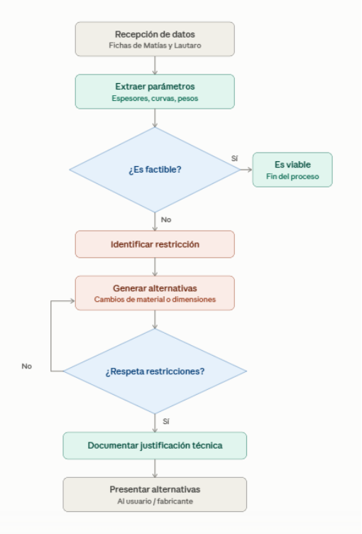

# ACTIVIDAD PI1

INTELIGENCIA ARTIFICIAL

Integrante: Luciano Marquesini

Profesores: Ing. Matilde Inés Césari — Ing. María Eugenia Stefanoni

## **b) Descripción del submódulo**

**Nombre del submódulo:** Evaluación de manufacturabilidad y alternativas de rediseño.

Este submódulo entra en acción cuando el diseño propuesto presenta restricciones físicas, estructurales o de recursos. Su problema experto consiste en analizar cómo razona un fabricante cuando una propuesta presenta una restricción técnica o de fabricación, evaluando qué alternativas considerar, qué compromisos resultan aceptables y qué criterios justifican recomendar cambios de material, tecnología, dimensiones o método constructivo sin perder la intención original del cliente.

Problema específico que resuelve: Determinar si un cartel es físicamente fabricable tal como fue concebido y, en caso de encontrar impedimentos técnicos (ej. trazos demasiado finos para alojar la tira LED, falta de espacio para ocultar fuentes de alimentación, o debilidad estructural, diseño que lleva a un coste excesivo innecesariamente), proponer alternativas viables de rediseño.

Usuario principal: Técnico, proyectista o fabricante de cartelería.

**Interacción con los demás submódulos:**

- Recibe del submódulo de Matías Zarandon las restricciones expresadas por el cliente y los requerimientos funcionales interpretados.

- Recibe del submódulo de Lautaro Quiros la evaluación de los materiales seleccionados inicialmente y las condiciones del entorno.

- Entrega al fabricante la confirmación de viabilidad de manufactura o una lista de alternativas de rediseño técnicamente compatibles.

## **c) Definición de la Tarea Experta**

**Tarea experta principal:** Recomendación.

**Tareas expertas secundarias:** Evaluación de factibilidad de manufactura.

**Justificación:** La tarea principal es la Recomendación porque el núcleo del razonamiento del experto no se limita a rechazar un diseño inviable (evaluación),

sino que se enfoca en proponer alternativas de rediseño fundamentadas que solucionen el problema constructivo respetando la intención del cliente.

**Preguntas expertas que debe responder:**

1. ¿Qué restricciones o incompatibilidades presenta la configuración propuesta a nivel de ensamblaje o manufactura?

2. Cuando una configuración presenta una restricción, ¿qué alternativas consideraría un fabricante experimentado?

3. ¿Qué compromisos entre factibilidad técnica, manufacturabilidad, estética y requerimientos del cliente son aceptables?

4. ¿Por qué una alternativa resulta más apropiada que otra y qué conocimiento experto fundamenta esa recomendación?

**Entradas:** Evaluación previa de materiales (Lautaro), requerimientos y restricciones del cliente (Matías), y disponibilidad técnica del taller.

**Salidas:** Confirmación de manufacturabilidad o alternativas de rediseño técnicamente aceptables con su respectiva justificación.

## **d) Diagrama de Procesos**

1. Recibir evaluación de materiales y requerimientos del cliente.

2. Extraer parámetros de diseño (espesores, curvas, pesos).

3. **Decisión:** ¿Es factible la manufactura con las herramientas y materiales actuales?

   - **SI:** Generar orden de manufacturabilidad -> Fin.

   - **NO:** Identificar tipo de restricción.

4. Generar alternativas de rediseño.

5. **Decisión:** ¿La alternativa respeta las restricciones innegociables del cliente?

   - **NO:** Buscar nueva alternativa.

   - **SI:** Documentar justificación técnica.

6. **Salida:** Presentar alternativas de rediseño al usuario.

> *Texto del diagrama (OCR):*
Recepcidén de datos Fichas de Matias y Lautaro Extraer parametros Espesores, curvas, pesos ¢Es factible? 5 = Essteedviabl Fin del proceso No Identificar restriccién Generar alternativas >| ‘Cambios de material o dimensiones No . > ¢Respeta restricciones? Si Documentar justificacién técnica Presentar alternativas Alusuario / fabricante 

## **e) Descripción del Flujo**

**Análisis inicial del experto:** El fabricante toma el diseño y lo despieza mentalmente, analizando cómo se cortará, unirá, soldará o imprimirá cada parte.

#### **Etapas:**

1. **Recepción:** (Entrada) Fichas de Matías y Lautaro. (Razonamiento) Identificar requerimientos funcionales y materiales propuestos. (Salida) Parámetros de diseño.

2. **Verificación constructiva:** (Entrada) Parámetros de diseño. (Razonamiento) Contrastar geometrías y medidas contra límites de maquinaria. (Salida) Detección de posibles conflictos.

3. **Análisis de restricciones:** (Entrada) Conflictos detectados. (Razonamiento) Determinar la causa técnica. (Salida) Restricción técnica identificada.

4. **Generación de alternativas:** (Entrada) Restricción técnica. (Razonamiento) Seleccionar opciones de rediseño según la experiencia. (Salida) Lista preliminar de alternativas.

5. **Filtro de requerimientos:** (Entrada) Alternativas y restricciones del cliente. (Razonamiento) Descartar opciones que violen pedidos innegociables. (Salida) Alternativas viables.

6. **Síntesis y justificación:** (Entrada) Alternativas viables. (Razonamiento) Explicar por qué el rediseño soluciona el problema sin comprometer calidad. (Salida) Ficha de rediseño recomendada.

## **f) Adquisición de conocimiento**

**Conocimiento requerido:** Dimensiones mínimas para Neón LED y ruteo, Criterios de reemplazo de materiales, Compromisos estéticos aceptables, Excepciones en ensamblaje complejo.

Posibles fuentes: Experiencia empírica (Luciano Marquesini), fichas técnicas, historial de clientes, casos atípicos.

Forma de adquisición: Análisis documental, pensamiento en voz alta, entrevistas, técnica de incidentes críticos.

#### **Plan de adquisición propuesto:**

1. Seleccionar diseños reales que hayan requerido modificaciones antes de fabricarse.

2. Analizar el motivo técnico exacto que forzó el rediseño.

3. Extraer la regla de decisión.

4. Validar estas reglas con nuevos diseños simulados.

## **g) Cuaderno de Conocimiento**

### **1. Alcance**

- **Dentro del alcance:** Evaluar viabilidad constructiva, proponer rediseño.

- **Fuera del alcance:** Precios, interpretar lenguaje inicial del cliente.

### **2. Glosario preliminar**

- **Rediseño:** Modificación técnica de un diseño original para hacerlo fabricable manteniendo su esencia.

- **Restricción constructiva:** Límite físico impuesto por el material o la maquinaria.

- **Alternativa viable:** Solución técnica que sortea un impedimento constructivo respetando las restricciones del cliente.

### **3. Fuentes de conocimiento**

- Fuente experta principal: Luciano Marquesini (experiencia en fabricación de cartelería).

- Fichas técnicas y manuales de componentes.

-

### **4. Casos típicos**

#### **Caso 1 — Trazos demasiado finos para iluminación interna**

Situación:

Al recibir un diseño para un cartel con iluminación LED interna, primero se observa si las partes del diseño tienen suficiente espacio físico para alojar la iluminación y permitir su fabricación. En algunos logotipos, los trazos son muy finos y, aunque visualmente el diseño puede verse correctamente en pantalla, físicamente no existe suficiente espacio para colocar la tira LED.

**Problema técnico:**

La geometría no permite colocar correctamente la iluminación sin deformar el diseño o generar zonas con iluminación deficiente.

#### **Alternativas consideradas:**

Aumentar el grosor de los trazos. Simplificar determinadas partes del logotipo.

Cambiar la forma de iluminación.

#### **Utilizar iluminación exterior o general en lugar de iluminación interna. Criterio de decisión:**

Primero intentó modificar lo menos posible la identidad visual. Si engrosar el trazado mantiene reconocible el logotipo, esa alternativa es preferible. Si la modificación altera demasiado el diseño, consideró cambiar el sistema de iluminación.

#### **Regla extraída:**

Si una geometría no permite alojar físicamente el sistema de iluminación elegido, primero se intenta modificar mínimamente la geometría y, si esto afecta demasiado la apariencia, se evalúa cambiar la tecnología de iluminación.

#### **Caso 2 — Cartel demasiado pesado**

#### **Situación** :

En carteles de grandes dimensiones, no solamente se evalúa si el cartel puede fabricarse, sino también si puede ser manipulado e instalado de forma segura.

#### **Problema técnico:**

El peso puede superar lo conveniente para el sistema de fijación previsto o hacer que el montaje resulte complicado.

#### **Alternativas consideradas:**

Reducir material en zonas que no necesitan ser macizas. Utilizar una estructura interna. Cambiar por un material más liviano. Dividir el cartel en módulos. Modificar el sistema de fijación.

#### **Criterio de decisión:**

Si el problema está relacionado principalmente con el peso del cuerpo del cartel, primero analizo si puedo reducir material sin modificar la apariencia exterior. Si esto no alcanza, evalúo modificar la estructura o la fijación.

#### **Regla extraída:**

Si el peso y/o forma constituye el problema principal, se intenta reducir masa sin alterar la apariencia visible antes de modificar significativamente el diseño.

#### **Caso 3 — Muchas letras pequeñas**

#### **Situación:**

Un cliente puede solicitar un cartel compuesto por muchas letras pequeñas, pretendiendo que cada una tenga iluminación interna.

#### **Problema técnico:**

La cantidad y tamaño de las letras puede hacer que colocar iluminación individual dentro de cada elemento sea innecesariamente complejo.

#### **Alternativas consideradas:**

Utilizar una iluminación general posterior.

Agrupar elementos. Modificar el tamaño de las letras.

**Criterio de decisión:**

Si el cliente prioriza que todas las letras se vean iluminadas pero no exige que cada una tenga iluminación interna independiente, puedo cambiar el sistema de iluminación manteniendo el efecto visual buscado.

#### **Regla extraída:**

Si la iluminación individual aumenta considerablemente la complejidad pero el efecto visual puede conseguirse mediante iluminación general, se prioriza la alternativa que mantenga el resultado visual con menor complejidad constructiva.

#### **Caso 4 — Diseño que se puede fabricar pero resulta innecesariamente complejo**

**Situación:**

No todos los diseños técnicamente fabricables son convenientes de fabricar. Puede ocurrir que un diseño requiera muchas piezas pequeñas, numerosos ensamblajes o procesos adicionales.

#### **Problema técnico** :

La fabricación es posible, pero aumenta innecesariamente la cantidad de operaciones y puntos donde puede aparecer un error.

#### **Alternativas consideradas:**

Simplificar la geometría.

Reducir la cantidad de piezas. Unificar componentes.

**Criterio de decisión:**

Si la simplificación no modifica significativamente el aspecto final ni incumple una condición del cliente, se prefiere reducir la cantidad de piezas y operaciones.

#### **Regla extraída:**

Si dos alternativas producen un resultado visual equivalente, se prefiere la que requiere menos piezas, uniones y operaciones de fabricación.

#### **Caso 5 — Modificación que afecta demasiado al logotipo Situación:**

Un diseño puede ser técnicamente difícil de fabricar y una posible solución sería modificar considerablemente el logotipo.

#### **Problema:**

La solución técnica podría resolver el problema de fabricación pero dejar de representar correctamente la identidad visual del cliente.

**Criterio de decisión:**

La identidad visual del cliente se considera una restricción prioritaria. Si una modificación cambia demasiado el logotipo, se descarta aunque técnicamente resuelva el problema.

#### **Regla extraída:**

Si una alternativa resuelve el problema constructivo pero modifica significativamente la identidad visual solicitada por el cliente, se debe descartar y buscar otra alternativa.

### **5. Casos límite**

- El rediseño estructural altera significativamente el logo original de la marca del cliente.

- Una modificación técnicamente viable afecta una característica visual que el cliente considera innegociable.

### **6. Excepciones**

- **Regla general:** Si el cartel es exterior, se debe usar placa base de mayor grosor.

- **Excepción:** Si el cartel va dentro de un nicho en la pared, se puede relajar el grosor.

### **7. Reglas candidatas**

**Condición (SI) Acción / Recomendación (ENTONCES)** recomendar aumentar el ancho del el ancho disponible de un trazado o trazado, simplificar la geometría o evaluar elemento del diseño no permite alojar una tecnología alternativa.

**Condición (SI)**

adecuadamente la tecnología de iluminación seleccionada,

el peso estimado del cartel supera la capacidad admisible del sistema de fijación previsto,

la geometría propuesta requiere un proceso de fabricación que no puede realizarse con las herramientas o recursos disponibles,

el material seleccionado no se encuentra disponible o no resulta adecuado para el proceso constructivo requerido,

la configuración propuesta resulta fabricable con los recursos, materiales y métodos disponibles y respeta las restricciones del cliente,

existen varias alternativas técnicamente viables y ninguna viola las restricciones del cliente

#### **Acción / Recomendación (ENTONCES)**

evaluar alternativas para reducir el peso, modificar la estructura o adaptar el sistema de fijación.

Recomendar una modificación de la geometría, del método constructivo o de la tecnología utilizada.

evaluar materiales alternativos que permitan conservar las características funcionales y visuales del diseño.

confirmar la manufacturabilidad sin proponer un rediseño innecesario

priorizar la alternativa que mantenga mejor la apariencia original y requiera menos modificaciones y complejidad de fabricación

Las reglas anteriores son candidatas y no representan valores técnicos definitivos. Los umbrales, materiales compatibles, capacidades de fabricación y condiciones específicas deberán ser relevados y validados posteriormente mediante adquisición de conocimiento con el experto, casos reales y documentación técnica.

### **8. Incertidumbres detectadas**

- Grado de flexibilidad del cliente para aceptar modificaciones estéticas.

- Complejidad de fabricación (evaluación gradual).

### **9. Preguntas abiertas**

- ¿Hasta qué punto se puede modificar un logotipo sin que el cliente lo considere inaceptable?

- ¿Qué combinaciones de materiales generan más rechazos por manufacturabilidad?

## **h) Referencias y fuentes consultadas**

1. Grupo 11 - PG0: Asistente Inteligente para Evaluación Técnica y Rediseño de Cartelería Comercial. Distribución preliminar en submódulos, 2026.

2. Ejemplo Actividad PI1: Análisis de la Tarea Experta y Cuaderno de Conocimiento - Evaluación de CVs. Material de referencia provisto por la cátedra.

3. Fuente experta prevista para la adquisición y validación: Luciano Marquesini, integrante del grupo con experiencia directa en fabricación de cartelería comercial.

4. Fuentes a relevar en la siguiente etapa: casos reales de fabricación, pedidos históricos disponibles, fichas técnicas y catálogos de proveedores vinculados a los casos analizados.
