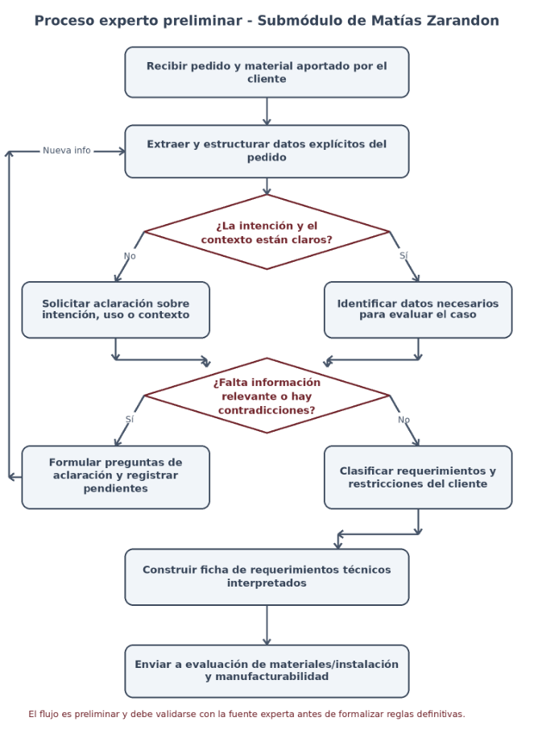

# ACTIVIDAD PI1

### INTELIGENCIA ARTIFICIAL

Integrante: Matias Zarandon

Profesores: Ing. Matilde Inés Césari — Ing. María Eugenia Stefanoni

## **b) Descripción del submódulo**

**Nombre del submódulo:** Interpretación técnica de requerimientos y restricciones del cliente.

Este submódulo transforma un pedido inicialmente expresado en lenguaje del cliente -que puede ser incompleto, ambiguo o contener prioridades no explicitadas- en una descripción técnica estructurada que pueda ser utilizada por los módulos posteriores. Su problema experto no consiste en decidir qué material utilizar ni en rediseñar el cartel, sino en comprender correctamente qué se solicita, determinar qué información hace falta y registrar las restricciones del cliente sin inventar datos ni asumir una solución técnica.

**Problema específico que resuelve:** determinar si el pedido contiene información suficiente y suficientemente clara para avanzar a una evaluación técnica, identificando datos faltantes, contradicciones, ambigüedades y restricciones expresadas por el cliente.

**Usuario principal:** fabricante, técnico o proyectista de cartelería que releva el pedido y necesita convertirlo en una base de requisitos confiable antes de evaluar factibilidad.

**Responsable actual de la decisión:** actualmente la interpretación inicial del pedido es realizada por el fabricante, técnico o proyectista, quien determina qué información resulta suficiente y qué aspectos requieren aclaración antes de continuar.

### **Interacción con los demás submódulos**

- Recibe del cliente o de la interfaz de ingreso el pedido inicial, referencias visuales, dimensiones informadas, tecnología deseada, entorno previsto, condiciones de montaje conocidas y restricciones expresadas.

- Entrega al submódulo de Lautaro Quiros una ficha estructurada con los datos necesarios para analizar materiales y condiciones de instalación.

- Entrega al submódulo de Luciano Marquesini las restricciones, prioridades y datos interpretados que condicionan la manufacturabilidad o un eventual rediseño.

- Cuando la información no alcanza, devuelve una solicitud de aclaración antes de permitir que el caso continúe hacia la evaluación técnica.

### **Conocimiento preliminar identificado**

A partir de PG0 se identifica que el experto necesita reconocer qué información técnica debe extraerse o solicitarse, qué datos son indispensables según el caso, qué expresiones del cliente admiten más de una interpretación y qué restricciones deben preservarse para los análisis posteriores. Este conocimiento es todavía preliminar: los criterios concretos de suficiencia, las excepciones y el vocabulario utilizado por el fabricante deben relevarse y validarse con la fuente experta.

**Límite del submódulo.** Matías no evalúa compatibilidad de materiales, estabilidad, método constructivo ni alternativas de rediseño. Su salida debe dejar el pedido en condiciones de ser evaluado por esos subproblemas, manteniendo una identidad experta propia.

## **c) Definición de la Tarea Experta**

#### **Tarea experta principal:** Interpretación.

**Tareas expertas secundarias:** evaluación de suficiencia de información y recomendación de aclaraciones necesarias para completar el pedido.

La clasificación principal es Interpretación porque el núcleo del razonamiento consiste en convertir información expresada en lenguaje cotidiano, visual o incompleto en conceptos técnicos utilizables. El experto no se limita a copiar datos: identifica la intención del cliente, distingue lo explícito de lo supuesto, detecta ambigüedades y decide qué debe preguntarse antes de continuar.

La evaluación aparece de manera secundaria al decidir si la información disponible es suficiente para habilitar el análisis técnico. La recomendación también es secundaria, ya que cuando falta información el submódulo debe indicar qué aclaración conviene solicitar. Estas tareas no reemplazan la evaluación de factibilidad del proyecto completo.

### **Preguntas expertas que debe responder**

**1.** ¿Qué información concreta puede extraerse del pedido sin realizar suposiciones?

**2.** ¿Cuál es la intención funcional y visual del cliente y qué parte de esa intención debe traducirse a datos técnicos?

**3.** ¿Qué datos son necesarios para que los módulos posteriores puedan evaluar el caso?

**4.** ¿Qué información falta, está expresada de manera ambigua o presenta contradicciones?

**5.** ¿Qué requerimientos son restricciones explícitas del cliente y cuáles son preferencias o deseos todavía negociables?

**6.** ¿Qué aclaración debería solicitarse para resolver una ambigüedad sin inducir al cliente hacia una solución técnica específica?

**7.** ¿Cuándo el pedido puede considerarse suficientemente definido para pasar a evaluación técnica?

**8.** ¿Qué elementos deben conservarse como advertencias o incertidumbres para que los siguientes submódulos no los traten como hechos confirmados?

### **Entradas y salidas**

**Entradas:** texto o conversación con el cliente, referencias visuales, tipo o tecnología deseada cuando esté definida, dimensiones informadas, ubicación o entorno previsto, condiciones de instalación conocidas, características visuales y restricciones de recursos o de uso expresadas por el cliente.

**Salidas:** ficha de requerimientos técnicos interpretados, datos confirmados, datos faltantes, ambigüedades o contradicciones detectadas, restricciones explícitas del cliente y preguntas de aclaración pendientes. Cuando la información alcanza, la ficha se deriva a los submódulos de evaluación.

## **d) Diagrama de Procesos**

El siguiente diagrama representa el proceso experto preliminar del submódulo. Se modela como un ciclo de interpretación y aclaración: el caso no avanza hasta que la información necesaria para la evaluación posterior pueda distinguirse de las suposiciones o dudas pendientes.

> *Texto del diagrama (OCR):*
Proceso experto preliminar - Submédulo de Matias Zarandon Recibir pedido y material aportado por el cliente Nueva info Extraer y estructurar" datos explicitos del pedido éLa intenci6én y el contexto estan claros? jo sf Solicitar aclaraci6n sobre Identificar datos necesarios intencién, uso o contexto para evaluar el caso éFalta informaci6n relevante o hay Si contradicciones? No Formular preguntas de . _ aclaraci6n y registrar Clasificar requerimientos y pendientes restricciones del cliente Construir ficha de requerimientos técnicos interpretados Enviar a evaluacion de materiales/instalacion y manufacturabilidad El flujo es preliminar y debe validarse con la fuente experta antes de formalizar reglas definitivas. 

_Figura 1. Proceso experto preliminar para interpretar requerimientos y restricciones del cliente._

## **e) Descripción del Flujo**

**Análisis inicial del experto:** el experto comienza revisando la información aportada por el cliente, separando los datos explícitos de las posibles suposiciones. Luego interpreta la intención del pedido e identifica qué información resulta necesaria para continuar.

|**Etapa**|**Entrada**|**Razonamiento experto** **preliminar**|**Salida**|
|---|---|---|---|
|1. Recepción del pedido|Pedido del cliente y material adjunto.|Registrar literalmente lo aportado, sin completar huecos por cuenta propia.|Conjunto inicial de datos y expresiones del cliente.|
|2. Estructuración inicial|Datos del pedido.|Separar información sobre producto, dimensiones, contexto de uso, entorno, instalación, apariencia y restricciones.|Datos organizados por categorías.|
|3. Interpretación de intención|Expresiones del cliente y referencias.|Determinar qué necesidad o resultado busca el cliente y qué partes admiten más de una lectura.|Intención interpretada + ambigüedades detectadas.|
|4. Identificación de información necesaria|Tipo de pedido y contexto.|Comparar lo disponible con la información que el experto considera necesaria para evaluar ese tipo de caso.|Lista de datos confirmados y faltantes.|
|5. Control de consistencia|Datos estructurados.|Detectar contradicciones entre texto, medidas, referencias o restricciones.|Datos consistentes o conflicto a aclarar.|
|6. Solicitud de aclaración|Faltantes o conflictos.|Formular preguntas específicas. La nueva información vuelve al ciclo de interpretación.|Pedido ampliado o confirmado.|
|7. Registro de restricciones|Pedido suficientemente claro.|Conservar qué condiciones son explícitamente obligatorias, cuáles son preferencias y cuáles continúan inciertas.|Restricciones y prioridades registradas.|
|8. Síntesis y derivación|Información ya interpretada.|Construir una ficha que pueda ser utilizada sin reinterpretar la conversación original.|Ficha técnica interpretada para los módulos posteriores.|

### **Puntos de decisión y excepciones**

- ¿La intención del cliente es suficientemente clara? Si no, se solicita una aclaración antes de inferir una solución.

- ¿La información necesaria para el caso está disponible? Si falta un dato relevante para la evaluación posterior, se registra como pendiente y se consulta.

- ¿Existen datos contradictorios? El submódulo no elige arbitrariamente uno: solicita confirmación o mantiene el conflicto explícito.

- El cliente puede no conocer el nombre técnico del producto o de la solución. En ese caso, el experto debe relevar la necesidad funcional y visual sin exigir una respuesta técnica que el cliente no está en condiciones de dar.

- Algunos datos podrían ser postergables y otros bloqueantes. La distinción exacta deberá validarse con la fuente experta y no se fija todavía como regla definitiva.

## **f) Adquisición de conocimiento**

Para que el submódulo reproduzca el razonamiento de un fabricante, no alcanza con definir campos de un formulario. Debe adquirirse conocimiento sobre cómo se interpreta un pedido real, qué señales hacen sospechar que falta información, qué preguntas se formulan y qué criterios permiten decidir que el caso ya puede pasar a evaluación.

|**Conocimiento requerido**|**Posible fuente**|**Forma de adquisición**|**Estado**|
|---|---|---|---|
|Información mínima necesaria según el tipo de pedido|Luciano Marquesini; casos reales de fabricación|Entrevista semiestructurada + comparación de pedidos completos e incompletos|Pendiente de relevar/validar|
|Vocabulario usado por clientes y su traducción a conceptos técnicos|Luciano Marquesini; conversaciones/pedidos históricos disponibles|Análisis de casos + construcción de glosario|Pendiente de relevar|
|Criterios para distinguir dato faltante, dato ambiguo y dato no relevante|Luciano Marquesini|Pensamiento en voz alta sobre casos preparados|Pendiente de validar|
|Criterios de suficiencia para permitir que el caso avance|Luciano Marquesini|Entrevista + clasificación de casos frontera|Pendiente de validar|
|Cómo identificar una restricción obligatoria, una preferencia y una condición negociable|Luciano Marquesini; pedidos reales|Entrevista + análisis de lenguaje usado en casos reales|Pendiente de validar|
|Dependencias entre el contexto del pedido y la información que debe solicitarse|Luciano Marquesini; documentación técnica cuando corresponda|Análisis de casos + contraste documental|Pendiente de relevar|
|Excepciones: casos donde una regla general de interpretación no alcanza|Luciano Marquesini; casos atípicos|Técnica de incidentes críticos|Pendiente de relevar|
|Forma más útil de formular aclaraciones al cliente|Luciano Marquesini|Entrevista + reconstrucción de preguntas usadas en trabajos reales|Pendiente de relevar|

### **Plan de adquisición propuesto**

**1.** Seleccionar entre cinco y diez pedidos reales con distintos niveles de claridad: completos, incompletos, contradictorios y con vocabulario no técnico.

**2.** Pedir al experto que piense en voz alta mientras interpreta cada caso: qué observa primero, qué le genera dudas, qué pregunta y por qué.

**3.** Registrar cada decisión con la estructura condición -> interpretación -> acción -> justificación -> excepción conocida.

**4.** Comparar los casos para identificar patrones repetidos y separar conocimiento general de decisiones particulares.

**5.** Formalizar reglas candidatas y volver a presentarlas al experto con casos nuevos para confirmar, corregir o descartar cada una.

**6.** Recién después de la validación, definir umbrales, categorías difusas o reglas técnicas definitivas que correspondan al submódulo.

**Criterio de validez.** En este PI1 no se inventan espesores, dimensiones máximas, materiales compatibles ni umbrales de suficiencia. Esos valores sólo deben incorporarse cuando hayan sido relevados y validados con la fuente experta o con documentación técnica pertinente.

## **g) Cuaderno de Conocimiento**

### **1. Alcance**

El submódulo tomará decisiones sobre la calidad interpretativa del pedido: si la información disponible es clara y suficiente para continuar, qué elementos están confirmados, qué elementos deben aclararse y qué restricciones del cliente deben conservarse para los módulos siguientes.

**Dentro del alcance:** interpretar requerimientos; detectar faltantes, ambigüedades y contradicciones; registrar restricciones y preferencias expresadas; formular aclaraciones; generar una ficha de requerimientos estructurada.

**Fuera del alcance:** elegir materiales, calcular espesores o refuerzos, determinar estabilidad estructural, resolver compatibilidad de instalación, evaluar manufacturabilidad, proponer el rediseño final, cotizar el trabajo o decidir por el fabricante.

### **2. Glosario preliminar**

|**Concepto**|**Definición preliminar**|
|---|---|
|Pedido del cliente|Conjunto inicial de expresiones, medidas, referencias y condiciones aportadas para solicitar una pieza de cartelería.|
|Requerimiento|Necesidad o condición que debe quedar representada para poder evaluar el trabajo.|

|**Concepto**|**Definición preliminar**|
|---|---|
|Dato confirmado|Información expresada de manera suficientemente clara y consistente como para utilizarla sin asumir un valor diferente.|
|Dato faltante|Información necesaria para el análisis que todavía no fue aportada.|
|Dato ambiguo|Información que admite más de una interpretación razonable o no tiene precisión suficiente.|
|Contradicción|Dos datos o expresiones del mismo pedido que no pueden asumirse simultáneamente sin aclaración.|
|Restricción del cliente|Condición que el cliente declara que debe respetarse. Su rigidez exacta debe registrarse y, cuando no sea clara, consultarse.|
|Preferencia|Característica deseada que no necesariamente funciona como condición obligatoria; su interpretación debe validarse si afecta decisiones posteriores.|
|Condición de instalación|Información sobre dónde y cómo se prevé colocar el cartel, relevante para los análisis posteriores.|
|Ficha de requerimientos interpretados|Salida estructurada del submódulo que separa datos confirmados, restricciones, dudas y pendientes de aclaración.|

### **3. Fuentes de conocimiento**

- Fuente experta principal prevista: Luciano Marquesini, integrante del grupo con experiencia directa en fabricación de cartelería comercial.

- Casos reales de trabajos anteriores: pedidos, mensajes, bocetos, referencias y decisiones tomadas durante la fabricación, en la medida en que estén disponibles para el grupo.

- Fichas técnicas, catálogos de proveedores y documentación de materiales, únicamente cuando sirvan para respaldar por qué cierta información resulta relevante para la evaluación posterior.

- Documentación de la cátedra sobre tareas expertas, análisis de procesos y adquisición de conocimiento.

### **4. Casos típicos**

|**Caso**|**Situación**|**Respuesta experta preliminar**|
|---|---|---|
|Pedido suficientemente definido|El cliente aporta un tipo de cartel identificable, medidas utilizables, contexto de uso e instalación y restricciones expresadas con claridad.|El experto estructura la información y habilita el paso a evaluación técnica.|
|Pedido con información faltante|El pedido expresa qué se desea, pero omite uno o más datos que el experto necesita para que otros módulos evalúen el caso.|El experto identifica exactamente qué falta y formula una pregunta de aclaración.|

|**Caso**|**Situación**|**Respuesta experta preliminar**|
|---|---|---|
|Pedido en lenguaje no técnico|El cliente describe un efecto visual, una necesidad de uso o una referencia sin conocer la tecnología adecuada.|El experto conserva la necesidad funcional y evita convertirla prematuramente en una solución técnica.|
|Pedido con restricción explícita|El cliente indica una condición que no desea modificar.|La condición se registra como restricción del cliente para que los módulos posteriores la tengan en cuenta.|

### **5. Casos límite**

- El texto del pedido y una referencia visual parecen indicar soluciones diferentes.

- Las dimensiones son aproximadas y no está claro si corresponden al cartel, al espacio disponible o a una referencia visual.

- El cliente expresa varias condiciones, pero no queda claro cuál tiene prioridad si aparecen incompatibilidades más adelante.

- Se conoce el objetivo general, pero el propio cliente no dispone todavía de datos del lugar de instalación.

- Una expresión parece una preferencia, pero podría ser una restricción obligatoria. El experto necesita confirmar su rigidez antes de registrarla como tal.

### **6. Excepciones**

- Puede existir información ausente que no impida continuar de inmediato y pueda completarse en una etapa posterior. Qué datos son postergables debe relevarse con el experto.

- El cliente puede no poder responder una pregunta técnica; en ese caso, la aclaración debe reformularse en términos de uso, necesidad o condiciones observables.

- Un pedido puede requerir consulta directa con otro submódulo para saber si cierto dato es realmente necesario. Matías no debe resolver por sí mismo una cuestión de materiales o manufacturabilidad.

### **7. Reglas candidatas**

Las siguientes reglas son preliminares y expresan el razonamiento que se pretende relevar. Deben ser validadas con la fuente experta antes de considerarse conocimiento definitivo:

**1.** SI una expresión admite más de una interpretación razonable, ENTONCES no elegir una interpretación en silencio y solicitar aclaración.

**2.** SI un dato requerido para la evaluación posterior no fue aportado, ENTONCES registrarlo como faltante y generar una pregunta específica para obtenerlo.

**3.** SI dos datos del pedido se contradicen, ENTONCES conservar el conflicto explícito y pedir confirmación sobre cuál es válido.

**4.** SI el cliente declara una condición como obligatoria, ENTONCES preservarla como restricción del cliente en la ficha de salida.

**5.** SI una característica fue expresada solamente como preferencia, ENTONCES no transformarla automáticamente en una restricción rígida.

**6.** SI el cliente no conoce una alternativa técnica pero puede describir el efecto o uso buscado, ENTONCES registrar el requerimiento funcional y derivar la selección técnica a los módulos correspondientes.

**7.** SI el entorno o la condición de instalación son necesarios para evaluar el caso y no están definidos, ENTONCES solicitar esa información o mantenerla como pendiente.

**8.** SI la información ya es suficiente y consistente según los criterios validados, ENTONCES generar la ficha de requerimientos interpretados y permitir que el caso avance.

**9.** SI un valor, dimensión o condición no fue aportado ni validado, ENTONCES el submódulo no debe inventarlo para completar el pedido.

**10.** SI una duda pertenece a materiales, instalación o manufacturabilidad, ENTONCES derivarla al submódulo experto correspondiente en lugar de resolverla dentro de la interpretación.

- **Inferencias preliminares:** a partir de la información disponible, el experto puede inferir que un dato es ambiguo, que el pedido no contiene información suficiente para continuar, que existe una contradicción entre datos o que una condición expresada por el cliente debe conservarse como restricción.

### **8. Incertidumbres detectadas**

- Grado de ambigüedad de una expresión del cliente.

- Grado de suficiencia del pedido cuando parte de la información está disponible y parte permanece pendiente.

- Confianza con la que una expresión puede traducirse a un concepto técnico concreto.

- Rigidez o negociabilidad de una condición cuando el cliente no la expresa de forma binaria.

Estas incertidumbres podrían representarse más adelante mediante categorías graduadas o lógica difusa. En PI1 sólo se identifican como variables posibles; todavía no se definen funciones de pertenencia, rangos ni umbrales.

### **9. Preguntas abiertas**

**1.** ¿Qué datos considera imprescindibles el fabricante para cada tipo de cartel antes de empezar a evaluar materiales o instalación?

**2.** ¿Qué datos pueden completarse más adelante sin bloquear el análisis?

**3.** ¿Qué palabras o expresiones ambiguas aparecen con mayor frecuencia en pedidos reales?

**4.** ¿Cómo distingue el experto una preferencia de una restricción no negociable?

**5.** ¿Qué contradicciones aparecen con mayor frecuencia entre texto, medidas y referencias visuales?

**6.** ¿Qué preguntas hace primero el experto y en qué orden?

**7.** ¿Cuándo decide que ya tiene información suficiente para derivar el caso?

**8.** ¿Qué información necesita específicamente cada uno de los otros dos submódulos?

**9.** ¿Qué casos requieren una consulta humana directa aunque la mayoría de los datos estén disponibles?

**10.** ¿Qué excepciones hacen que una regla general de interpretación deje de ser válida?

### **10. Conceptos y relaciones preliminares para PI2**

El cuaderno deja una base directa para la representación posterior mediante red semántica o frames. Los conceptos centrales y sus relaciones preliminares son:

- Cliente -> formula -> Pedido.

- Pedido -> contiene -> Requerimiento.

- Requerimiento -> puede presentar -> Dato confirmado / Dato faltante / Dato ambiguo / Contradicción.

- Requerimiento -> puede expresar -> Restricción / Preferencia / Necesidad funcional.

- Submódulo de interpretación -> solicita -> Aclaración.

- Submódulo de interpretación -> produce -> Ficha de requerimientos interpretados.

- Ficha de requerimientos interpretados -> alimenta -> Evaluación de materiales y condiciones de instalación.

- Ficha de requerimientos interpretados -> alimenta -> Evaluación de manufacturabilidad y alternativas de rediseño.

## **h) Referencias y fuentes consultadas**

**1.** Actividad PI1 - Unidad 1 (Individual): Análisis de la Tarea Experta, Procesos y Cuaderno de Conocimiento. Cátedra de Inteligencia Artificial, UTN FRM, 2026.

**2.** Grupo 11 - PG0: Asistente Inteligente para Evaluación Técnica y Rediseño de Cartelería Comercial. Distribución preliminar en submódulos, 2026.

**3.** Ejemplo Actividad PI1: Análisis de la Tarea Experta y Cuaderno de Conocimiento - Evaluación de CVs. Material de referencia provisto por la cátedra.

**4.** Fuente experta prevista para la adquisición y validación: Luciano Marquesini, integrante del grupo con experiencia directa en fabricación de cartelería comercial.

**5.** Fuentes a relevar en la siguiente etapa: casos reales de fabricación, pedidos históricos disponibles, fichas técnicas y catálogos de proveedores vinculados a los casos analizados.

**Resultado del PI1.** El submódulo queda definido como un problema experto propio: interpretar un pedido ambiguo y determinar qué información debe aclararse antes de la evaluación técnica. Las reglas incluidas son candidatas y el próximo paso es validarlas mediante adquisición de conocimiento con casos reales y pensamiento en voz alta.
