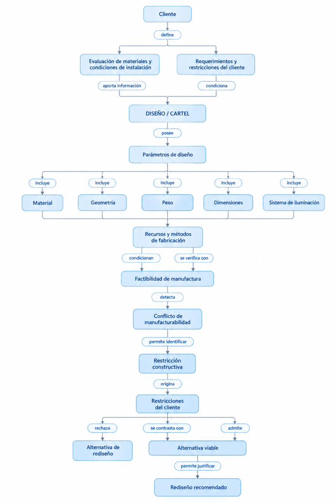
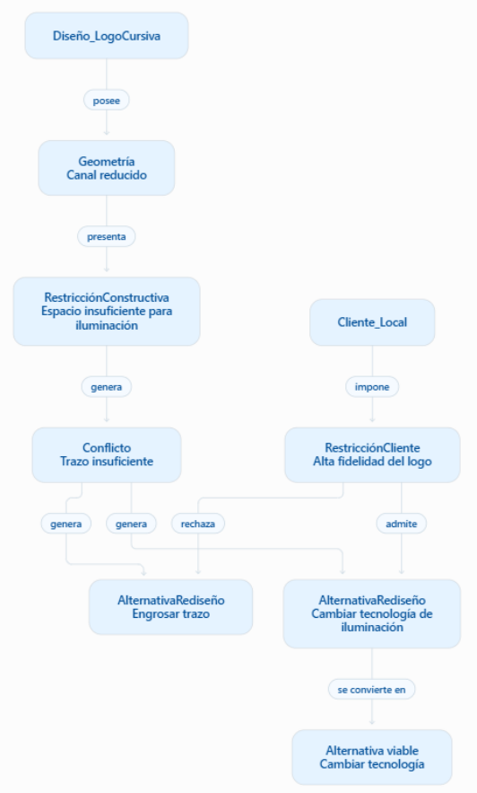
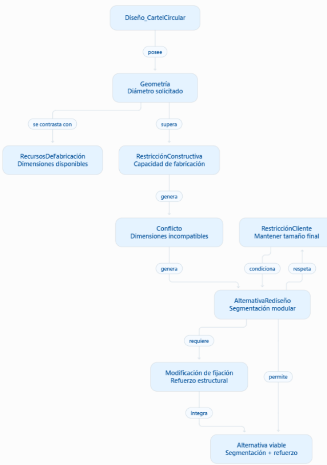

# ACTIVIDAD PI2

## INTELIGENCIA ARTIFICIAL

Integrante: Luciano Marquesini

Submódulo: Evaluación de manufacturabilidad y alternativas de rediseño

Profesores: Ing. Matilde Inés Césari — Ing. María Eugenia Stefanoni

### **b) Revisión del Cuaderno de Conocimiento**

A partir de las devoluciones de la cátedra sobre el PI1, se ajustó el alcance y se extrajo el conocimiento tácito del experto para explicitar los criterios de decisión. **Modificaciones respecto del PI1:** se acotó el dominio a la fabricación por impresión 3D FDM (PLA y PETG) con iluminación por neón frontal o retroiluminación; se incorporó el concepto Herramienta (impresora 3D) como fuente de las restricciones de volumen; se unificó el vocabulario de relaciones entre la red conceptual y los casos instanciados; se agregaron la regla R8, para el caso límite del PI1 en que ninguna alternativa respeta las restricciones del cliente, y la regla R9, que formaliza el criterio de reducir peso sin perforar la superficie (Caso 2 del PI1); y se incorporó el concepto Recomendación como salida del submódulo (Etapa 6). Para mantener la coherencia con el submódulo de interpretación (M. Zarandon), la entrada se renombró FichaRequerimientos, la RestricciónCliente incorpora la rigidez definida en ese submódulo, el entorno pasa a ser un dato del Diseño y toda renegociación con el cliente se canaliza mediante sus Aclaraciones.

● Conceptos identificados

|ID|Concepto|Tipo|Descripción|Origen (PI1)|Sinónimos|
|---|---|---|---|---|---|
|C1|Diseño|Entidad|Requerimiento base a manufacturar.|Etapa 1: Recepción|Cartel, Modelo, Proyecto|
|C2|Cliente|Entidad|Sujeto que solicita el cartel y define límites.|Etapa 1: Recepción|Comprador, Usuario|
|C3|FichaRequerimientos|Evidencia|Ficha de requerimientos interpretados que entrega el submódulo de M. Zarandon: datos confirmados, restricciones, preferencias, necesidades funcionales y advertencias.|Etapa 1: Recepción|Ficha de requerimientos interpretados|
|C4|EvaluaciónMateriales|Evidencia|Entrada del submódulo de L. Quiros.|Etapa 1: Recepción|Análisis material|
|C5|Geometría|Atributo|Propiedades espaciales y de trazo del diseño.|Etapa 2: Verificación|Forma, Medidas|
|C6|Material|Entidad|Insumo base (PLA, PETG) para impresión FDM.|Etapa 2: Verificación|Filamento|
|C7|Herramienta|Entidad|Impresora 3D FDM que define el volumen máximo fabricable.|Etapa 2: Verificación|Impresora 3D, Máquina|

|ID|Concepto|Tipo|Descripción|Origen (PI1)|Sinónimos|
|---|---|---|---|---|---|
|C8|SistemaFijación|Entidad|Soporte para el peso del cartel.|Etapa 2: Verificación|Anclaje, Soporte|
|C9|TecnologíaIluminación|Entidad|Método de iluminación (NeónFrontal, Retroiluminado).|Etapa 2: Verificación|Iluminación|
|C10|RestricciónConstructiva|Restricción|Límite físico innegociable de la manufactura.|Etapa 3: Análisis restr.|Límite técnico|
|C11|Conflicto|Estado|Situación donde una geometría/material viola una restricción.|Etapa 3: Análisis restr.|Problema, Inviabilidad|
|C12|AlternativaRediseño|Acción|Modificación propuesta para sortear el conflicto.|Etapa 4: Generación|Solución técnica|
|C13|RestricciónCliente|Restricción|Condición del cliente recibida en la Ficha; es innegociable cuando su rigidez es obligatoria.|Etapa 5: Filtro req.|Restricción del cliente, Preferencia (SM Zarandon)|
|C14|Recomendación|Acción (salida)|Confirmación de manufacturabilidad o alternativas admitidas con su justificación técnica.|Etapa 6: Síntesis|Ficha de rediseño, Dictamen|

#### ● Relaciones identificadas

|ID|Relación (Verbo)|Origen|Destino|Tipo|Card.|Origen (PI1)|
|---|---|---|---|---|---|---|
|RL1|tiene|Diseño|Geometría|Determinística|1:1|Etapa 2|
|RL2|utiliza|Diseño|Material / SistemaFijación|Determinística|1:1|Etapa 2|
|RL3|requiere|Diseño|TecnologíaIluminación|Determinística|1:1|Etapa 2|
|RL4|viola|Geometría/Material|RestricciónConstructiva|Determinística|1:N|Etapa 3|
|RL5|genera|RestricciónConstructiva|Conflicto|Determinística|1:1|Etapa 3|
|RL6|exige|Conflicto / AlternativaRediseño|AlternativaRediseño|Heurística|1:N|Etapa 4|
|RL7|impone|Cliente|RestricciónCliente|Determinística|1:N|Etapa 1|
|RL8|es_filtrada_por|AlternativaRediseño|RestricciónCliente|Determinística|N:M|Etapa 5|

|ID|Relación (Verbo)|Origen|Destino|Tipo|Card.|Origen (PI1)|
|---|---|---|---|---|---|---|
|RL9|admite|RestricciónCliente|AlternativaRediseño|Heurística|1:N|Etapa 5|
|RL10|rechaza|RestricciónCliente|AlternativaRediseño|Heurística|1:N|Etapa 5|
|RL11|define|Herramienta / Material / SistemaFijación / TecnologíaIluminación|RestricciónConstructiva|Determinística|N:M|Etapa 2|
|RL12|alimenta|FichaRequerimientos / EvaluaciónMateriales|Diseño|Determinística|N:1|Etapa 1|
|RL13|es_un|Subtipo (ej. PETG)|Concepto general (ej. Material)|Determinística|N:1|Etapa 2 a 4|
|RL14|conforma|AlternativaRediseño|Recomendación|Determinística|N:1|Etapa 6|

- Jerarquías identificadas (es_un)

- **TecnologíaIluminación** -> NeónFrontal, Retroiluminado.

- **Material** -> PLA, PETG.

- **RestricciónConstructiva** -> RestricciónVolumen, RestricciónTrazo, RestricciónPeso, RestricciónTemperatura.

- **AlternativaRediseño** -> CambioMaterial, CambioGeometría, CambioFijación, CambioTecnología, SegmentaciónModular.

### **c) Descripción y diagrama de Red Semántica Conceptual**

La red semántica conceptual modela el flujo de decisión experto. El nodo central es el **Diseño** , el cual toma entradas de la **EvaluaciónMateriales** y el **FichaRequerimientos** .

Este Diseño _tiene_ una **Geometría** , _utiliza_ un **Material** y un **SistemaFijación** , y _requiere_ una **TecnologíaIluminación** . La **Herramienta** (impresora 3D), el **Material** , el **SistemaFijación** y

la **TecnologíaIluminación** _definen_ las restricciones constructivas de volumen, temperatura, peso y trazo, respectivamente.

Cuando las dimensiones o propiedades del diseño superan las capacidades del hardware o del insumo, la Geometría o Material _violan_ una **RestricciónConstructiva** . Esto automáticamente _genera_ un estado de **Conflicto** , el cual _exige_ la creación de una o más instancias de **AlternativaRediseño** .

Paralelamente, el **Cliente** _impone_ una **RestricciónCliente** (por ejemplo, la fidelidad absoluta al logo), que llega en la Ficha con su rigidez (obligatoria o preferencia). La AlternativaRediseño generada _es_filtrada_por_ esta RestricciónCliente, la cual finalmente _admite_ (hace viable) o _rechaza_ (descarta) la propuesta. Las alternativas admitidas _conforman_ la **Recomendación** , que es la salida del submódulo; si ninguna resulta admitida, el Conflicto pasa a estado Inviable y vuelve al submódulo de interpretación para renegociar con el cliente (R8).

Las jerarquías se modelan con la relación _es_un_ : **TecnologíaIluminación** , **Material** , **RestricciónConstructiva** y **AlternativaRediseño** se especializan en los subtipos listados en la sección b.

> *Texto del diagrama (OCR):*
Cliente define acne acl (0 { a 1 | Evaluacién de materiales y Requerimientos y | condiciones de instalacién restricciones del cliente I aporta informacién condiciona | DISENO / CARTEL posee | Parémetros de disefio | $ t + } ) incluye incluye incluye incluye incluye + t + + t Material Geometria | Peso Dimensiones Sistema de iluminacién [ | J Recursos y métodos de fabricaci6n condicionan se verifica con Factibilidad de manufactura. | detecta x > Conflicto de manufacturabilidad | permite identificar Restriccién constructiva origina Ss i Sa Restricciones del cliente t t + rechaza se contrasta con admite 1 sant Tr Alternativa de | Alternativa viable | redisefio ————EE permite justificar Redisefio recomendado 

### **d) Casos de uso e instanciación**

### **Caso 1: Trazo insuficiente para alojar el sistema de iluminación**

Un cliente solicita un **Diseño** de logo en tipografía cursiva con trazos muy delgados. El **Diseño** tiene una **Geometría** con canales internos de 4 mm y requiere una **TecnologíaIluminación** NeónFrontal, cuya tira no puede alojarse en ese espacio.

La **Geometría** viola una **RestricciónConstructiva** (ancho mínimo de 6 mm de la tira de neón).

La **RestricciónConstructiva** genera un **Conflicto** (TrazoFino).

El fabricante genera dos AlternativasRediseño:

- **Alternativa 1:** aumentar el grosor de los trazos.

- **Alternativa 2:** modificar la tecnología de iluminación.

El cliente posee una **RestricciónCliente** de mantener la identidad visual del logo. La Alternativa 1 **afecta** significativamente la apariencia del diseño y por lo tanto **es rechazada** .

La Alternativa 2 **mantiene** la apariencia requerida y por lo tanto **es admitida** .

#### **Instanciación principal:**

Diseño_LogoCursiva → tiene → Geometría(Canal_4mm) Diseño_LogoCursiva → requiere → TecnologíaIluminación(NeónFrontal) TecnologíaIluminación(NeónFrontal) → define → RestricciónConstructiva(Min_Neón_6mm) Geometría(Canal_4mm) → viola → RestricciónConstructiva(Min_Neón_6mm) RestricciónConstructiva(Min_Neón_6mm) → genera → Conflicto(TrazoFino) Conflicto(TrazoFino) → exige → AlternativaRediseño(EngrosarTrazo) Conflicto(TrazoFino) → exige → AlternativaRediseño(PasarRetroiluminado) Cliente_Local → impone → RestricciónCliente(Fidelidad_Logo_Alta) RestricciónCliente(Fidelidad_Logo_Alta) → rechaza → AlternativaRediseño(EngrosarTrazo) RestricciónCliente(Fidelidad_Logo_Alta) → admite → AlternativaRediseño(PasarRetroiluminado) AlternativaRediseño(PasarRetroiluminado) → conforma → Recomendación(Rediseño_Retroiluminado)

### **Caso 2: Dimensiones incompatibles con los recursos de fabricación**

Un cliente solicita un **Cartel circular** de 500 mm de diámetro.

El **Diseño** tiene una **Geometría** que supera el área de impresión disponible para fabricarlo en una única pieza.

La **Geometría** se contrasta con la **Herramienta** disponible (impresora 3D, cuya área de impresión es de 400 x 400 mm) y viola su **RestricciónConstructiva** de volumen.

La **RestricciónConstructiva** violada genera un **Conflicto** (ExcedeCama).

El fabricante propone como **AlternativaRediseño** la segmentación del cartel en varias piezas (SegmentaciónModular).

La segmentación permite fabricar el cartel utilizando los recursos disponibles, pero introduce una nueva consideración estructural.

Por ello, la AlternativaRediseño **requiere** una modificación del sistema de unión o fijación.

El cliente establece como RestricciónCliente que el **tamaño final del cartel debe mantenerse** .

La alternativa de segmentación **respeta** dicha restricción y puede continuar hacia la justificación técnica.

#### **Instanciación principal:**

Diseño_CartelCircular → tiene → Geometría(Diametro_500mm) Herramienta(Impresora3D) → define → RestricciónConstructiva(VolumenMax_400mm) Geometría(Diametro_500mm) → viola → RestricciónConstructiva(VolumenMax_400mm) RestricciónConstructiva(VolumenMax_400mm) → genera → Conflicto(ExcedeCama) Conflicto(ExcedeCama) → exige → AlternativaRediseño(SegmentaciónModular) AlternativaRediseño(SegmentaciónModular) → exige → AlternativaRediseño(CambioFijación_Refuerzo) Cliente → impone → RestricciónCliente(TamañoFinal_500mm) RestricciónCliente(TamañoFinal_500mm) → admite → AlternativaRediseño(SegmentaciónModular) AlternativaRediseño(SegmentaciónModular) → conforma → Recomendación(Segmentar_y_Reforzar) AlternativaRediseño(CambioFijación_Refuerzo) → conforma → Recomendación(Segmentar_y_Reforzar)

### **Caso 3: Exceso de peso para el sistema de fijación**

Un **Diseño** incorpora un volumen considerable de material y presenta una **Geometría** con peso estimado elevado.

El peso estimado supera la carga admisible del **SistemaFijación** previsto (cinta bifaz). La Geometría viola la **RestricciónConstructiva** de peso y se genera un **Conflicto** por riesgo de caída durante la instalación.

El fabricante genera dos AlternativasRediseño:

- **Alternativa 1:** reducir el peso mediante modificaciones internas del diseño.

- **Alternativa 2:** reemplazar el sistema de fijación por uno de mayor capacidad.

El cliente establece como RestricciónCliente que la instalación debe ser **no invasiva** , por lo que no se permite una solución que requiera perforar la superficie.

La Alternativa 2 **viola** la RestricciónCliente y es rechazada.

La Alternativa 1 **mantiene** las características exteriores del cartel y respeta la restricción de instalación, por lo que es admitida como alternativa viable.

#### **Instanciación principal:**

Diseño_CartelGrande → tiene → Geometría(peso_estimado elevado) Diseño_CartelGrande → utiliza → SistemaFijación(CintaBifaz) SistemaFijación(CintaBifaz) → define → RestricciónConstructiva(Peso) Geometría(peso_estimado elevado) → viola → RestricciónConstructiva(Peso) RestricciónConstructiva(Peso) → genera → Conflicto(RiesgoCaída) Conflicto(RiesgoCaída) → exige → AlternativaRediseño(ReducirInfill) Conflicto(RiesgoCaída) → exige → AlternativaRediseño(CambioFijación) Cliente → impone → RestricciónCliente(InstalaciónNoInvasiva) RestricciónCliente(InstalaciónNoInvasiva) → rechaza → AlternativaRediseño(CambioFijación) RestricciónCliente(InstalaciónNoInvasiva) → admite → AlternativaRediseño(ReducirInfill) AlternativaRediseño(ReducirInfill) → conforma → Recomendación(Aligerar_Infill)

**Continuidad con el submódulo de interpretación.** La ficha FR-02 del PI2 de M. Zarandon (letras corpóreas con luz, exterior, 3 m de largo, montaje sobre marquesina) ingresa a este submódulo como FichaRequerimientos. El largo de 3000 mm supera los 400 mm de la impresora y dispara R3; en letras corpóreas la SegmentaciónModular coincide con fabricar letra por letra. El entorno exterior dispara R7 (PETG) y, como la ficha confirma que las letras llevan luz pero no fija la tecnología, la propone este submódulo (demonio del frame Diseño).

El plazo RC1 llega como RestricciónCliente obligatoria y los colores del logo (PR1) como preferencia, que solo ordena las alternativas.

### **e) Descripción y diagrama de Red Semántica Instanciada**

**Caso 1 — Red semántica instanciada**

> *Texto del diagrama (OCR):*
Disefio_LogoCursiva posee Geometria Canal reducido presenta RestricciénConstructiva Espacio insuficiente para iluminacion Cliente_Local genera impone Conflicto RestricciénCliente Trazo insuficiente Alta fidelidad del logo genera genera rechaza admite AltemativaRediseno AlternativaRedisefio Engrosar trazo Cambiar tecnologia de iluminacion se convierte en Alternativa viable Cambiar tecnologia 

La red representa la instanciación de un diseño de logo con geometría de trazos reducidos. La restricción constructiva genera un conflicto de manufacturabilidad que da lugar a dos

alternativas de rediseño. La restricción del cliente relacionada con la fidelidad visual permite filtrar las alternativas y seleccionar aquella que mantiene la identidad del diseño.

**Caso 2 — Red semántica instanciada**

> *Texto del diagrama (OCR):*
Disefio_CartelCircular posee Geometria Diametro solicitado se contrasta con supera RecursosDeFabricacion RestricciénConstructiva Dimensiones disponibles Capacidad de fabricacion genera Conflicto RestricciénCliente Dimensiones incompatibles Mantener tamano final genera condiciona respeta AlternativaRedisenio Segmentacién modular requiere Modificacion de fijacion vermite Refuerzo estructural 2 integra Alternativa viable Segmentacién + refuerzo 

La red representa un cartel circular de 500 mm de diámetro que supera el área de impresión de 400 x 400 mm de la impresora 3D. El Conflicto ExcedeCama exige la segmentación modular, que a su vez exige reforzar la fijación para mantener la integridad estructural. La restricción del cliente de conservar el tamaño final admite esta alternativa.

### **f) Diccionario de Frames**

A continuación, se define la estructura de datos mediante Frames, vinculando las entidades identificadas con las reglas de inferencia.

|**Frame: Geometría**|**Origen:**Etapa 2 (PI1)|**Trazabilidad:**R1, R2, R3, R4|
|---|---|---|
|**Descripción**||Propiedades espaciales y de trazo del diseño.|
|**Slots**||ancho_canal_mm (Number, mm), dimension_maxima_mm (Number, mm), peso_estimado_gr (Number, gr).|
|**Facetas**||Valores > 0.|
|**Herencia**||N/A.|
|**Demonios**||SI ancho_canal_mm cambia ENTONCES recalcular Conflicto.|
|**Instancias**||Geometría(ancho_canal_mm=4, dimension_maxima_mm=350, peso_estimado_gr=800)|
|**Frame: Diseño**|**Origen:**Etapa 1 y 2 (PI1)|**Trazabilidad:**R2, R7|
|**Descripción**||Requerimiento base a fabricar.|
|**Slots**||nombre (String), tipo_iluminacion (String), material (String), entorno (String).|
|**Facetas**||tipo_iluminacion: [NeónFrontal, Retroiluminado]. material: [PLA, PETG].|

|||entorno: [Interior, Exterior], dato confirmado de la Ficha.|
|---|---|---|
|**Herencia**||N/A.|
|**Demonios**||SI tipo_iluminacion = vacío Y la Ficha confirma que lleva luz (o trae una Necesidad funcional) ENTONCES este submódulo propone la tecnología; si no consta si lleva luz, devolver el caso al submódulo de interpretación. SI entorno = Exterior ENTONCES disparar R7.|
|**Instancias**||Diseño(nombre="Logo_Cursiva", tipo_iluminacion="NeónFrontal", material="PLA", entorno="Interior")|
|**Frame:** **AlternativaRediseño**|**Origen:**Etapa 4 (PI1)|**Trazabilidad:**R2, R3, R4, R5, R6, R8, R9|
|**Descripción**||Solución técnica propuesta para mitigar un conflicto.|
|**Slots**||tipo_cambio (String), impacto_estetico (String), viable (Boolean), justificacion (String).|
|**Facetas**||tipo_cambio: [Material, Geometría, Fijación, Tecnología, Segmentación]. impacto_estetico: [Alto, Medio, Bajo].|
|**Herencia**||Especializa en: CambioMaterial, CambioGeometría, CambioFijación, CambioTecnología, SegmentaciónModular.|
|**Demonios**||SI impacto_estetico = "Alto" Y RestricciónCliente.fidelidad_logo = "Alta" ENTONCES marcar viable = False.|
|**Instancias**||AlternativaRediseño(tipo_cambio="Geometrí a", impacto_estetico="Alto", viable=False)|

|**Frame:** **RestricciónConstruc** **tiva**|**Origen:**Etapa 3 (PI1)|**Trazabilidad:**R1, R2, R4|
|---|---|---|
|**Descripción**||Límite físico innegociable del hardware o material.|
|**Slots**||tipo (String), valor_limite (Number), unidad (String).|
|**Facetas**||tipo: [Trazo, Volumen, Peso, Temperatura].|
|**Herencia**||Especializa en: RestricciónTrazo, RestricciónVolumen, RestricciónPeso, RestricciónTemperatura.|
|**Demonios**||SI valor_limite es superado por Geometría ENTONCES instanciar nuevo Conflicto.|
|**Instancias**||RestricciónConstructiva(tipo="Trazo", valor_limite=6, unidad="mm")|
|**Frame: Herramienta**|**Origen:**Etapa 2 (PI1)|**Trazabilidad:**R1, R3|
|**Descripción**||Hardware utilizado (Impresora 3D).|
|**Slots**||tipo (String), volumen_util_maximo (Number, mm).|
|**Facetas**||volumen_util_maximo > 0.|
|**Herencia**||N/A.|
|**Demonios**||SI Geometría.dimension_maxima_mm > volumen_util_maximo ENTONCES marcar Conflicto = "ExcedeCama".|
|**Instancias**||Herramienta(tipo="Impresora 3D FDM", volumen_util_maximo=400)|
|**Frame:** **RestricciónCliente**|**Origen:**Etapa 5 (PI1)|**Trazabilidad:**R5, R6, R9|

|**Descripción**||Condición del cliente recibida en la Ficha; es innegociable cuando su rigidez es obligatoria.|
|---|---|---|
|**Slots**||rigidez (String), fidelidad_logo (String), flexibilidad_estetica (String), tamaño_final_fijo (Boolean), instalacion_no_invasiva (Boolean).|
|**Facetas**||rigidez: [obligatoria, preferencia, a_confirmar], tomada de la Ficha; a_confirmar se trata como obligatoria. fidelidad_logo / flexibilidad_estetica: [Alta, Media, Baja]. fidelidad_logo = Alta excluye flexibilidad_estetica = Alta (evita que R5 y R6 se contradigan).|
|**Herencia**||N/A.|
|**Demonios**||SI rigidez = obligatoria ENTONCES rechazar (RL10) toda alternativa que la viole; SI rigidez = preferencia ENTONCES solo bajar la prioridad de esa alternativa.|
|**Instancias**||RestricciónCliente(rigidez="obligatoria", fidelidad_logo="Alta")|
|**Frame: Conflicto**|**Origen:**Etapa 3 (PI1)|**Trazabilidad:**R2, R3, R4, R5, R6, R8, R9|
|**Descripción**||Estado que se produce cuando la Geometría o el Material violan una RestricciónConstructiva.|
|**Slots**||tipo (String), restriccion_violada (RestricciónConstructiva), alternativas (List de AlternativaRediseño), estado (String).|
|**Facetas**||tipo: [TrazoFino, ExcedeCama, RiesgoCaída]. alternativas: cardinalidad 1..N. estado: [Abierto, Resuelto, Inviable].|
|**Herencia**||N/A.|
|**Demonios**||SI se instancia un Conflicto ENTONCES generar sus AlternativasRediseño (R2, R3,|

||R4). SI todas sus alternativas tienen viable = False ENTONCES estado = "Inviable" (R8).|
|---|---|
|**Instancias**|Conflicto(tipo="TrazoFino", restriccion_violada=Trazo_6mm, estado="Resuelto")|

### **g) Reglas de Conocimiento**

Las reglas modelan la evaluación técnica y las prioridades de rediseño según el criterio experto.

**REGLA R1 - Confirmación de Manufacturabilidad Directa (Sin rediseño)**

- **Descripción:** Aprueba diseños que no violan restricciones.

- **Propósito:** Evitar rediseños innecesarios (Feedback PI1).

- **Condición:** SI Geometría.ancho_canal_mm >= RestricciónConstructiva(Trazo).valor_limite Y Geometría.dimension_maxima_mm <= Herramienta.volumen_util_maximo Y Geometría.peso_estimado_gr <= RestricciónConstructiva(Peso).valor_limite Y la FichaRequerimientos no trae Advertencias sobre geometría, peso o fijación

- **Acción:** ENTONCES Confirmar(Manufacturabilidad) Y Estado = "Listo para laminar".

- **Evidencia:** ancho de canal, dimensión máxima y peso estimado del diseño, contrastados con los límites de la impresora y de la fijación.

- **Origen / Tipo:** Etapa 2 / Determinística.

#### **REGLA R2 - Detección Conflicto de Trazo**

- **Descripción:** Detecta canales imposibles para Neón Frontal.

- **Propósito:** Evitar fallos de inserción de la tira LED.

- **Condición:** SI Geometría.ancho_canal_mm < RestricciónConstructiva(Trazo).valor_limite Y Diseño.tipo_iluminacion =

   - "NeónFrontal"

- **Acción:** ENTONCES Conflicto = "TrazoFino" Y Generar(AlternativasRediseño: CambioGeometría, CambioTecnología).

- **Evidencia:** ancho de canal medido en el vector del diseño y tipo de iluminación solicitado.

- **Origen / Tipo:** Etapa 2 (Ficha técnica del Neón) / Determinística.

**REGLA R3 - Detección Conflicto de Volumen**

- **Descripción:** Evalúa dimensiones contra el área de impresión de la impresora 3D.

- **Propósito:** Prevenir errores en el Slicer.

- **Condición:** SI Geometría.dimension_maxima_mm > Herramienta.volumen_util_maximo

- **Acción:** ENTONCES Conflicto = "ExcedeCama" Y Generar(AlternativaRediseño: SegmentaciónModular) Y Generar(AlternativaRediseño: CambioFijación_Refuerzo) para unir los módulos.

- **Evidencia:** dimensión máxima del diseño y volumen útil de la impresora (400 x 400 mm).

- **Origen / Tipo:** Etapa 2 (Ficha técnica de la impresora 3D) / Determinística.

**REGLA R4 - Conflicto de Peso vs. Sistema de Fijación**

   - **Descripción:** Evalúa riesgo de caída.

   - **Propósito:** Asegurar integridad post-instalación.

   - **Condición:** SI Geometría.peso_estimado_gr > RestricciónConstructiva(Peso).valor_limite

   - **Acción:** ENTONCES Conflicto = "RiesgoCaída" Y Generar(AlternativasRediseño: CambioGeometría_Infill, CambioFijación).

   - **Evidencia:** peso estimado por el slicer y carga admisible del sistema de fijación.

   - **Origen / Tipo:** Etapa 2 / Heurística (El peso estimado varía según Slicer).

- **REGLA R5 - Prioridad de Alternativa (Flexibilidad Estética Alta)**

   - **Descripción:** Elige el rediseño más simple si el cliente es flexible.

   - **Propósito:** Reducir costos de horas/hombre en rediseño.

   - **Condición:** SI Conflicto = "TrazoFino" Y RestricciónCliente.flexibilidad_estetica = "Alta"

   - **Acción:** ENTONCES Seleccionar(AlternativaRediseño: CambioGeometría) Y Descartar(AlternativaRediseño: CambioTecnología).

   - **Evidencia:** tipo de conflicto detectado y flexibilidad estética declarada por el cliente (submódulo de M. Zarandon).

   - **Origen / Tipo:** Etapa 4 y 5 (Experiencia de L. Marquesini) / Heurística.

- **REGLA R6 - Prioridad Conservadora (Filtro por Fidelidad)**

   - **Descripción:** Protege la marca del cliente.

   - **Propósito:** Evitar rechazo del producto final.

   - **Condición:** SI Conflicto = "TrazoFino" Y RestricciónCliente.fidelidad_logo = "Alta"

   - **Acción:** ENTONCES Descartar(AlternativaRediseño: CambioGeometría) Y Seleccionar(AlternativaRediseño: CambioTecnología_Retroiluminado).

   - **Evidencia:** tipo de conflicto detectado y nivel de fidelidad al logo exigido por el cliente.

   - **Origen / Tipo:** Etapa 5 / Contextual.

#### **REGLA R7 - Material apto para exterior**

- **Descripción:** Invalida materiales no aptos para intemperie.

- **Propósito:** Prevenir deformación térmica (warping/derretimiento por UV).

- **Condición:** SI Diseño.entorno = "Exterior"

- **Acción:** ENTONCES Descartar(Material = PLA) Y Seleccionar(Material = PETG).

- **Evidencia:** entorno confirmado en la Ficha de M. Zarandon y evaluación de materiales (submódulo de L. Quiros).

- **Origen / Tipo:** Etapa 2 y 5 (Propiedades térmicas FDM) / Contextual.

#### **REGLA R8 - Escalado al Cliente (Caso Límite)**

- **Descripción:** Maneja el estado donde todas las alternativas son invalidadas.

- **Propósito:** Evitar bucles infinitos de rediseño.

- **Condición:** SI Conflicto existe Y TODAS las AlternativasRediseño.viable = False

- **Acción:** ENTONCES Estado = "Inviable" Y devolver el caso al submódulo de interpretación para que genere una Aclaración (motivo = rigidez) sobre la RestricciónCliente que bloquea.

- **Evidencia:** valor del slot viable de todas las alternativas generadas para el conflicto.

- **Origen / Tipo:** Etapa 6 / Inferencial.

#### **REGLA R9 - Filtro por Instalación No Invasiva**

- **Descripción:** Descarta las alternativas que requieran perforar la superficie de montaje.

- **Propósito:** Reducir peso sin alterar la apariencia antes de modificar la fijación (regla extraída del Caso 2 del PI1).

- **Condición:** SI Conflicto = "RiesgoCaída" Y RestricciónCliente.instalacion_no_invasiva = True

- **Acción:** ENTONCES Descartar(AlternativaRediseño: CambioFijación) Y Seleccionar(AlternativaRediseño: ReducirInfill).

- **Evidencia:** tipo de conflicto detectado y condición de instalación declarada por el cliente (submódulo de M. Zarandon).

- **Origen / Tipo:** Etapa 5 (Experiencia de L. Marquesini) / Contextual.

### **h) Clasificación del conocimiento**

|**Regla / Concepto**|**Clasificación**|**Justificación**|
|---|---|---|
|Umbral de 6 mm para Neón y Volumen máximo de cama|**Documental**|Provienen directamente de la ficha técnica de los insumos y de las impresoras 3D.|
|Reglas R1, R2 y R3|**Determinístico**|Responden a leyes físicas o geométricas inmutables (un canal de 4mm no admite un tubo de 6mm).|
|Reglas R4 y R5|**Heurístico**|Se basan en "reglas de oro" del dominio. El peso estimado no es exacto, y preferir cambiar geometría por simplicidad es una táctica del experto, no una ley natural.|
|Reglas R6, R7 y R9|**Contextual**|La decisión depende exclusivamente del entorno comercial (restricción del cliente) o físico (clima exterior) en ese instante.|

|**Regla / Concepto**|**Clasificación**|**Justificación**|
|---|---|---|
|Fidelidad al logo / Impacto estético|**Subjetivo**|La apreciación de cuánto "se deforma" visualmente un logo al engrosar su trazo varía de persona a persona.|
|Regla R8 y Selección final|**Inferencial**|Es una deducción lógica: si no queda ninguna alternativa viable, se infiere la necesidad de intervención humana.|
|Criterio de segmentación y fijación|**Empírico**|Nace del aprendizaje a través de impresiones fallidas en Lux 3D(negocio personal de carteleria), no de un manual teórico.|

### **i) Elementos candidatos para lógica difusa**

El dominio presenta variables que no operan con límites tajantes (booleanos), sino que poseen grados de membresía, ideales para Lógica Difusa:

1. **Flexibilidad Estética del Cliente:**

   - a. _Por qué no es binaria:_ Un cliente puede tolerar un cambio de geometría del 5%, dudar con un 10%, y rechazar un 20%.

   - b. _Términos lingüísticos:_ Baja, Media, Alta.

2. **Complejidad de Fabricación:**

   - a. _Por qué no es binaria:_ Depende de la suma de cortes de neón, cantidad de empalmes, tiempos de laminado y uso de soportes.

   - b. _Términos lingüísticos:_ Rutinaria, Moderada, Crítica.

3. **Fidelidad al Logo (Impacto Estético de la Alternativa):**

   - a. _Por qué no es binaria:_ Al engrosar una tipografía o alterar las proporciones para acomodar la tira LED, el diseño se "aleja" progresivamente del archivo vectorial original.

   - b. _Términos lingüísticos:_ Impacto Imperceptible, Impacto Aceptable, Impacto Deformativo.

4. **Exceso de Peso:**

   - a. _Por qué no es binaria:_ Un cartel puede estar cerca del límite de la cinta bifaz pero soportar si la pared es lisa; el riesgo de caída es probabilístico.

   - b. _Términos lingüísticos:_ Seguro, En el Límite, Peligroso.

### **j) Referencias y fuentes consultadas**

- Cuaderno de Conocimiento PI1, incluyendo feedback y correcciones de la cátedra de Inteligencia Artificial (2026).

- Experiencia empírica del experto de dominio en la manufactura comercial de cartelería corpórea (Lux 3D - Luciano Marquesini).

- Material bibliográfico Unidad 1, Cátedra IA, UTN FRM: Redes Semánticas, Frames, Reglas y Modelado Conceptual.

- Material de la cátedra: plantillas de Red Semántica Integrada y de Frames y Reglas Trazables, y Ejemplo PI2 (Evaluación de CVs).
