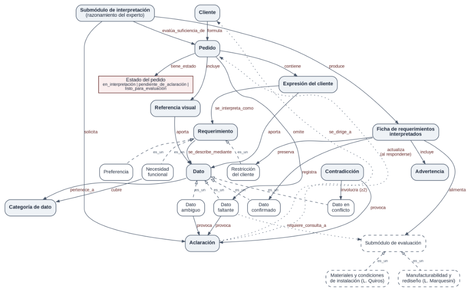
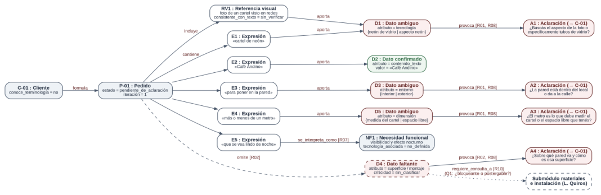
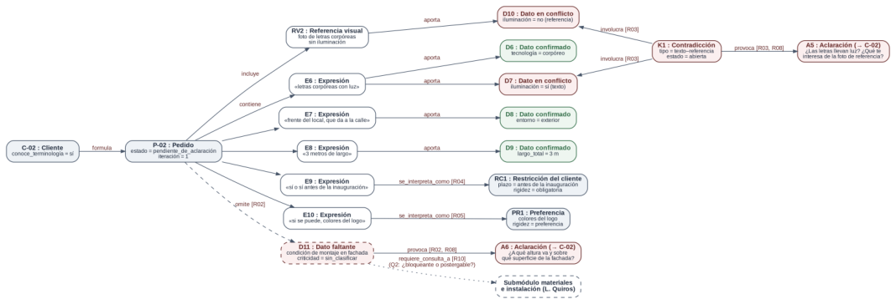

# ACTIVIDAD PI2

INTELIGENCIA ARTIFICIAL

Integrante: Matias Zarandon

Profesores: Ing. Matilde Inés Césari — Ing. María Eugenia Stefanoni

## **b) Revisión del Cuaderno de Conocimiento**

La devolución de PI1 no exigió correcciones de fondo (riesgo verde), pero marcó el punto central de esta etapa: transformar los conceptos y decisiones identificados en relaciones, frames y reglas **sin convertir en definitivos criterios que todavía están pendientes de validación** , en particular la distinción entre información bloqueante y postergable y los criterios concretos de suficiencia.

Al intentar representar formalmente el Cuaderno aparecieron conceptos que estaban implícitos en el flujo, inconsistencias en las relaciones preliminares y reglas que necesitaban condiciones más precisas. Al recorrer los casos de uso regla por regla se detectaron además dos situaciones que el modelo no podía cerrar (una tecnología que quedaba siempre faltante y una advertencia sin regla que la generara) y la necesidad de fijar el orden de disparo de las reglas. Las modificaciones se incorporaron al Cuaderno de Conocimiento y se documentan a continuación.

### **Modificaciones realizadas**

|**N°**|**Tipo**|**Modificación**|**Motivo**|**Sección afectada**|
|---|---|---|---|---|
|**M1**|Concepto faltante|Se incorpora**Expresión del cliente**: fragmento literal del pedido (mensaje, conversación o descripción) que se conserva sin reescribir y del que se derivan los datos.|El flujo trabaja sobre expresiones (etapas 1 y 3) pero el glosario no las definía. Permite trazar cada dato hasta lo que el cliente dijo.|§2 Glosario; Flujo etapas 1 y 3|
|**M2**|Concepto faltante|**Referencia visual**pasa a ser un concepto propio, con un atributo de consistencia respecto del texto.|Figuraba como entrada y en el primer caso límite, pero no en las relaciones de §10.|Entradas; §5; §10|
|**M3**|Generalizació n|Dato confirmado, faltante y ambiguo se modelan como especializaciones de un concepto general**Dato**. Se agrega**Dato en conflicto**.|Comparten atributo, categoría, valor y origen; la jerarquía evita repetir slots y habilita herencia en los frames.|§2 Glosario; §10|
|**M4**|Inconsistencia|**Contradicción**deja de ser un estado del requerimiento y pasa a ser un concepto relacional que involucra al menos dos datos.|§10 decía «Requerimiento puede presentar Contradicción», pero una contradicción no es propiedad de un dato aislado sino de la relación entre dos o más.|§2 Glosario; §10|
|**M5**|Concepto faltante|**Categoría de dato**: producto/tecnología, dimensiones, contexto de uso, entorno, instalación, apariencia y restricciones.|La etapa 2 del flujo separa la información por categorías que no estaban representadas.|Flujo etapa 2|
|**M6**|Estado faltante|**Estado del pedido**: en_interpretación, pendiente_de_aclaración o listo_para_evaluación.|Los puntos de decisión del diagrama implican estos estados sin nombrarlos.|Diagrama de procesos; §1|
|**M7**|Atributo nuevo (pendiente)|Atributo**criticidad**del dato faltante: bloqueante, postergable o sin_clasificar, con valor por defecto _sin_clasificar_. No se asigna ningún dato concreto a cada clase.|La devolución y la excepción 1 indican que la distinción existe, pero el criterio sigue pendiente de adquisición.|§6 Excepciones; §9 pregunta 2|
|**M8**|Atributo nuevo|Atributo**rigidez**del requerimiento: obligatoria, preferencia o a_confirmar.|Representa la duda del caso límite 5 sin forzar una clasificación binaria.|§5; §7 regla 5|
|**M9**|Concepto faltante|**Advertencia**: elemento que viaja en la ficha como incertidumbre y no como hecho confirmado.|La pregunta experta 8 de PI1 no tenía un concepto asociado.|Sección c), pregunta 8|

|**N°**|**Tipo**|**Modificación**|**Motivo**|**Sección afectada**|
|---|---|---|---|---|
|**M10**|Relación y concepto faltantes|Relación**requiere_consulta_a**entre un dato y un submódulo de evaluación, materializada como **Consulta a submódulo**.|La excepción 3 y la regla candidata 10 no tenían relación en §10.|§6; §7 regla 10; §10|
|**M11**|Reglas incompletas|La regla 7 (entorno/instalación) se integra como caso particular de la regla 2. La regla 8 (suficiencia) se reescribe con condiciones explícitas sobre los estados del modelo. La regla 9 (no inventar) pasa a ser también una faceta del slot_origen_.|Las reglas 7 a 9 dependían de condiciones no representadas.|§7 Reglas candidatas|
|**M12**|Reglas faltantes|Se agregan una regla de ciclo (la respuesta a una aclaración reingresa como nueva expresión) y una regla de herencia de incertidumbre hacia la ficha.|La flecha «Nueva info» del diagrama y la pregunta experta 8 no tenían regla asociada.|Diagrama de procesos; §7|
|**M13**|Relación faltante|Relación**omite**(Pedido → Dato faltante): el faltante surge de comparar los datos requeridos con lo aportado, no de una expresión del cliente.|La etapa 4 del flujo detecta ausencias, pero la red no tenía una relación que las representara.|Flujo etapa 4; §7 regla 2|
|**M14**|Relación y criterio faltantes|Relación**cubre**(Necesidad funcional → Categoría de dato). Un atributo requerido de la categoría producto/tecnología queda cubierto si existe una necesidad funcional que describe el efecto buscado.|Con el conjunto provisional de datos requeridos, la tecnología quedaba siempre faltante cuando el cliente describe un efecto: la regla 2 la reclamaba y la regla 6 prohíbe elegirla en este submódulo.|§7 reglas 2, 6 y 8|
|**M15**|Estado faltante|Estado**descartado**del dato y reclasificación de instancias: cuando un dato cambia de estado pasa a la especialización correspondiente.|Al resolver una contradicción o una ambigüedad, los datos no validados no tenían estado y los validados cambiaban de clase sin que el modelo lo describiera.|§2 Glosario; Flujo etapas 5 y 6|
|**M16**|Regla incompleta|La regla de herencia de incertidumbre se amplía a las referencias visuales cuyo alcance quedó restringido tras una aclaración.|La advertencia sobre el alcance de una referencia visual (caso 2) no tenía regla que la generara.|§5 caso límite 1; pregunta experta 8|
|**M17**|Control del razonamiento|Se define una**estrategia de** **resolución de conflictos**(orden de disparo de las reglas) y se establece que sólo la regla de suficiencia asigna el estado listo_para_evaluación.|Una misma expresión podía activar dos reglas (ambigüedad y necesidad funcional), y el demonio de aclaraciones contradecía la regla de suficiencia.|Diagrama de procesos; §7|

**Estado de validación.** PI2 formaliza el conocimiento candidato relevado en PI1. Las reglas mantienen el estado _pendiente de validación con la fuente experta_ hasta completar las sesiones de pensamiento en voz alta previstas. No se fija como definitivo ningún umbral, ningún conjunto de datos obligatorios por tipo de cartel ni ningún criterio de suficiencia; donde el modelo los necesita, se representan como parámetros con valor provisional o «sin clasificar».

### **Conceptos y elementos identificados**

La siguiente tabla clasifica los elementos del modelo según las categorías que pide la consigna (concepto principal, entidad, estado, evento, evidencia, acción y restricción) e indica su origen en el Cuaderno de Conocimiento de PI1. En la red (sección c) los mismos

elementos se tipifican como entidad, concepto o atributo, siguiendo la plantilla de la cátedra.

|**Elemento**|**Tipo**|**Descripción**|**Origen en el Cuaderno**|
|---|---|---|---|
|**Pedido**|Concepto principal|Unidad de trabajo que se interpreta; agrupa expresiones, referencias, datos y aclaraciones.|§2 Glosario; Flujo etapa 1|
|**Requerimiento**|Concepto principal|Necesidad o condición que debe quedar representada para evaluar el trabajo.|§2 Glosario; §10|
|**Dato**|Concepto principal|Valor de un atributo del pedido (p. ej., entorno, dimensión), con estado y origen.|§2 Glosario (generalizado, M3)|
|**Aclaración**|Concepto principal|Pregunta dirigida al cliente para resolver un faltante, una ambigüedad, una contradicción o una rigidez dudosa.|Flujo etapa 6; §10|
|**Ficha de requerimientos** **interpretados**|Concepto principal|Salida estructurada que se deriva a los submódulos de evaluación.|§2 Glosario; Flujo etapa 8|
|**Cliente**|Entidad|Quien formula el pedido y responde las aclaraciones.|§10|
|**Expresión del cliente**|Entidad|Fragmento literal del pedido.|Flujo etapas 1 y 3 (M1)|
|**Referencia visual**|Entidad / evidencia|Imagen o boceto aportado por el cliente.|Entradas; §5 (M2)|
|**Categoría de dato**|Entidad|Agrupación de atributos del pedido.|Flujo etapa 2 (M5)|
|**Contradicción**|Entidad relacional|Incompatibilidad entre dos o más datos del mismo atributo.|§2 Glosario; Flujo etapa 5 (M4)|
|**Restricción del cliente /** **Preferencia / Necesidad** **funcional**|Conceptos (espe cializaciones de Requerimiento)|Tipos de requerimiento según su rigidez y su forma de expresión.|§2 Glosario; §4; §10|
|**Submódulos de evaluación**|Entidades externas|Materiales e instalación (L. Quiros); manufacturabilidad y rediseño (L. Marquesini).|Interacción con submódulos; §10|
|**Advertencia / Consulta a** **submódulo**|Entidades|Incertidumbre que viaja en la ficha; consulta sobre la necesidad o criticidad de un dato.|Pregunta 8; §6 (M9, M10)|
|**Estado del dato**|Estado|confirmado, faltante, ambiguo, en_conflicto, descartado.|§2 Glosario (M15)|
|**Estado del pedido**|Estado|en_interpretación, pendiente_de_aclaración, listo_para_evaluación.|Diagrama de procesos (M6)|
|**Rigidez**|Estado|obligatoria, preferencia, a_confirmar.|§5; §7 (M8)|
|**Criticidad del faltante**|Estado (pendiente)|bloqueante, postergable, sin_clasificar.|§6; devolución PI1 (M7)|
|**Recepción del pedido**|Evento|Ingreso del pedido y del material adjunto.|Flujo etapa 1|
|**Detección de ambigüedad /** **faltante / contradicción**|Eventos|Momento en que el experto reconoce un problema interpretativo.|Flujo etapas 3 a 5|
|**Respuesta a una aclaración**|Evento|Nueva información que reinicia el ciclo de interpretación.|Diagrama («Nueva info»)|
|**Derivación del caso**|Evento|Envío de la ficha a los submódulos de evaluación.|Flujo etapa 8|
|**Expresión literal, valor** **informado, referencia visual**|Evidencias|Lo que el cliente efectivamente aportó.|Flujo etapa 1; §2|

|**Elemento**|**Tipo**|**Descripción**|**Origen en el Cuaderno**|
|---|---|---|---|
|**Declaración explícita de** **obligatoriedad o de deseo**|Evidencia|Forma en que el cliente presenta una condición.|§4; §7 reglas 4 y 5|
|**Ausencia de valor para un** **dato requerido**|Evidencia|Falta de información necesaria para otro submódulo.|Flujo etapa 4; §7 regla 2 (M13)|
|**Extraer, interpretar, solicitar** **aclaración, registrar,** **mantener conflicto,** **descartar, consultar,** **derivar**|Acciones|Operaciones del razonamiento experto.|Flujo etapas 1 a 8|
|**No inventar valores; no** **elegir una interpretación en** **silencio; no resolver** **cuestiones de otros** **submódulos; no promover** **preferencias a restricciones**|Restricciones del conocimiento|Límites que el razonamiento no puede violar.|§1 Alcance; §7 reglas 1, 5, 9 y 10; Criterio de validez|

### **Relaciones identificadas**

Las relaciones tienen dirección y se nombran con verbos. Para cada una se indica si es **determinística** (se establece siempre que existan los nodos) o **heurística** (depende del juicio del experto), su cardinalidad y la parte del Cuaderno de la que surge. Se usa el prefijo RL para no confundirlas con las reglas (R01 a R13).

|**ID**|**Nodo origen**|**Relación**|**Nodo destino**|**Tipo**|**Card.**|**Origen en PI1**|
|---|---|---|---|---|---|---|
|**RL01**|Cliente|formula|Pedido|Det.|1:N|§10|
|**RL02**|Pedido|contiene|Expresión del cliente|Det.|1:N|Flujo etapa 1; §10|
|**RL03**|Pedido|incluye|Referencia visual|Det.|1:N|Entradas (M2)|
|**RL04**|Pedido|tiene_estado|Estado del pedido|Det.|N:1|Diagrama (M6)|
|**RL05**|Expresión del cliente|se_interpreta_co mo|Requerimiento|Heur.|N:N|Flujo etapa 3; §10|
|**RL06**|Expresión del cliente|aporta|Dato|Heur.|1:N|Flujo etapas 1 y 2|
|**RL07**|Referencia visual|aporta|Dato|Heur.|1:N|Entradas; §5|
|**RL08**|Requerimiento|se_describe_med iante|Dato|Det.|1:N|§10 (reformulada)|
|**RL09**|Dato|pertenece_a|Categoría de dato|Det.|N:1|Flujo etapa 2 (M5)|
|**RL10**|Contradicción|involucra|Dato en conflicto|Det.|N:M (≥ 2 por contradicción )|Flujo etapa 5 (M4)|
|**RL11**|Dato faltante / Dato ambiguo / Contradicción|provoca|Aclaración|Det.|1:1|Diagrama; §7 reglas 1 a 3|
|**RL12**|Submódulo de interpretación|solicita|Aclaración|Det.|1:N|§10|
|**RL13**|Aclaración|se_dirige_a|Cliente|Det.|N:1|Flujo etapa 6|
|**RL14**|Aclaración (respondida)|actualiza|Pedido|Det.|N:1|Diagrama («Nueva info»)|
|**RL15**|Submódulo de interpretación|evalúa_suficienci a_de|Pedido|Det.|1:N|Tarea secundaria de evaluación|
|**RL16**|Dato faltante|requiere_consulta _a|Submódulo de evaluación|Heur.|N:1|§6 excepción 3; §7 regla 10 (M10)|

|**ID**|**Nodo origen**|**Relación**|**Nodo destino**|**Tipo**|**Card.**|**Origen en PI1**|
|---|---|---|---|---|---|---|
|**RL17**|Submódulo de interpretación|produce|Ficha de requerimientos interpretados|Det.|1:N|§10|
|**RL18**|Ficha|registra|Dato confirmado|Det.|1:N|§2 Glosario|
|**RL19**|Ficha|preserva|Restricción del cliente|Det.|1:N|§7 regla 4|
|**RL20**|Ficha|incluye|Advertencia|Det.|1:N|Pregunta experta 8 (M9)|
|**RL21**|Ficha|alimenta|Submódulo de evaluación|Det.|N:N|§10|
|**RL22**|Especializaciones (ver tabla de jerarquías)|es_un|Dato / Requerimiento / Submódulo de evaluación|Det.|N:1|§2; §10; PG0|
|**RL23**|Pedido|omite|Dato faltante|Det.|1:N|Flujo etapa 4; §7 regla 2 (M13)|
|**RL24**|Necesidad funcional|cubre|Categoría de dato|Heur.|N:1|§7 regla 6 (M14)|

## **c) Red Semántica Conceptual**

La red representa el conocimiento del submódulo como un grafo dirigido. Los nodos son conceptos del dominio y las aristas son relaciones nombradas con verbos. Se organiza en tres zonas que siguen el razonamiento del experto descripto en PI1:

- **Entrada:** Cliente, Pedido, Expresión del cliente y Referencia visual. Representan lo que el cliente aportó, conservado de forma literal.

- **Núcleo interpretativo:** Requerimiento, Dato, Categoría de dato y Contradicción, con sus especializaciones. Aquí se registra qué se entendió, qué falta, qué es ambiguo y qué está en conflicto.

- **Salida:** Aclaración (que vuelve al Cliente y reabre el ciclo) y Ficha de requerimientos interpretados (que alimenta a los submódulos de evaluación, junto con las advertencias).

#### **Nodos de la red**

El tipo de cada nodo sigue la plantilla de la cátedra (entidad, concepto o atributo). Los sinónimos registran cómo puede aparecer cada concepto en el lenguaje del fabricante o del cliente; servirán para eliminar redundancias al integrar la red grupal en PG1.

|**ID**|**Nodo / Concepto**|**Tipo**|**Descripción**|**Sinónimos**|
|---|---|---|---|---|
|N01|Cliente|Entidad|Quien formula el pedido y responde aclaraciones|Solicitante, comitente|
|N02|Pedido|Entidad|Unidad de trabajo que se interpreta|Solicitud, encargo, consulta|
|N03|Expresión del cliente|Entidad|Fragmento literal del pedido|Frase, mención|
|N04|Referencia visual|Entidad|Imagen o boceto aportado por el cliente|Foto de referencia, boceto, ejemplo|
|N05|Requerimiento|Concepto|Necesidad o condición a representar|Requisito, necesidad|
|N06|Restricción del cliente|Concepto (especialización)|Condición declarada como obligatoria|Condición obligatoria, exigencia|
|N07|Preferencia|Concepto (especialización)|Característica deseada y negociable|Deseo, condición negociable|
|N08|Necesidad funcional|Concepto (especialización)|Efecto o uso buscado sin solución técnica|Efecto buscado, intención de uso|
|N09|Dato|Concepto|Valor de un atributo del pedido con estado y origen|Información del pedido|
|N10|Dato confirmado|Concepto (especialización)|Dato aportado, claro y consistente|Dato validado|
|N11|Dato faltante|Concepto (especialización)|Dato requerido que no fue aportado|Pendiente, dato a solicitar|
|N12|Dato ambiguo|Concepto (especialización)|Dato con más de una lectura o precisión insuficiente|Dato impreciso|
|N13|Dato en conflicto|Concepto (especialización)|Dato incompatible con otro del mismo atributo|Dato inconsistente|
|N14|Categoría de dato|Concepto|Agrupación de atributos del pedido|Aspecto del pedido|
|N15|Contradicción|Concepto|Incompatibilidad entre dos o más datos|Inconsistencia, conflicto|
|N16|Aclaración|Concepto|Pregunta al cliente para resolver un problema interpretativo|Repregunta, consulta al cliente|

|**ID**|**Nodo / Concepto**|**Tipo**|**Descripción**|**Sinónimos**|
|---|---|---|---|---|
|N17|Ficha de requerimientos interpretados|Entidad|Salida estructurada del submódulo|Ficha técnica interpretada|
|N18|Advertencia|Concepto|Incertidumbre que viaja en la ficha|Reserva, observación|
|N19|Estado del pedido|Atributo (estado)|Situación del pedido en el ciclo de interpretación|Situación del pedido|
|N20|Submódulo de interpretación|Entidad|Agente que razona (rol del experto)|Intérprete, proyectista|
|N21|Submódulo de evaluación|Entidad (externa)|Interfaz con los submódulos siguientes|Módulo de evaluación|
|N22|Materiales y condiciones de instalación|Entidad (externa)|Submódulo de L. Quiros|SM materiales|
|N23|Manufacturabilidad y rediseño|Entidad (externa)|Submódulo de L. Marquesini|SM rediseño|

La «Consulta a submódulo» no se dibuja como nodo en la red conceptual: se representa mediante la relación requiere_consulta_a (RL16) y se materializa como frame y como instancia en los casos de uso.

#### **Jerarquías y especializaciones**

|**Concepto general**|**Conceptos especializados**|**Criterio de especialización**|**Origen**|
|---|---|---|---|
|**Dato**|Dato confirmado, Dato faltante, Dato ambiguo, Dato en conflicto|Estado de la información: aportada y consistente, ausente, con varias lecturas o incompatible con otra. Una instancia cambia de especialización cuando cambia su estado (M15).|§2 Glosario (M3)|
|**Requerimiento**|Restricción del cliente, Preferencia, Necesidad funcional|Rigidez y forma de expresión: obligatoria, deseada o descripta como efecto|§2 Glosario; §10|
|**Submódulo de** **evaluación**|Materiales y condiciones de instalación; Manufacturabilidad y rediseño|Dominio experto que evalúa la ficha|PG0|

#### **Asociaciones relevantes**

- **provoca** conecta los problemas interpretativos con la acción experta: un dato faltante, uno ambiguo o una contradicción generan una aclaración. Es la traducción directa de los puntos de decisión del diagrama de PI1.

- **involucra** vincula una contradicción con dos o más datos en conflicto, en lugar de tratarla como estado de un dato (M4).

- **omite** representa que un faltante no nace de lo que el cliente dijo sino de lo que no dijo: surge de comparar los datos requeridos con los aportados (M13).

- **cubre** permite que una necesidad funcional satisfaga el requisito de tecnología sin que este submódulo elija una solución técnica (M14).

- **requiere_consulta_a** representa la excepción en la que no corresponde decidir dentro de la interpretación si un dato es necesario, sino consultarlo con el submódulo dueño de ese conocimiento.

- **actualiza** cierra el ciclo: una aclaración respondida reingresa al pedido como nueva información.

> *Texto del diagrama (OCR):*
‘Submédulo de interpretacién (razonamiento del experto) Nemes > Pedido SS ‘ene estado _fncluye contiene produce Estado del pedido , ; en_interpretacion | pendiente_de_actaracién | Expresi6n del cliente isto_para_evaluacion Cs) somepeceone . - botota avora crite +, ~ --=” R anina "+, (Float requerimientos 177 ~ “eanean 7 ealche (se.(se_descrbe_medianedesre meat eses.n aresena - cq cos aulaQatualza ay  \incluye\inst Necesidad eG.aK MI ->Restricciénettente eee - wn) eefo (=) ! s . tee! ; Dato Dato Dato J D> >> {dato en provoca /provoca Ope. cegitere_consuta_a ~ ng yer" \(\  Materialesde instalaciony condiciones,(L. Quiros) | redisefioManufacturabilidad(L. Marquesini) y ~\1 

_Figura 1. Red semántica conceptual del submódulo de interpretación técnica de requerimientos y restricciones del cliente._

**Convenciones:** caja gris con texto en negrita: concepto principal o entidad · caja blanca: especialización · borde discontinuo: concepto externo de otro submódulo · borde bordó: conjunto de valores de estado · flecha continua con verbo: asociación dirigida · flecha discontinua con punta hueca: es_un · flecha punteada: interacción (pregunta al cliente, consulta a otro submódulo o reingreso de la respuesta).

## **d) Casos de uso e instanciación**

Se seleccionaron dos casos representativos que cubren los casos típicos y límite del Cuaderno: un pedido en lenguaje no técnico con varias ambigüedades y un pedido con una restricción explícita, una preferencia y una contradicción entre el texto y la referencia visual. El segundo retoma el caso de uso concreto planteado en PG0 (cartel corpóreo para exterior).

**Alcance de los casos.** Los textos de los pedidos son ilustrativos: se construyeron a partir de las situaciones descriptas en §4 y §5 del Cuaderno y no son transcripciones de pedidos reales. Deberán contrastarse con los pedidos históricos que aporte la fuente experta. Como conjunto de datos requeridos se usa provisoriamente el de las entradas definidas en PG0 y PI1 (tecnología, dimensiones, entorno, instalación, apariencia/contenido y restricciones); su versión por tipo de cartel sigue pendiente de relevamiento.

### **Caso 1 — Pedido en lenguaje no técnico con ambigüedades (P-01)**

_«Hola! Quiero un cartel de neón con el nombre del café,_ **_Café Andino_** _, para poner en la pared. Más o menos de un metro. Que se vea lindo de noche. Te paso una foto de uno que vi en Instagram.»_

#### **Instancias involucradas**

|**Instancia**|**Frame**|**Valores relevantes**|**Regla**|
|---|---|---|---|
|**C-01**|Cliente|conoce_terminología = no (describe efectos, no soluciones)|—|
|**P-01**|Pedido|estado = pendiente_de_aclaración; iteración = 1|R11 (no se cumple)|
|**E1–E5**|Expresión del cliente|«cartel de neón», «Café Andino», «para poner en la pared», «más o menos de un metro», «que se vea lindo de noche»|—|
|**RV1**|Referencia visual|foto de un cartel visto en redes; consistente_con_texto = sin_verificar|—|
|**D1**|Dato ambiguo|tecnología: {neón de vidrio | aspecto neón}|R01|
|**D2**|Dato confirmado|contenido_texto = «Café Andino»; origen = cliente|—|
|**D3**|Dato ambiguo|entorno: {interior | exterior}. «La pared» no indica si da a la calle|R01|
|**D4**|Dato faltante|superficie / montaje; criticidad = sin_clasificar; el pedido lo omite (RL23)|R02, R10|
|**D5**|Dato ambiguo|dimensión: {medida del cartel | espacio libre} (caso límite 2)|R01|
|**NF1**|Necesidad funcional|visibilidad y efecto nocturno; tecnología_asociada = no_definida|R07|
|**A1–A4**|Aclaración|dirigidas a C-01; A1 a A3 por ambigüedad, A4 por faltante; formulación = en_términos_de_uso|R01, R02, R08|
|**Q1**|Consulta a submódulo|¿D4 es bloqueante o postergable? → Materiales e instalación|R10|

#### **Recorrido conceptual**

1. **Recepción y estructuración.** P-01 se registra con cinco expresiones y una referencia visual. Cada expresión se conserva literal (faceta inmutable de _texto_literal_ ) y se asocia a una categoría de dato.

2. **Interpretación de intención.** E5 no nombra una tecnología sino un efecto: se interpreta como la necesidad funcional NF1 y la selección técnica queda para los módulos de evaluación (R07). No se infiere «neón LED» a partir de «que se vea lindo». E1 («cartel de neón») activa tanto R01 como R07; por la estrategia de resolución de conflictos se dispara primero R01, porque «neón» todavía admite dos lecturas.

3. **Detección de ambigüedades.** E1, E3 y E4 admiten más de una lectura razonable, por lo que generan D1, D3 y D5 en estado ambiguo y sin valor asignado (R01). En particular, no se elige en silencio si el metro es el tamaño del cartel o el espacio disponible.

4. **Identificación de faltantes.** Al comparar _datos_requeridos_ con lo aportado, ninguna expresión informa sobre la superficie o el montaje: el pedido los omite (RL23) y se crea D4 como faltante con criticidad _sin_clasificar_ (R02). Como saber si este dato bloquea la evaluación depende del conocimiento de materiales e instalación, se genera la consulta Q1 a ese submódulo (R10).

5. **Formulación de aclaraciones.** Como C-01 no maneja terminología técnica, A1 a A4 se formulan en términos de uso y condiciones observables (R08): por ejemplo, «¿la pared está dentro del local o da a la calle?» en lugar de «¿el cartel es para interior o exterior?».

6. **Evaluación de suficiencia.** Hay datos ambiguos sobre atributos requeridos y un faltante sin clasificar, por lo que R11 no se cumple y P-01 queda en _pendiente_de_aclaración_ .

#### **Segunda iteración**

El cliente responde: «Es adentro, en la pared detrás del mostrador. El metro es lo que tiene que medir el cartel de largo. Quiero que se vea como el de la foto, no me importa si es de vidrio». La respuesta reingresa como nueva expresión con fuente _respuesta_a_aclaración_ (R13). D3 se reclasifica como Dato confirmado (entorno = interior) y D5 como Dato confirmado (largo del cartel ≈ 1 m). Para D1 el cliente elige el aspecto y no la tecnología: D1 pasa a _descartado_ y, por R07, NF1 amplía su efecto buscado («aspecto similar a RV1») y **cubre** la categoría producto/tecnología (RL24). Por eso R02 no reclama la tecnología como faltante: su selección corresponde a los submódulos de evaluación (M14). RV1 pasa a consistente_con_texto = sí. El avance depende de Q1:

- si el submódulo de materiales e instalación indica que la superficie puede relevarse más adelante, D4 pasa a _postergable_ , R11 se cumple y P-01 queda _listo_para_evaluación_ ; al crear la ficha, R12 registra la advertencia AV1. A4 sigue pendiente, pero no bloquea: sólo R11 asigna el estado del pedido (M17);

- si lo considera bloqueante, P-01 permanece en _pendiente_de_aclaración_ hasta que el cliente responda A4.

De esta forma el modelo representa ambos caminos sin decidir dentro del submódulo un criterio que todavía no fue validado.

### **Caso 2 — Pedido con restricción explícita y contradicción (P-02)**

_«Necesito letras corpóreas con luz para el frente del local, que da a la calle. 3 metros de largo. Tienen que estar_ **_sí o sí_** _antes de la inauguración._ **_Si se puede_** _, en los colores del logo. Adjunto foto de referencia.»_ (La foto muestra letras corpóreas sin iluminación.)

#### **Instancias involucradas**

|**Instancia**|**Frame**|**Valores relevantes**|**Regla**|
|---|---|---|---|
|**C-02**|Cliente|conoce_terminología = sí (usa «letras corpóreas»)|—|
|**P-02**|Pedido|estado = pendiente_de_aclaración; iteración = 1|R11 (no se cumple)|
|**E6–E10**|Expresión del cliente|«letras corpóreas con luz», «frente del local, que da a la calle», «3 metros de largo», «sí o sí antes de la inauguración», «si se puede, colores del logo»|—|
|**RV2**|Referencia visual|letras corpóreas sin iluminación; consistente_con_texto = no|R03|
|**D6, D8, D9**|Dato confirmado|tecnología = corpóreo; entorno = exterior; largo_total = 3 m|—|
|**D7, D10**|Dato en conflicto|iluminación = sí (texto) / iluminación = no (referencia)|R03|
|**K1**|Contradicción|tipo = texto–referencia; estado = abierta; involucra D7 y D10|R03|
|**D11**|Dato faltante|condición de montaje en fachada; criticidad = sin_clasificar; el pedido lo omite (RL23)|R02, R10|
|**RC1**|Restricción del cliente|plazo = antes de la inauguración; rigidez = obligatoria|R04|
|**PR1**|Preferencia|colores del logo; rigidez = preferencia|R05|
|**A5, A6**|Aclaración|A5 resuelve K1; A6 pide el dato de montaje; formulación = técnica|R03, R02, R08|
|**Q2**|Consulta a submódulo|¿D11 es bloqueante o postergable? → Materiales e instalación|R10|

#### **Recorrido conceptual**

1. **Datos explícitos.** E6, E7 y E8 aportan datos claros y consistentes, que se registran como confirmados con origen «cliente». El experto no agrega valores que el cliente no dio (R09): por ejemplo, no se asume una altura de letras a partir del largo total.

2. **Control de consistencia.** El texto indica letras «con luz» y la referencia muestra letras sin iluminación. Son valores incompatibles del mismo atributo, por lo que el submódulo no elige una de las dos versiones: crea la contradicción K1, que involucra a D7 y D10 como datos en conflicto, y genera A5 (R03). La pregunta no propone una solución técnica: pide confirmar la iluminación y qué rescata el cliente de la foto.

3. **Clasificación de condiciones.** «Sí o sí» es una declaración explícita de obligatoriedad, por lo que el plazo se registra como restricción del cliente RC1 (R04). «Si se puede» expresa un deseo, por lo que los colores se registran como preferencia PR1 y no se transforman en una restricción rígida (R05).

4. **Faltantes y consultas.** El pedido omite la información sobre el montaje en la fachada (RL23): D11 queda faltante y sin clasificar; se solicita a C-02 (A6) y se consulta su criticidad al submódulo de materiales e instalación (Q2). Como C-02 maneja la terminología, A5 y A6 se formulan en términos técnicos (R08).

5. **Evaluación de suficiencia.** Con K1 abierta, R11 no se cumple y P-02 queda _pendiente_de_aclaración_ . RC1 ya está registrada y condicionará la evaluación de manufacturabilidad cuando la ficha se derive.

#### **Segunda iteración y ficha resultante**

El cliente responde: «Sí, llevan luz; la foto era por la tipografía. Van sobre la marquesina, a 4 metros de altura». La respuesta reingresa como nueva expresión (R13). K1 pasa a _resuelta_ con resolución = D7: D7 se reclasifica como Dato confirmado y D10 pasa a _descartado_ (M15). RV2.aporta_sobre se restringe a la categoría apariencia (tipografía). D11 recibe valor con origen «respuesta_a_aclaración» y se reclasifica como confirmado, por lo que Q2 pasa a _innecesaria_ . Se cumplen las condiciones de R11 y se genera la ficha; al crearla, R12 detecta el alcance restringido de RV2 y genera la advertencia AV2:

|**Sección de la ficha FR-02**|**Contenido**|
|---|---|
|**Datos confirmados**|tecnología = corpóreo; iluminación = sí; entorno = exterior; largo_total = 3 m; montaje = sobre marquesina a 4 m de altura|
|**Restricciones del cliente**|RC1: plazo antes de la inauguración (obligatoria)|
|**Preferencias**|PR1: colores del logo (negociable)|
|**Necesidades funcionales**|—|
|**Advertencias**|AV2: la referencia visual RV2 sólo es válida para la tipografía, no para la iluminación (R12)|
|**Destinatarios**|Materiales y condiciones de instalación; Manufacturabilidad y rediseño|

## **e) Red Semántica Instanciada**

Las redes instanciadas muestran los casos 1 y 2 al cierre de la primera iteración, que es el momento de mayor carga interpretativa. Cada nodo es una instancia (identificador : frame) con sus valores relevantes, y las aristas usan exclusivamente los verbos definidos en la red conceptual (RL01 a RL24). Junto a cada relación generada por inferencia se indica entre corchetes la regla que la produce, lo que permite seguir el razonamiento desde la expresión del cliente hasta la acción experta.

#### **Lectura de la Figura 2 (caso P-01)**

Se lee de izquierda a derecha: el cliente formula el pedido; el pedido contiene cinco expresiones e incluye una referencia; cada expresión aporta un dato o se interpreta como necesidad funcional, y cada dato problemático provoca una aclaración. Tres de las cinco expresiones terminan en datos ambiguos. D4 no proviene de ninguna expresión: surge de que el pedido omite un dato requerido (RL23, R02). D2 es el único dato confirmado y NF1 conserva la necesidad sin convertirla en una tecnología. La relación requiere_consulta_a, materializada como la consulta Q1, muestra el punto en el que el submódulo deriva una decisión que no le corresponde.

#### **Lectura de la Figura 3 (caso P-02)**

La mayoría de los datos son confirmados (en verde), lo que refleja un cliente con vocabulario técnico. El nodo central del caso es K1: involucra dos datos del mismo atributo, provenientes de fuentes distintas (texto y referencia), y provoca una única aclaración. En la parte inferior se ve la distinción entre RC1 (obligatoria) y PR1 (preferencia). RC1 no se conecta todavía con el submódulo de manufacturabilidad: lo condicionará a través de la ficha (RL19 y RL21) cuando P-02 esté listo para evaluación, sin que el submódulo de interpretación evalúe si el plazo es factible.

Las dos figuras se presentan a continuación en orientación horizontal.

> *Texto del diagrama (OCR):*
RVI; Referencia visual inctuye EL; Expresion sortapor {ne6nDi,aruo de vidrioDato secre| aspectoambiguo nedn} prove R01, ROS especificamentedbuscsAi Aelaracion daspecb tubos de(~ dela€-07) vidrio?ou E2«Cale: ExpresionAndino»; score, Dz,atributo‘valorDato== «Café Andino» contenido_texto confimado ; P01; Pedido ; DB, Dato ambiguo — Fa: Relaracion (6-09 conoce_terminologiaG01; cliente= no| formula 6 esado=pendioneiteracion de= 1 acaracn «para3:ponerExpresionen la pared» agora aoa{interior| exterior}ere Rot, Rog aimedodaalacalle? esa derdo dtiocy . . nace: Expresion apora Srbuos aman provoca (ROL, RO atinersesloquedebe rectel ‘ >» resid Sl ant Toop ie) ITeM sea nese . 5, . : ca nternetawerreta_ comecomo [R07 cereTFL;VisbliiodyNecesidad seco nocurefuncional S SS se mite (R02) — prove (02, R08) Ba‘BaiRelaacionquepre(—fy ino©-03) (( {BA Baoaltante ae wrrecce a wtMetbedadeeeSneSastiar” (ox ebioquante ops) = = = =~ = =~ ~~, *”) 1”+ einstalacionSubmédulo materiales")(L-Quios) | 

_Figura 2. Red semántica instanciada del caso 1 (pedido P-01) al cierre de la primera iteración._

**Verde:** dato confirmado · **Bordó:** dato problemático, contradicción o aclaración · **Discontinuo:** dato omitido por el pedido o elemento de otro submódulo · **Punteado:** consulta a otro submódulo · **[Rxx]:** regla que genera la relación.

> *Texto del diagrama (OCR):*
_————___ —— ‘porta_——_ - invotucea (Rog_—-\_" estado= aber iteresa de la fot de telsrencia? incuye a — fuera (R95) — -02 : Cliente tormola—.(caugy P03; Pedido _—_ EB: Expresion apona D8: Dato confirmado a .— ‘RC1 : Restricci6n del client somite (R02) ‘Ss xpresion _se_interpreta_como [RO ‘PRI : Preferencia ee eee (Q2: cbloquéanteo pastergabie?) + enc ees | 

_Figura 3. Red semántica instanciada del caso 2 (pedido P-02) al cierre de la primera iteración._

**Verde:** dato confirmado · **Bordó:** dato problemático, contradicción o aclaración · **Discontinuo:** dato omitido por el pedido o elemento de otro submódulo · **Punteado:** consulta a otro submódulo · **[Rxx]:** regla que genera la relación.

## **f) Diccionario de Frames**

Cada concepto principal de la red se representa como un frame. Los **slots** son los atributos del concepto y las **facetas** expresan su tipo, los valores permitidos, la cardinalidad, el valor por defecto y las restricciones. Los **demonios** son procedimientos asociados a un slot que se ejecutan cuando su valor se necesita ( _si_necesario_ ), se agrega ( _si_añadido_ ) o se modifica ( _si_modificado_ ). Los frames especializados heredan todos los slots de su frame padre y sólo agregan o restringen lo que cambia.

Cada frame indica además su **origen** en el Cuaderno, su **trazabilidad** (reglas y relaciones que lo usan) y **ejemplos de instanciación** tomados de los casos de uso.

#### **Estructura de herencia**

|**Frame**|**Hereda de**|**Especializaciones**|
|---|---|---|
|**Pedido**|— (raíz)|—|
|**Cliente**|— (raíz)|—|
|**Expresión del cliente**|— (raíz)|—|
|**Referencia visual**|— (raíz)|—|
|**Dato (abstracto)**|— (raíz)|Dato confirmado, Dato faltante, Dato ambiguo, Dato en conflicto|
|**Contradicción**|— (raíz)|—|
|**Requerimiento (abstracto)**|— (raíz)|Restricción del cliente, Preferencia, Necesidad funcional|
|**Aclaración**|— (raíz)|—|
|**Consulta a submódulo**|— (raíz)|—|
|**Ficha de requerimientos interpretados**|— (raíz)|—|
|**Advertencia**|— (raíz)|—|
|**Submódulo de evaluación (externo)**|— (raíz)|Materiales e instalación; Manufacturabilidad y rediseño|

|**FRAME: PEDIDO** **Descripción**|Unidad de trabajo que e y el resultado de la inter|l submódulo interpreta. Agrupa pretación.|todo lo aportado por el cliente|
|---|---|---|---|
|**Origen**|SM Interpretación (M. Z procesos.|arandon). PI1: glosario §2, flujo|etapas 1 y 8, diagrama de|
|**Trazabilidad**|Reglas que lo usan: R0|2, R11, R13. Relaciones: RL01|–RL04, RL14, RL15, RL23.|
|**Herencia**|Frame raíz.|||
|**Slot**|**Tipo / valores** **permitidos**|**Facetas (cardinalidad,** **defecto, restricciones)**|**Demonio**|
|**id_pedido**|Texto|Cardinalidad 1; obligatorio; único|—|
|**cliente**|Instancia de CLIENTE|Cardinalidad 1; obligatorio|—|
|**expresiones**|Lista de EXPRESIÓN|Cardinalidad 1..n|si_añadido: clasificar por categoría y evaluar R01, R02 y R07 según el orden de disparo|
|**referencias_visuales**|Lista de REFERENCIA VISUAL|Cardinalidad 0..n|si_añadido: verificar consistencia con los datos del texto (R03)|
|**datos**|Lista de DATO|Cardinalidad 0..n|si_modificado: reevaluar contradicciones y suficiencia (R03, R11)|
|**requerimientos**|Lista de REQUERIMIENTO|Cardinalidad 0..n|—|
|**contradicciones**|Lista de CONTRADICCIÓN|Cardinalidad 0..n|—|
|**aclaraciones**|Lista de ACLARACIÓN|Cardinalidad 0..n|si_añadido: recalcular estado (no lo asigna directamente)|
|**datos_requeridos**|Lista de (categoría, atributo)|Cardinalidad 1..n; valor provisional tomado de las entradas de PG0/PI1; pendiente de validación por tipo de pedido. Un elemento está cubierto si existe un Dato confirmado para el atributo o, en producto_tecnología, una Necesidad funcional que cubre la categoría (M14)|si_necesario: obtener el conjunto validado para el tipo de pedido|
|**estado**|{en_interpretación, pe ndiente_de_aclaració n, listo_para_evaluaci ón}|Cardinalidad 1; defecto en_interpretación; sólo R11 asigna listo_para_evaluación (M17)|si_necesario: listo_para_evaluación si se cumple R11; si no, pendiente_de_aclaración si hay aclaraciones o consultas pendientes; si no, en_interpretación|
|**iteración**|Entero ≥ 1|Cardinalidad 1; defecto 1; sólo la incrementa R13|—|
|**Ejemplos de** **instanciación**|P-01(estado = pendient listo_para_evaluación, i|e_de_aclaración, iteración = 1) teración = 2)|· P-02(estado =|

##### **FRAME: CLIENTE**

|**Descripción**|Persona u organización|que formula el pedido y respo|nde las aclaraciones.|
|---|---|---|---|
|**Origen**|PI1 §10 (Cliente formul|a Pedido); excepción 2 de §6.||
|**Trazabilidad**|Reglas: R08. Relacione|s: RL01, RL13.||
|**Herencia**|Frame raíz.|||
|**Slot**|**Tipo / valores** **permitidos**|**Facetas (cardinalidad,** **defecto, restricciones)**|**Demonio**|
|**identificación**|Texto|Cardinalidad 1|—|
|**conoce_terminología**|{sí, no, desconocido}|Cardinalidad 1; defecto desconocido|si_necesario: estimar a partir del vocabulario de sus expresiones; si no es posible, desconocido|
|**pedidos**|Lista de PEDIDO|Cardinalidad 1..n|—|
|**Ejemplos de** **instanciación**|C-01(conoce_terminolo|gía = no) · C-02(conoce_termin|ología = sí)|

##### **FRAME: EXPRESIÓN DEL CLIENTE**

|**Descripción**|Fragmento literal del pe|dido. Es la evidencia primaria d|e la interpretación.|
|---|---|---|---|
|**Origen**|PI1 flujo etapas 1 y 3 (m|odificación M1).||
|**Trazabilidad**|Reglas: R01, R04, R05,|R07, R13. Relaciones: RL02, R|L05, RL06.|
|**Herencia**|Frame raíz.|||
|**Slot**|**Tipo / valores** **permitidos**|**Facetas (cardinalidad,** **defecto, restricciones)**|**Demonio**|
|**texto_literal**|Texto|Cardinalidad 1; obligatorio; inmutable (no se reescribe ni se completa)|—|
|**fuente**|{mensaje, conversación, boceto, respuesta_a_aclaraci ón}|Cardinalidad 1|—|
|**categorías**|Lista de CATEGORÍA DE DATO|Cardinalidad 0..n|—|
|**interpretaciones_posible** **s**|Lista de texto|Cardinalidad 1..n|si_añadido: si hay más de una, disparar R01 (con prioridad sobre R07)|
|**interpretación_elegida**|Texto o nulo|Cardinalidad 0..1; defecto nulo; sólo se asigna si existe una única interpretación o la confirma el cliente|—|
|**Ejemplos de** **instanciación**|E4(texto_literal = «más del cartel, espacio libre])|o menos de un metro», interpret · E9(texto_literal = «sí o sí ant|aciones_posibles = [medida es de la inauguración»)|

|**FRAME: REFERENC**|**IA VISUAL**|||
|---|---|---|---|
|**Descripción**|Imagen, foto o boceto a|portado por el cliente.||
|**Origen**|PI1 entradas; caso límit|e 1 de §5 (M2).||
|**Trazabilidad**|Reglas: R03, R12. Rela|ciones: RL03, RL07.||
|**Herencia**|Frame raíz.|||
|**Slot**|**Tipo / valores** **permitidos**|**Facetas (cardinalidad,** **defecto, restricciones)**|**Demonio**|
|**descripción**|Texto|Cardinalidad 1|—|
|**aporta_sobre**|Lista de CATEGORÍA DE DATO|Cardinalidad 1..n; puede restringirse tras una aclaración|si_modificado: si se restringe, registrar alcance limitado para R12|
|**consistente_con_texto**|{sí, no, sin_verificar}|Cardinalidad 1; defecto sin_verificar|si_modificado: si toma el valor «no», crear CONTRADICCIÓN (R03)|
|**Ejemplos de** **instanciación**|RV1(foto de redes, con iluminación, consistente|sistente_con_texto = sin_verifi _con_texto = no; aporta_sobr|car → sí) · RV2(letras sin e = [apariencia] tras A5)|

|**FRAME: DATO (**|**abstracto)**|||
|---|---|---|---|
|**Descripción**|Valor de un atributo del directamente.|pedido junto con su estado y su|procedencia. No se instancia|
|**Origen**|PI1 glosario §2 (genera|lización M3).||
|**Trazabilidad**|Reglas: R01, R02, R03|, R09, R11. Relaciones: RL06–R|L11, RL16, RL18, RL23.|
|**Herencia**|Frame raíz. Especializa en conflicto. Una instan (M15).|ciones: Dato confirmado, Dato f cia cambia de especialización c|altante, Dato ambiguo, Dato uando cambia su estado|
|**Slot**|**Tipo / valores** **permitidos**|**Facetas (cardinalidad,** **defecto, restricciones)**|**Demonio**|
|**atributo**|Texto (p. ej., tecnología, entorno, largo_total)|Cardinalidad 1; obligatorio|—|
|**categoría**|{producto_tecnología, dimensiones, contexto_de_uso, entorno, instalación, apariencia, restricciones}|Cardinalidad 1. En la categoría restricciones el dato guarda el valor de la condición (p. ej., la fecha límite); su rigidez se registra en el Requerimiento asociado (RL08)|—|
|**valor**|Cualquier tipo o nulo|Cardinalidad 0..1|si_añadido: verificar la faceta de origen (R09)|
|**unidad**|Texto|Cardinalidad 0..1; obligatoria si categoría = dimensiones|—|
|**origen**|{cliente, respuesta_a_ aclaración}|Cardinalidad 1;**no admite** «supuesto» ni «completado_por_sistema»|—|
|**fuente**|EXPRESIÓN o REFERENCIA VISUAL|Cardinalidad 0..n (0 sólo en datos faltantes)|—|
|**estado**|{confirmado, faltante, ambiguo, en_conflicto, descartado}|Cardinalidad 1; coincide con la especialización. _descartado_: la instancia se conserva para trazabilidad, pero no cuenta en R11 ni pasa a la ficha (M15)|si_modificado: reclasificar la instancia en la especialización correspondiente (en Neo4j, cambio de etiqueta) y notificar al PEDIDO para recalcular su estado|
|**Ejemplos de** **instanciación**|D2 : DatoConfirmado(c DatoFaltante(superficie DatoAmbiguo(entorno, D10 : estado = descarta|ontenido_texto = «Café Andino» /montaje, criticidad = sin_clasific [interior, exterior]) · D7 : DatoEn do (iteración 2 del caso 2)|) · D4 : ar) · D3 : Conflicto(iluminación = sí) ·|

#### **Especializaciones de DATO**

|**Especialización**|**Slots propios o facetas que restringen lo heredado**|**Demonio**|
|---|---|---|
|**DATO CONFIRMADO**|estado = confirmado (fijo); valor ≠ nulo; fuente con al menos un elemento.|—|
|**DATO FALTANTE**|estado = faltante; valor = nulo;**criticidad**en {bloqueante, postergable, sin_clasificar}, defecto sin_clasificar (criterio pendiente de adquisición);**consulta**: CONSULTA A SUBMÓDULO, 0..1. Se vincula al pedido mediante_omite_ (RL23).|si_añadido: crear ACLARACIÓN (R02); si la necesidad del dato depende de otro submódulo, crear CONSULTA (R10)|
|**DATO AMBIGUO**|estado = ambiguo; valor = nulo hasta la aclaración; **interpretaciones**: lista de texto, 2..n.|si_añadido: crear ACLARACIÓN de desambiguación (R01)|
|**DATO EN** **CONFLICTO**|estado = en_conflicto; valor = el propuesto por su fuente, sin considerarse válido;**contradicción**: CONTRADICCIÓN, 1..n.|—|

##### **FRAME: CONTRADICCIÓN**

|**Descripción**|Incompatibilidad entre|dos o más datos que refieren al|mismo atributo.|
|---|---|---|---|
|**Origen**|PI1 glosario §2; flujo e|tapa 5 (M4).||
|**Trazabilidad**|Reglas: R03, R11, R1|3. Relaciones: RL10, RL11.||
|**Herencia**|Frame raíz.|||
|**Slot**|**Tipo / valores** **permitidos**|**Facetas (cardinalidad,** **defecto, restricciones)**|**Demonio**|
|**datos_involucrados**|Lista de DATO EN CONFLICTO|Cardinalidad 2..n; todos del mismo pedido y con el mismo atributo|si_añadido: crear ACLARACIÓN de confirmación (R03)|
|**tipo**|{texto–texto, texto–medida, texto–referencia, medida–referencia}|Cardinalidad 1|—|
|**estado**|{abierta, resuelta}|Cardinalidad 1; defecto abierta|si_modificado: al resolverse, el dato elegido pasa a confirmado y los restantes a descartado (M15)|
|**resolución**|DATO|Cardinalidad 0..1; sólo puede asignarse a partir de la respuesta del cliente, nunca por elección del sistema|—|
|**Ejemplos de** **instanciación**|K1(tipo = texto–referen resuelta, resolución =|cia, datos_involucrados = [D7, D7)|D10], estado = abierta →|

##### **FRAME: REQUERIMIENTO (abstracto)**

|**Descripción**|Necesidad o condición trabajo.|del cliente que debe quedar r|epresentada para evaluar el|
|---|---|---|---|
|**Origen**|PI1 glosario §2; §10; ca|sos típicos de §4.||
|**Trazabilidad**|Reglas: R04, R05, R06|, R07, R12. Relaciones: RL05|, RL08, RL19, RL24.|
|**Herencia**|Frame raíz. Especializa funcional.|ciones: Restricción del cliente|, Preferencia, Necesidad|
|**Slot**|**Tipo / valores** **permitidos**|**Facetas (cardinalidad,** **defecto, restricciones)**|**Demonio**|
|**descripción**|Texto|Cardinalidad 1|—|
|**fuente**|Lista de EXPRESIÓN|Cardinalidad 1..n|—|
|**rigidez**|{obligatoria, preferencia, a_confirmar}|Cardinalidad 1; defecto a_confirmar|si_modificado: mover el requerimiento a la sección correspondiente de la ficha|
|**datos_asociados**|Lista de DATO|Cardinalidad 0..n|—|
|**Ejemplos de** **instanciación**|RC1 : RestricciónDelCli del logo) · NF1 : Neces no_definida)|ente(plazo, rigidez = obligato idadFuncional(visibilidad noct|ria) · PR1 : Preferencia(colores urna, tecnología_asociada =|

#### **Especializaciones de REQUERIMIENTO**

|**Especialización**|**Slots propios o facetas que restringen lo heredado**|**Demonio**|
|---|---|---|
|**RESTRICCIÓN DEL** **CLIENTE**|rigidez = obligatoria (fijo);**evidencia**: declaración explícita de obligatoriedad, 1..n;**ámbito**en {plazo, recursos, dimensiones, apariencia, uso, otro}.|si_añadido: incluir en ficha.restricciones (R04)|
|**PREFERENCIA**|rigidez = preferencia (fijo); sólo puede pasar a restricción si el cliente lo confirma (R05).|—|
|**NECESIDAD** **FUNCIONAL**|**efecto_buscado**: texto;**tecnología_asociada**: texto o no_definida, defecto no_definida. Este submódulo no puede asignarla.**cubre**: lista de CATEGORÍA DE DATO, 0..n (M14).|si_añadido: marcar la selección técnica como tarea de los submódulos de evaluación y registrar la cobertura de producto_tecnología (R07)|

##### **FRAME: ACLARACIÓN**

|**Descripción**|Pregunta dirigida al clie|nte para resolver un problema i|nterpretativo.|
|---|---|---|---|
|**Origen**|PI1 flujo etapa 6; §7 reg|las 1 a 3; excepción 2.||
|**Trazabilidad**|Reglas: R01, R02, R03,|R06, R08, R13. Relaciones: R|L11–RL14.|
|**Herencia**|Frame raíz.|||
|**Slot**|**Tipo / valores** **permitidos**|**Facetas (cardinalidad,** **defecto, restricciones)**|**Demonio**|
|**motivo**|{ambigüedad, faltante, contradicción, rigidez}|Cardinalidad 1|—|
|**objeto**|DATO, CONTRADICCIÓN o REQUERIMIENTO|Cardinalidad 1|—|
|**destinatario**|CLIENTE|Cardinalidad 1|—|
|**pregunta**|Texto|Cardinalidad 1; no debe inducir una solución técnica específica|—|
|**formulación**|{técnica, en_términos_de_uso}|Cardinalidad 1; sin defecto: la asigna R08 al crearse la aclaración|si_necesario: aplicar R08 según cliente.conoce_terminología|
|**estado**|{pendiente, respondida}|Cardinalidad 1; defecto pendiente|si_modificado: al pasar a respondida, aplicar R13|
|**respuesta**|EXPRESIÓN|Cardinalidad 0..1|—|
|**Ejemplos de** **instanciación**|A2(motivo = ambigüeda = «¿La pared está dentr objeto = K1, formulación|d, objeto = D3, formulación = e o del local o da a la calle?») · = técnica)|n_términos_de_uso, pregunta A5(motivo = contradicción,|

|**FRAME: CONSU**|**LTA A SUBMÓDULO**|||
|---|---|---|---|
|**Descripción**|Pregunta dirigida a otro depende de un conoci|submódulo cuando la necesida miento que no pertenece a la int|d o la criticidad de un dato erpretación.|
|**Origen**|PI1 excepción 3 de §6;|regla candidata 10 (M10).||
|**Trazabilidad**|Reglas: R10, R11. Rel|aciones: RL16 (la materializa).||
|**Herencia**|Frame raíz.|||
|**Slot**|**Tipo / valores** **permitidos**|**Facetas (cardinalidad,** **defecto, restricciones)**|**Demonio**|
|**dato**|DATO FALTANTE|Cardinalidad 1|—|
|**destino**|SUBMÓDULO DE EVALUACIÓN|Cardinalidad 1|—|
|**pregunta**|{¿es necesario?, ¿es bloqueante o postergable?}|Cardinalidad 1|—|
|**estado**|{pendiente, respondida, innecesaria}|Cardinalidad 1; defecto pendiente|si_necesario: pasa a innecesaria si el dato recibe valor del cliente|
|**respuesta**|{bloqueante, postergable, no_necesario}|Cardinalidad 0..1|si_añadido: actualizar dato.criticidad|
|**Ejemplos de** **instanciación**|Q1(dato = D4, destino D11, estado = inneces|= Materiales e instalación, estad aria)|o = pendiente) · Q2(dato =|

##### **FRAME: FICHA DE REQUERIMIENTOS INTERPRETADOS**

|**Descripción**|Salida del submódulo.|Debe poder usarse sin reinterpre|tar la conversación original.|
|---|---|---|---|
|**Origen**|PI1 glosario §2; flujo et|apa 8; §10.||
|**Trazabilidad**|Reglas: R11, R12. Rela|ciones: RL17–RL21.||
|**Herencia**|Frame raíz.|||
|**Slot**|**Tipo / valores** **permitidos**|**Facetas (cardinalidad,** **defecto, restricciones)**|**Demonio**|
|**pedido**|PEDIDO|Cardinalidad 1; precondición: pedido.estado = listo_para_evaluación|si_añadido: verificar la precondición; si no se cumple, rechazar la creación|
|**datos_confirmados**|Lista de DATO CONFIRMADO|Cardinalidad 1..n; no admite datos ambiguos, en conflicto ni descartados|—|
|**restricciones**|Lista de RESTRICCIÓN DEL CLIENTE|Cardinalidad 0..n|—|
|**preferencias**|Lista de PREFERENCIA|Cardinalidad 0..n|—|
|**necesidades_funcionale** **s**|Lista de NECESIDAD FUNCIONAL|Cardinalidad 0..n|—|
|**advertencias**|Lista de ADVERTENCIA|Cardinalidad 0..n|si_necesario: generar según R12|
|**destinatarios**|Lista de SUBMÓDULO DE EVALUACIÓN|Cardinalidad 1..2|—|
|**Ejemplos de** **instanciación**|FR-02(datos_confirmad preferencias = [PR1], a|os = [D6, D7, D8, D9, D11], res dvertencias = [AV2])|tricciones = [RC1],|

##### **FRAME: ADVERTENCIA**

|**Descripción**|Incertidumbre que la fic traten como hecho conf|ha transmite a los submódulos irmado.|siguientes para que no la|
|---|---|---|---|
|**Origen**|PI1 pregunta experta 8;|excepción 1; caso límite 1 (M9|, M16).|
|**Trazabilidad**|Reglas: R12. Relacione|s: RL20.||
|**Herencia**|Frame raíz.|||
|**Slot**|**Tipo / valores** **permitidos**|**Facetas (cardinalidad,** **defecto, restricciones)**|**Demonio**|
|**elemento**|DATO, REQUERIMIENTO o REFERENCIA VISUAL|Cardinalidad 1|—|
|**motivo**|{dato_postergable_pe ndiente, rigidez_a_confirmar, a lcance_limitado_de_r eferencia}|Cardinalidad 1; cada valor corresponde a una condición de R12|—|
|**texto**|Texto|Cardinalidad 1|—|
|**destinatario**|SUBMÓDULO DE EVALUACIÓN|Cardinalidad 1..2|—|
|**Ejemplos de** **instanciación**|AV1(elemento = D4, mo caso 1 · AV2(elemento|tivo = dato_postergable_pend = RV2, motivo = alcance_limita|iente), rama postergable del do_de_referencia), caso 2|

##### **FRAME: SUBMÓDULO DE EVALUACIÓN (externo)**

|**Descripción**|Interfaz con los submód necesarios para derivar|ulos que reciben la ficha. Sólo y consultar.|se modelan los slots|
|---|---|---|---|
|**Origen**|PG0, distribución prelim submódulos.|inar en submódulos; PI1, intera|cción con los demás|
|**Trazabilidad**|Reglas: R10, R11. Rela|ciones: RL16, RL21.||
|**Herencia**|Frame raíz. Especializa Manufacturabilidad y al|ciones: Materiales y condicione ternativas de rediseño (L. Marq|s de instalación (L. Quiros); uesini).|
|**Slot**|**Tipo / valores** **permitidos**|**Facetas (cardinalidad,** **defecto, restricciones)**|**Demonio**|
|**responsable**|Texto|Cardinalidad 1|—|
|**dominio**|Lista de CATEGORÍA DE DATO|Cardinalidad 1..n; pendiente de relevar con cada integrante (pregunta abierta 8 de PI1)|—|
|**consultas_recibidas**|Lista de CONSULTA A SUBMÓDULO|Cardinalidad 0..n|—|
|**Ejemplos de** **instanciación**|SM-Materiales(respons Marquesini)|able = L. Quiros) · SM-Manufac|turabilidad(responsable = L.|

#### **Correspondencia con la implementación en Neo4j**

Según la tabla de productos de la consigna, los frames se traducirán a nodos y propiedades en Neo4j y las reglas crisp a consultas Cypher. La correspondencia prevista es:

|**Elemento de la red**|**Elemento en Neo4j**|**Ejemplo**|
|---|---|---|
|**Nodo**|Etiqueta + propiedades|(:Pedido {id: 'P-02', estado: 'pendiente_de_aclaracion'})|
|**Especialización** **(es_un)**|Relación ES_UN en el esquema; etiquetas múltiples en las instancias|(:DatoAmbiguo)-[:ES_UN]->(:Dato) · (:Dato:DatoAmbiguo {atributo: 'entorno'})|
|**Relación**|Relación dirigida|(k:Contradiccion)-[:INVOLUCRA]->(d:Dato)|
|**Relación generada por** **regla**|Relación con propiedad que registra la regla|(d:Dato)-[:PROVOCA {regla: 'R01'}]->(a:Aclaracion)|
|**Cambio de estado de** **un dato**|Reemplazo de la etiqueta de especialización|REMOVE d:DatoEnConflicto SET d.estado = 'descartado'|
|**Regla crisp**|Consulta Cypher (MATCH … WHERE … CREATE/SET)|R03: dos datos del mismo pedido y atributo con valores incompatibles → crear Contradicción|

## **g) Reglas de conocimiento**

Cada regla documenta, además de lo que pide la consigna, su tipo, su trazabilidad (frames que utiliza y reglas relacionadas) y un ejemplo tomado de los casos de uso. Las reglas se expresan en lenguaje natural estructurado con la forma SI condición ENTONCES conclusión o acción, y referencian los slots de los frames para que puedan implementarse posteriormente como consultas o inferencias. Todas son reglas crisp: dada una misma situación del modelo producen siempre el mismo resultado. Cuando una regla depende de un criterio todavía no relevado (el conjunto de datos requeridos o la criticidad), ese criterio se trata como parámetro y no como conocimiento fijado.

**Estrategia de resolución de conflictos (M17).** Cuando varias reglas pueden dispararse sobre la misma situación se aplica este orden: (1) R09, restricción de integridad que se verifica antes de cualquier asignación; (2) R13, que incorpora la nueva información; (3) detección: R03, R01 y R02; (4) clasificación: R04 a R07; (5) R08 y R10, que completan las aclaraciones y consultas creadas; (6) R11 y, si se cumple, R12. Si una expresión activa R01 y R07 (por ejemplo, E1 «cartel de neón»), se dispara R01 y R07 se evalúa recién con la respuesta del cliente: no se convierte en necesidad funcional una expresión cuya lectura todavía es dudosa. R11 es la única regla que asigna el estado _listo_para_evaluación_ . El orden es una decisión de diseño y se validará con la fuente experta.

##### **R01 · Ambigüedad interpretativa**

|**SI**|Expresión.interpretaciones_posibles contiene más de una interpretación razonable Y el cliente no confirmó ninguna de ellas|
|---|---|
|**ENTONCES**|crear Dato ambiguo para el atributo correspondiente con valor = nulo Y mantener Expresión.interpretación_elegida = nulo Y crear Aclaración (motivo = ambigüedad)|
|**Tipo**|Heurística / subjetiva en el reconocimiento; ejecución determinística.|
|**Descripción**|Cuando lo dicho por el cliente admite varias lecturas, el experto no elige una en silencio sino que pregunta.|
|**Propósito**|Evitar que una suposición del intérprete se transmita como requerimiento del cliente.|
|**Evidencia** **utilizada**|Texto literal de la expresión e interpretaciones alternativas reconocidas por el experto.|
|**Origen del** **conocimiento**|PI1: regla candidata 1; flujo etapa 3; casos límite 1 y 2.|
|**Trazabilidad**|Frames: Expresión, Dato ambiguo, Aclaración. Reglas relacionadas: R07 (tiene prioridad sobre ella), R08, R11, R13.|
|**Ejemplo**|Entrada: E3 «para poner en la pared» (P-01). Salida: D3 ambiguo {interior | exterior}, valor nulo; se crea A2.|
|**Estado / notas**|Pendiente de validación. La detección de cuándo una lectura es «razonable» requiere el glosario de expresiones frecuentes (pregunta abierta 3).|

|**R02 · Dato req**|**uerido faltante**|
|---|---|
|**SI**|un atributo pertenece a Pedido.datos_requeridos Y no existe Dato con valor aportado para ese atributo Y el atributo no está cubierto por una Necesidad funcional (RL24)|
|**ENTONCES**|crear Dato faltante (criticidad = sin_clasificar) y registrar que el Pedido lo omite (RL23) Y crear Aclaración (motivo = faltante) específica para ese atributo|
|**Tipo**|Determinística.|
|**Descripción**|Si falta información necesaria para la evaluación posterior, se registra como pendiente y se pide de forma concreta.|
|**Propósito**|Que ningún submódulo reciba un caso al que le falta información que necesita.|
|**Evidencia** **utilizada**|Ausencia de valor para un atributo requerido.|
|**Origen del** **conocimiento**|PI1: reglas candidatas 2 y 7; flujo etapa 4; caso típico «pedido con información faltante» (M13, M14).|
|**Trazabilidad**|Frames: Pedido (datos_requeridos), Dato faltante, Necesidad funcional, Aclaración. Reglas relacionadas: R07, R10, R11, R12.|
|**Ejemplo**|Entrada: P-01 no informa superficie ni montaje. Salida: D4 faltante (criticidad = sin_clasificar) y A4. La tecnología no se reclama porque NF1 la cubre tras la iteración 2.|
|**Estado / notas**|Pendiente de validación. El conjunto datos_requeridos por tipo de cartel se relevará con la fuente experta.|

##### **R03 · Contradicción entre datos**

|**SI**|existen dos o más Datos del mismo Pedido con el mismo atributo Y sus valores son incompatibles entre sí (no alcanza con que difieran en la forma: «3 m» y «300 cm» son compatibles)|
|---|---|
|**ENTONCES**|crear Contradicción que involucra esos datos Y estado de cada dato ← en_conflicto Y no asignar valor válido al atributo Y crear Aclaración (motivo = contradicción)|
|**Tipo**|Determinística.|
|**Descripción**|Ante datos contradictorios, el experto conserva el conflicto explícito y pide confirmación.|
|**Propósito**|Impedir que el sistema resuelva arbitrariamente un conflicto que sólo el cliente puede resolver.|
|**Evidencia** **utilizada**|Valores del texto, medidas y referencias visuales sobre un mismo atributo.|
|**Origen del** **conocimiento**|PI1: regla candidata 3; flujo etapa 5; casos límite 1 y 2; punto de decisión sobre datos contradictorios.|
|**Trazabilidad**|Frames: Dato en conflicto, Contradicción, Referencia visual, Aclaración. Reglas relacionadas: R11, R13.|
|**Ejemplo**|Entrada: E6 «con luz» y RV2 sin iluminación (P-02). Salida: K1 abierta; D7 y D10 en conflicto; A5.|
|**Estado / notas**|Pendiente de validación de las contradicciones más frecuentes (pregunta abierta 5). Las diferencias de unidad se resuelven normalizando; la incompatibilidad semántica depende del experto.|

|**R04 · Restricc**|**ión explícita**|
|---|---|
|**SI**|el cliente declara de forma explícita que una condición debe cumplirse|
|**ENTONCES**|crear Restricción del cliente (rigidez = obligatoria) Y registrarla en Ficha.restricciones|
|**Tipo**|Heurística / empírica.|
|**Descripción**|Una condición declarada como obligatoria se preserva como restricción para los submódulos siguientes.|
|**Propósito**|Garantizar que la evaluación y el rediseño respeten lo que el cliente no quiere modificar.|
|**Evidencia** **utilizada**|Declaración explícita de obligatoriedad en la expresión del cliente.|
|**Origen del** **conocimiento**|PI1: regla candidata 4; caso típico «pedido con restricción explícita».|
|**Trazabilidad**|Frames: Expresión, Restricción del cliente, Ficha. Reglas relacionadas: R05, R06.|
|**Ejemplo**|Entrada: E9 «sí o sí antes de la inauguración». Salida: RC1 con rigidez = obligatoria en Ficha.restricciones.|
|**Estado / notas**|Pendiente de validación de las marcas de obligatoriedad (pregunta abierta 4).|

##### **R05 · Preferencia no promovible**

|**SI**|una condición fue expresada como deseo Y no existe declaración explícita de obligatoriedad|
|---|---|
|**ENTONCES**|crear Preferencia (rigidez = preferencia) Y no transformarla en Restricción del cliente sin confirmación del cliente|
|**Tipo**|Heurística / empírica.|
|**Descripción**|Lo que el cliente expresa como deseo no se convierte automáticamente en una exigencia.|
|**Propósito**|Conservar margen para que los submódulos siguientes propongan alternativas.|
|**Evidencia** **utilizada**|Forma en que el cliente presenta la condición (deseo frente a exigencia).|
|**Origen del** **conocimiento**|PI1: regla candidata 5; glosario «Preferencia».|
|**Trazabilidad**|Frames: Expresión, Preferencia. Reglas relacionadas: R04, R06.|
|**Ejemplo**|Entrada: E10 «si se puede, en los colores del logo». Salida: PR1 con rigidez = preferencia.|
|**Estado / notas**|Pendiente de validación.|

|**R06 · Rigidez**|**a confirmar**|
|---|---|
|**SI**|no puede determinarse si una condición es obligatoria o un deseo|
|**ENTONCES**|Requerimiento.rigidez ← a_confirmar Y crear Aclaración (motivo = rigidez)|
|**Tipo**|Subjetiva.|
|**Descripción**|Si una expresión puede ser preferencia o restricción, el experto confirma su rigidez antes de registrarla.|
|**Propósito**|Evitar tanto endurecer como relajar indebidamente una condición.|
|**Evidencia** **utilizada**|Expresión sin marca clara de obligatoriedad ni de deseo.|
|**Origen del** **conocimiento**|PI1: caso límite 5; incertidumbre «rigidez o negociabilidad».|
|**Trazabilidad**|Frames: Requerimiento, Aclaración, Advertencia. Reglas relacionadas: R04, R05, R12.|
|**Ejemplo**|Entrada (ilustrativa, fuera de los casos): «estaría bueno que no pase de 2 metros». Salida: rigidez = a_confirmar y aclaración de rigidez.|
|**Estado / notas**|Pendiente de validación. Candidata a tratamiento difuso en PI3.|

##### **R07 · Necesidad funcional sin tecnología**

|**SI**|el cliente describe un efecto, uso o apariencia buscada Y no define la tecnología o la define de forma coloquial Y la expresión no tiene interpretaciones pendientes de aclarar (R01 tiene prioridad)|
|---|---|
|**ENTONCES**|crear Necesidad funcional (tecnología_asociada = no_definida) Y registrar que cubre la categoría producto_tecnología (RL24) Y derivar la selección técnica a los submódulos de evaluación|
|**Tipo**|Inferencial.|
|**Descripción**|El experto conserva la necesidad del cliente y no la convierte prematuramente en una solución técnica.|
|**Propósito**|Mantener el límite del submódulo: interpretar sin elegir materiales ni tecnología.|
|**Evidencia** **utilizada**|Expresiones que describen efectos («que se vea lindo de noche») o referencias visuales.|
|**Origen del** **conocimiento**|PI1: regla candidata 6; caso típico «pedido en lenguaje no técnico»; excepción 2 (M14).|
|**Trazabilidad**|Frames: Expresión, Necesidad funcional. Reglas relacionadas: R01, R02, R10.|
|**Ejemplo**|Entrada: E5 «que se vea lindo de noche». Salida: NF1 con tecnología_asociada = no_definida. En la iteración 2, la respuesta a A1 amplía NF1 y cubre la tecnología.|
|**Estado / notas**|Pendiente de validación.|

##### **R08 · Formulación adaptada al cliente**

|**SI**|se crea una Aclaración|
|---|---|
|**ENTONCES**|Aclaración.formulación ← en_términos_de_uso si Cliente.conoce_terminología � {no, desconocido} (la pregunta se expresa en términos de uso, necesidad o condiciones observables) Aclaración.formulación ← técnica si Cliente.conoce_terminología = sí Aclaraci6n.formulacién — en_términos_de_uso si Cliente.conoce_terminologia 0|
|**Tipo**|Contextual.|
|**Descripción**|Si el cliente no puede responder una pregunta técnica, se reformula en términos que pueda contestar.|
|**Propósito**|Obtener una respuesta útil sin exigir conocimiento que el cliente no tiene.|
|**Evidencia** **utilizada**|Vocabulario del cliente en sus expresiones.|
|**Origen del** **conocimiento**|PI1: excepción 2 (§6); pregunta experta 6.|
|**Trazabilidad**|Frames: Cliente, Aclaración. Reglas relacionadas: R01, R02, R03.|
|**Ejemplo**|Entrada: C-01 con conoce_terminología = no y aclaración sobre D3. Salida: A2 formulada en términos de uso. Con C-02 (conoce_terminología = sí), A5 y A6 se formulan en términos técnicos.|
|**Estado / notas**|Pendiente de validación de la forma más útil de formular aclaraciones.|

##### **R09 · Prohibición de inventar valores**

|**SI**|se intenta asignar un valor a un Dato Y el origen no es «cliente» ni «respuesta_a_aclaración»|
|---|---|
|**ENTONCES**|rechazar la asignación Y mantener o crear el Dato como faltante|
|**Tipo**|Determinística.|
|**Descripción**|El submódulo no completa el pedido con valores que nadie aportó ni validó.|
|**Propósito**|Asegurar la trazabilidad de cada dato hasta su fuente.|
|**Evidencia** **utilizada**|Procedencia (origen) del valor.|
|**Origen del** **conocimiento**|PI1: regla candidata 9; criterio de validez.|
|**Trazabilidad**|Frames: Dato (faceta origen). Reglas relacionadas: R02.|
|**Ejemplo**|Entrada: intento de deducir la altura de las letras de P-02 a partir del largo total. Salida: asignación rechazada; el dato no se completa.|
|**Estado / notas**|Validada como criterio de diseño en PI1; se implementa además como faceta del slot origen.|

|**R10 · Consulta**|**a otro submódulo**|
|---|---|
|**SI**|la necesidad o la criticidad de un Dato depende de conocimiento de materiales, instalación o manufacturabilidad|
|**ENTONCES**|crear Consulta a submódulo dirigida al submódulo correspondiente (relación requiere_consulta_a) Y no resolver la cuestión dentro de la interpretación|
|**Tipo**|Contextual / documental.|
|**Descripción**|Las dudas que pertenecen a otro dominio se derivan al submódulo experto correspondiente.|
|**Propósito**|Respetar los límites entre submódulos y evitar decisiones técnicas fuera de alcance.|
|**Evidencia** **utilizada**|Categoría del dato y dominio del submódulo de evaluación.|
|**Origen del** **conocimiento**|PI1: regla candidata 10; excepción 3; límite del submódulo.|
|**Trazabilidad**|Frames: Dato faltante, Consulta a submódulo, Submódulo de evaluación. Reglas relacionadas: R02, R11.|
|**Ejemplo**|Entrada: D4 superficie/montaje (P-01). Salida: Q1 dirigida a Materiales e instalación.|
|**Estado / notas**|Pendiente de validación del dominio de cada submódulo (pregunta abierta 8).|

|**R11 · Habilitaci**|**ón del pedido (suficiencia)**|
|---|---|
|**SI**|todo atributo de Pedido.datos_requeridos tiene Dato confirmado, está cubierto por una Necesidad funcional o tiene Dato faltante con criticidad = postergable Y no existe Dato ambiguo sobre un dato requerido Y no existe Contradicción con estado = abierta|
|**ENTONCES**|Pedido.estado ← listo_para_evaluación Y crear Ficha de requerimientos interpretados Y derivarla a los submódulos de evaluación|
|**Tipo**|Determinística / inferencial.|
|**Descripción**|El pedido avanza sólo cuando la información necesaria está confirmada y es consistente. Es la única regla que asigna este estado: una aclaración pendiente sobre un dato postergable o una rigidez a_confirmar no bloquea el avance, sino que viaja como advertencia (R12).|
|**Propósito**|Definir de forma verificable el punto de salida del ciclo de interpretación.|
|**Evidencia** **utilizada**|Estados de los datos, cobertura de los datos requeridos, criticidad de los faltantes y estado de las contradicciones.|
|**Origen del** **conocimiento**|PI1: regla candidata 8; puntos de decisión del diagrama; caso típico «pedido suficientemente definido» (M14, M17).|
|**Trazabilidad**|Frames: Pedido, Dato, Necesidad funcional, Contradicción, Ficha. Reglas relacionadas: R01, R02, R03, R10, R12.|
|**Ejemplo**|Entrada: P-02 en la iteración 2, sin faltantes ni ambiguos y con K1 resuelta. Salida: estado = listo_para_evaluación; se crea FR-02.|
|**Estado / notas**|Pendiente de validación. Tratar «sin_clasificar» como bloqueante es un criterio de resguardo tomado del flujo de PI1 (el faltante se consulta antes de avanzar), no un umbral relevado.|

|**R12 · Herencia**|**de incertidumbre**|
|---|---|
|**SI**|se crea la Ficha Y existe Dato faltante con criticidad = postergable, Requerimiento con rigidez = a_confirmar o Referencia visual cuyo aporta_sobre se restringió tras una aclaración|
|**ENTONCES**|crear una Advertencia por cada uno (motivo = dato_postergable_pendiente, rigidez_a_confirmar o alcance_limitado_de_referencia) e incluirla en Ficha.advertencias Y no registrarlos como datos confirmados|
|**Tipo**|Inferencial.|
|**Descripción**|Lo que sigue incierto viaja a los submódulos siguientes marcado como tal.|
|**Propósito**|Que los submódulos de evaluación no traten dudas como hechos.|
|**Evidencia** **utilizada**|Criticidad, rigidez y alcance de las referencias registrados.|
|**Origen del** **conocimiento**|PI1: pregunta experta 8; excepción 1; caso límite 1 (M16).|
|**Trazabilidad**|Frames: Ficha, Advertencia, Dato faltante, Requerimiento, Referencia visual. Reglas relacionadas: R06, R11.|
|**Ejemplo**|Entrada: P-01 en la iteración 2 con D4 postergable → AV1. P-02 en la iteración 2 con RV2 restringida a la tipografía → AV2.|
|**Estado / notas**|Pendiente de validación.|

|**R13 · Reingres**|**o de la respuesta**|
|---|---|
|**SI**|Aclaración.estado cambia a respondida|
|**ENTONCES**|registrar la respuesta como nueva Expresión (fuente = respuesta_a_aclaración) Y reevaluar R01, R02, R03 y R07 sobre los datos afectados Y Pedido.iteración ← Pedido.iteración + 1|
|**Tipo**|Determinística.|
|**Descripción**|La nueva información vuelve al ciclo de interpretación.|
|**Propósito**|Representar el carácter iterativo del proceso experto.|
|**Evidencia** **utilizada**|Respuesta del cliente.|
|**Origen del** **conocimiento**|PI1: flujo etapa 6; flecha «Nueva info» del diagrama de procesos.|
|**Trazabilidad**|Frames: Aclaración, Expresión, Pedido. Reglas relacionadas: R01, R02, R03, R07.|
|**Ejemplo**|Entrada: respuesta de C-01 («Es adentro… el metro es lo que tiene que medir el cartel»). Salida: nueva expresión; D3 y D5 se reclasifican como confirmados; iteración = 2.|
|**Estado / notas**|Pendiente de validación.|

## **h) Clasificación del conocimiento**

La tabla clasifica las reglas y los conceptos modelados según el tipo de conocimiento que representan, con la misma denominación usada en el campo _Tipo_ de cada regla. Un mismo elemento puede tener más de una clasificación: por ejemplo, una regla puede ejecutarse de forma determinística aunque la condición que evalúa se haya obtenido de la experiencia.

|**Elemento**|**Clasificación**|**Justificación**|
|---|---|---|
|**R02, R03, R09, R13**|Determinístico|Las condiciones son verificables sobre el estado del modelo (hay o no hay valor, son compatibles o no los valores, cambia o no el estado de una aclaración) y siempre producen la misma acción.|
|**R11**|Determinístico / inferencial|Su ejecución es crisp, pero infiere el estado del pedido a partir de los estados de sus datos; no se asigna de forma directa.|
|**R01**|Heurístico / subjetivo|La regla es crisp una vez registradas las interpretaciones, pero reconocer que una expresión admite varias lecturas depende de la experiencia del fabricante.|
|**R04, R05**|Heurístico / empírico|Se basan en marcas del lenguaje (declaraciones de obligatoriedad o de deseo) que el experto aprendió con la práctica y que se relevarán con casos reales.|
|**R06**|Subjetivo|La rigidez de una condición mal expresada es una apreciación del intérprete; por eso se modela un valor intermedio (a_confirmar).|
|**R07**|Inferencial|Se infiere una necesidad funcional a partir de un efecto descripto, sin llegar a una solución técnica.|
|**R08**|Contextual|La formulación depende del cliente concreto y de su familiaridad con la terminología.|
|**R10**|Contextual / documental|Depende del dominio de otro submódulo; en parte puede justificarse con fichas técnicas y documentación de materiales.|
|**R12**|Inferencial|Deriva advertencias a partir de la criticidad, la rigidez y el alcance registrados.|
|**Estrategia de resolución de** **conflictos**|Determinístico (control)|Fija el orden de disparo de las reglas; es una decisión de diseño que se validará con el experto.|
|**Conjunto de datos** **requeridos**|Contextual / empírico / documental|Varía según el tipo de cartel y el contexto; se obtiene de casos reales y, en parte, de documentación técnica.|
|**Criticidad del faltante**|Empírico|La distinción entre bloqueante y postergable surge de la experiencia del fabricante; hoy permanece sin clasificar.|
|**Glosario cliente →** **concepto técnico**|Empírico|Se construye a partir del análisis de pedidos y conversaciones históricas.|
|**Categorías de dato**|Documental|Surgen de la estructura de entradas definida en PG0 y PI1.|
|**Faceta de origen (no** **inventar)**|Determinístico|Es una restricción de integridad derivada del criterio de validez de PI1.|
|**Claridad de la intención del** **cliente**|Subjetivo|Corresponde al primer punto de decisión del diagrama y depende del juicio del experto.|

En síntesis, el **control** del submódulo es determinístico (cuándo pedir, cuándo registrar, en qué orden razonar y cuándo avanzar), mientras que el **reconocimiento** de las situaciones que activan esas reglas es mayormente heurístico, empírico y subjetivo. Esta diferencia explica por qué la adquisición de conocimiento pendiente se concentra en glosarios, marcas del lenguaje y criterios de criticidad, y no en la lógica de las reglas.

## **i) Elementos candidatos para lógica difusa**

En PI2 estos elementos se representan con valores discretos que funcionan como marcadores crisp (ambiguo, a_confirmar, sin_clasificar). Se identifican aquí porque el experto los evalúa de forma gradual. Los términos lingüísticos son tentativos: los conjuntos difusos, rangos y funciones de pertenencia se definirán en PI3 a partir del conocimiento validado.

|**Variable candidata**|**Dónde aparece en el** **modelo**|**Por qué no es estrictamente binaria**|**Términos** **tentativos**|
|---|---|---|---|
|**Grado de ambigüedad** **de una expresión**|Expresión.interpretaciones_ posibles; R01|Algunas expresiones tienen una lectura claramente dominante y otras son totalmente abiertas.|baja, media, alta|
|**Precisión de una** **dimensión informada**|Dato.valor (dimensiones); caso 1 «más o menos de un metro»|Un valor aproximado puede alcanzar para una etapa y no para otra.|exacta, aproximada, vaga|
|**Grado de suficiencia** **del pedido**|Pedido.estado; R11|Un pedido puede estar casi completo; hoy R11 lo trata como binario.|insuficiente, parcial, suficiente|
|**Rigidez de una** **condición**|Requerimiento.rigidez; R04 a R06|El cliente expresa condiciones con distintos grados de firmeza.|negociable, flexible, no negociable|
|**Confianza de** **traducción a concepto** **técnico**|Necesidad funcional; R07|Algunas descripciones apuntan claramente a una solución y otras admiten varias.|baja, media, alta|
|**Criticidad de un dato** **faltante**|Dato faltante.criticidad; R02, R11, R12|Un faltante puede ser más o menos determinante según el caso.|postergable, relevante, bloqueante|
|**Claridad de la** **intención del cliente**|Primer punto de decisión del diagrama de PI1|La intención rara vez es totalmente clara o totalmente confusa.|confusa, parcial, clara|
|**Familiaridad con la** **terminología**|Cliente.conoce_terminologí a; R08|El cliente puede manejar algunos términos técnicos y desconocer otros.|baja, media, alta|

La criticidad de un dato faltante merece una observación: la devolución de PI1 la plantea como una distinción pendiente de adquisición. Es posible que, una vez relevada, resulte suficiente como clasificación crisp por tipo de cartel; su tratamiento difuso se decidirá con el experto en PI3.

## **j) Referencias y fuentes consultadas**

1. Actividad PI2 – Unidad 1 (Individual): Documentación del modelado mediante redes semánticas, frames y reglas. Cátedra de Inteligencia Artificial, UTN FRM, 2026.

2. Zarandon, M. Actividad PI1: Análisis de la tarea experta, procesos y Cuaderno de Conocimiento. Submódulo de interpretación técnica de requerimientos y restricciones del cliente. UTN FRM, 2026.

3. Devolución de la cátedra sobre la Actividad PI1 (revisión conceptual y proyección a PI2), 2026.

4. Grupo 11 – PG0: Asistente Inteligente para Evaluación Técnica y Rediseño de Cartelería Comercial. Distribución preliminar en submódulos. UTN FRM, 2026.

5. Apuntes de la cátedra: Unidad 1 – Representación del conocimiento y razonamiento (redes semánticas, frames, reglas de producción, cuaderno de conocimiento). UTN FRM, 2026.

6. Minsky, M. (1974). _A Framework for Representing Knowledge_ . MIT AI Laboratory, Memo 306.

7. Quillian, M. R. (1968). Semantic memory. En M. Minsky (Ed.), _Semantic Information Processing_ (pp. 227–270). MIT Press.

8. Giarratano, J. y Riley, G. (2001). _Sistemas expertos: principios y programación_ (3.ª ed.). International Thomson Editores.

9. Russell, S. y Norvig, P. (2020). _Artificial Intelligence: A Modern Approach_ (4.ª ed.). Pearson.

10. Fuente experta prevista para la validación: Luciano Marquesini, integrante del grupo con experiencia directa en fabricación de cartelería comercial.

**Resultado del PI2.** El submódulo cuenta con una red semántica conceptual, dos casos instanciados con los mismos verbos de la red, un diccionario de frames con herencia, facetas y demonios, y trece reglas crisp trazables a PI1 con una estrategia explícita de resolución de conflictos. Los frames se traducirán a etiquetas y propiedades de nodos en Neo4j (las relaciones es_un como etiquetas múltiples) y las reglas a consultas Cypher. Los criterios pendientes (datos requeridos por tipo de cartel y criticidad de los faltantes) quedan representados como parámetros, listos para completarse con la adquisición de conocimiento y retomarse en PI3.
