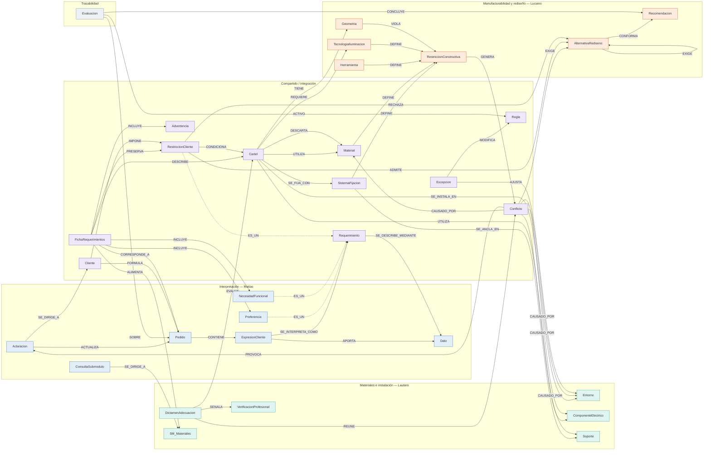

# 02 — Modelo integrado (Grupo 11)

Un solo modelo para los tres submódulos. Todo lo de este documento está cargado en Neo4j
(`neo4j/02_modelo.cypher` se genera desde la misma especificación: `salida/build/modelo_spec.py`).
Los tres submódulos están modelados desde su PI2 (el de Lautaro se incorporó el 04/10/2026: `pi2/Quiros_Lautaro_PI2_U1.md`).

## 1. Nombres unificados

| Concepto unificado | Matías (PI2) | Lautaro (PI2) | Luciano (PI2) | Por qué |
|---|---|---|---|---|
| **Cartel** | — (trabaja con Pedido/Dato) | Configuración del cartel (C1) + Cartel (C2) | Diseño | Es el objeto que se evalúa y rediseña. La Configuración de Lautaro es el Cartel con sus relaciones; su `estado` vive en `DictamenAdecuacion.resultado` (no_evaluable = pendiente_de_datos) |
| **FichaRequerimientos** | Ficha de requerimientos interpretados | ficha de requerimientos | FichaRequerimientos | Ya estaba alineado: es la interfaz entre submódulos |
| **Requerimiento → RestriccionCliente / Preferencia / NecesidadFuncional** | ídem, con `rigidez` | «restricciones del cliente» | RestricciónCliente (rigidez + fidelidad_logo, tamaño_final_fijo, no_invasiva) | Los slots booleanos de Luciano pasan a `criterio` + `nivel`; la rigidez es la de Matías |
| **Entorno** | Dato `entorno` | Entorno (C6) → Exposición ambiental (C8) | slot `Diseño.entorno` | Nodo propio con los slots del frame ENTORNO de Lautaro; la exposición (un estado) pasa a slot `nivel_exposicion` (variable difusa candidata) |
| **Conflicto** | — | Restricción (C15) con severidad excluyente / corregible | Conflicto | Mismo concepto: hallazgo que viola un límite o criterio. `origen` = instalación o manufactura; `severidad` decide el dictamen |
| **RestriccionConstructiva** | — | — | RestricciónConstructiva | Límite físico (6 mm, 400 mm). Se separa del hallazgo (Conflicto) |
| **DictamenAdecuacion** | — | Dictamen de adecuación (C19), que reúne restricciones, impone condiciones, establece requisitos y señala verificaciones | EvaluaciónMateriales | Salida de Lautaro y entrada de Luciano |
| **SistemaFijacion** / **Soporte** | — | Sistema de fijación (C11) se_ancla_en Soporte (C9) | SistemaFijación (sin. «Soporte») | Se elimina el sinónimo ambiguo: Soporte = superficie; SistemaFijacion = elementos de unión |
| **Material** | — | PLA, PETG, acrílico (alcance acotado al taller, M2) | PLA, PETG | Un frame con especializaciones PLA, PETG y Acrilico |
| **TecnologiaIluminacion** vs `tipo_cartel` | Dato tecnología (corpóreo) + iluminación | tiene_tecnología (Neón LED / Corpóreo / Retroiluminado) | NeónFrontal / Retroiluminado | El tipo de cartel (PG0) y la tecnología de iluminación son ejes distintos |
| **Recomendacion** | — | — | Recomendación (sin. «Dictamen») | «Dictamen» queda para Lautaro |
| **Aclaracion** | Aclaración / Consulta a submódulo | Solicitud de datos faltantes (C13) | «devolver al submódulo de interpretación» (R8) | Todo pedido al cliente pasa por Interpretación |
| **RequisitoMaterial / CondicionInstalacion** | — | Requisito de material (C17) / Condición de instalación (C16) | — (el requisito llega con el dictamen) | Frames nuevos del PI2 de Lautaro: lo que el material todavía no elegido debe cumplir y lo que hay que hacer para resolver una restricción corregible |
| **UTILIZA / SE_FIJA_CON** | — | usa, incorpora / se_fija_con | utiliza | Un verbo por relación |

## 2. Red semántica integrada

Imagen generada desde Neo4j: `salida/img/red_semantica_integrada.png` (núcleo) y
`salida/img/red_semantica_completa.png` (todos los frames no hoja). Diagrama Mermaid del núcleo:

**Reglas de diseño aplicadas.**
1. Relaciones nombradas con verbos en mayúsculas y dirigidas; el mismo verbo en el esquema y en las instancias
   (patrón del PI2 de Matías).
2. Un concepto, un nombre: los sinónimos se registran en la propiedad `sinonimos` del frame (tabla de la sección 1).
3. Herencia con `ES_UN` solo cuando la especialización comparte slots (Dato, Requerimiento, AlternativaRediseno,
   RestriccionConstructiva, Material, TecnologiaIluminacion, Submodulo); composición con `ES_PARTE_DE`.
4. Se separa **límite** (RestriccionConstructiva, criterio de entorno) de **hallazgo** (Conflicto): así Lautaro y
   Luciano comparten el mismo patrón «límite → se viola → conflicto → alternativa/condición».
5. Lo que viene de otro submódulo se modela como nodo compartido (Ficha, Cartel, Dictamen), no se duplica.
6. Las relaciones generadas por reglas llevan la propiedad `regla` → trazabilidad.
7. Lo que no está relevado no se inventa: queda como slot vacío con nota `[PENDIENTE: …]`.

Totales en Neo4j: 58 frames, 123 slots, 73 relaciones de esquema,
42 reglas, 7 excepciones.

## 3. Jerarquía de frames (slots, facetas y demonios)

Imagen: `salida/img/jerarquia_frames.png`. Cómo se pasó de la red a los marcos:

| Elemento de la red | Elemento del marco | Elemento en Neo4j |
|---|---|---|
| Concepto | Frame | `(:Frame {nombre, tipo:'clase', submodulo})` |
| Atributo del concepto | Slot | `(:Frame)-[:TIENE_SLOT]->(:Slot)` |
| Restricción del atributo (tipo, rango, defecto, cardinalidad) | Faceta | propiedades del `:Slot` |
| Procedimiento asociado | Demonio (si_necesario / si_agregado / si_modificado) | propiedades del `:Slot`; la acción se implementa como consulta Cypher en 04 |
| es_un | Herencia | `(:Frame)-[:ES_UN]->(:Frame)`; en las instancias, etiquetas múltiples (`:Dato:DatoFaltante`) |
| Parte de | Composición | `(:Frame)-[:ES_PARTE_DE]->(:Frame)` |
| Instancia | Frame instancia | nodo con la etiqueta del frame + `:Instancia` + `[:INSTANCIA_DE]->(:Frame)` |
| Cambio de estado (M15) | Reclasificación | `REMOVE d:DatoFaltante SET d:DatoConfirmado` |

### Cliente

Quien formula el pedido, impone restricciones y responde aclaraciones.

*Submódulo:* Compartido · *Hereda de:* — (raíz) · *Origen:* PI2 Matías N01 / PI2 Luciano C2

| Slot | Tipo | Valores / rango | Defecto | Card. | Demonio | Nota |
|---|---|---|---|---|---|---|
| identificacion | Texto | — | — | 1 | — | — |
| conoce_terminologia | Enum | si \| no \| desconocido | desconocido | 1 | si_necesario: estimar por el vocabulario de sus expresiones | — |

### Pedido

Unidad de trabajo que se interpreta.

*Submódulo:* Interpretación (Matías) · *Hereda de:* — (raíz) · *Origen:* PI2 Matías N02

| Slot | Tipo | Valores / rango | Defecto | Card. | Demonio | Nota |
|---|---|---|---|---|---|---|
| id | Texto | único | — | 1 | — | — |
| estado | Enum | en_interpretacion \| pendiente_de_aclaracion \| listo_para_evaluacion | en_interpretacion | 1 | si_necesario: listo solo si se cumple INT-R11; si no, pendiente si hay aclaraciones/consultas abiertas | Solo INT-R11 asigna listo_para_evaluacion (M17) |
| iteracion | Entero | >= 1 | 1 | 1 | — | Solo la incrementa INT-R13 |
| datos_requeridos | Lista(Categoría) | producto_tecnologia, dimensiones, entorno, instalacion, apariencia | — | 1..n | si_necesario: obtener el conjunto validado por tipo de cartel | Valor provisional de PG0/PI1 [PENDIENTE: conjunto por tipo de cartel] |

### ExpresionCliente

Fragmento literal del pedido.

*Submódulo:* Interpretación (Matías) · *Hereda de:* — (raíz) · *Es parte de:* Pedido · *Origen:* PI2 Matías N03 (M1)

| Slot | Tipo | Valores / rango | Defecto | Card. | Demonio | Nota |
|---|---|---|---|---|---|---|
| texto_literal | Texto | inmutable | — | 1 | — | No se reescribe ni se completa |
| fuente | Enum | mensaje \| conversacion \| boceto \| respuesta_a_aclaracion | — | 1 | — | — |
| interpretaciones_posibles | Lista(Texto) | — | — | 1..n | si_agregado: si hay más de una → INT-R01 (prioridad sobre INT-R07) | — |

### ReferenciaVisual

Imagen o boceto aportado por el cliente.

*Submódulo:* Interpretación (Matías) · *Hereda de:* — (raíz) · *Origen:* PI2 Matías N04 (M2)

| Slot | Tipo | Valores / rango | Defecto | Card. | Demonio | Nota |
|---|---|---|---|---|---|---|
| descripcion | Texto | — | — | 1 | — | — |
| aporta_sobre | Lista(Categoría) | — | — | 1..n | si_modificado: si se restringe, registrar alcance limitado (INT-R12) | — |
| consistente_con_texto | Enum | si \| no \| sin_verificar | sin_verificar | 1 | si_modificado: si = no → crear Contradiccion (INT-R03) | — |

### Requerimiento

Necesidad o condición del cliente.

*Submódulo:* Compartido · *Hereda de:* — (raíz) · *abstracto* · *Origen:* PI2 Matías N05 · *Especializaciones:* RestriccionCliente, Preferencia, NecesidadFuncional

| Slot | Tipo | Valores / rango | Defecto | Card. | Demonio | Nota |
|---|---|---|---|---|---|---|
| descripcion | Texto | — | — | 1 | — | — |
| rigidez | Enum | obligatoria \| preferencia \| a_confirmar | a_confirmar | 1 | si_modificado: mover a la sección de la ficha | a_confirmar se trata como obligatoria en el filtro de rediseño (PI2 Luciano) |
| ambito | Enum | plazo \| recursos \| dimensiones \| apariencia \| uso \| instalacion \| otro | — | 1 | — | — |

### RestriccionCliente

Condición declarada como obligatoria.

*Submódulo:* Compartido · *Hereda de:* Requerimiento · *Origen:* PI2 Matías N06 + PI2 Luciano C13

| Slot | Tipo | Valores / rango | Defecto | Card. | Demonio | Nota |
|---|---|---|---|---|---|---|
| rigidez | Enum | obligatoria (fijo) | obligatoria | 1 | — | — |
| criterio | Enum | fidelidad_logo \| flexibilidad_estetica \| tamano_final_fijo \| instalacion_no_invasiva \| plazo | — | 0..1 | — | Slots de Luciano unificados en un criterio + nivel |
| nivel | Enum | Alta \| Media \| Baja | — | 0..1 | — | fidelidad_logo = Alta excluye flexibilidad = Alta |
| evidencia | Texto | declaración explícita de obligatoriedad | — | 1..n | si_agregado: incluir en ficha.restricciones (INT-R04) | — |

### Preferencia

Característica deseada y negociable.

*Submódulo:* Interpretación (Matías) · *Hereda de:* Requerimiento · *Origen:* PI2 Matías N07

| Slot | Tipo | Valores / rango | Defecto | Card. | Demonio | Nota |
|---|---|---|---|---|---|---|
| rigidez | Enum | preferencia (fijo) | preferencia | 1 | — | Solo ordena alternativas; no rechaza (Luciano) |

### NecesidadFuncional

Efecto o uso buscado sin solución técnica.

*Submódulo:* Interpretación (Matías) · *Hereda de:* Requerimiento · *Origen:* PI2 Matías N08

| Slot | Tipo | Valores / rango | Defecto | Card. | Demonio | Nota |
|---|---|---|---|---|---|---|
| efecto_buscado | Texto | — | — | 1 | — | — |
| tecnologia_asociada | Texto | no_definida \| <tecnología> | no_definida | 1 | — | Interpretación no puede asignarla; la propone Manufacturabilidad [PENDIENTE: criterio] |
| cubre | Lista(Categoría) | — | — | 0..n | si_agregado: registrar cobertura de producto_tecnologia (INT-R07) | — |

### Dato

Valor de un atributo del pedido con estado y origen.

*Submódulo:* Interpretación (Matías) · *Hereda de:* — (raíz) · *abstracto* · *Origen:* PI2 Matías N09 (M3) · *Especializaciones:* DatoConfirmado, DatoFaltante, DatoAmbiguo, DatoEnConflicto

| Slot | Tipo | Valores / rango | Defecto | Card. | Demonio | Nota |
|---|---|---|---|---|---|---|
| atributo | Texto | — | — | 1 | — | — |
| categoria | Enum | producto_tecnologia \| dimensiones \| contexto_de_uso \| entorno \| instalacion \| apariencia \| restricciones | — | 1 | — | — |
| valor | Cualquiera | — | — | 0..1 | si_agregado: verificar faceta origen (INT-R09) | — |
| valor_normalizado | Número | — | — | 0..1 | — | mm; INT-R03 normaliza unidades |
| origen | Enum | cliente \| respuesta_a_aclaracion | — | 1 | — | NO admite 'supuesto' ni 'completado_por_sistema' (INT-R09) |
| estado | Enum | confirmado \| faltante \| ambiguo \| en_conflicto \| descartado | — | 1 | si_modificado: reclasificar etiqueta y recalcular estado del Pedido | — |

### DatoConfirmado

Dato aportado, claro y consistente.

*Submódulo:* Interpretación (Matías) · *Hereda de:* Dato · *Origen:* PI2 Matías N10

| Slot | Tipo | Valores / rango | Defecto | Card. | Demonio | Nota |
|---|---|---|---|---|---|---|
| estado | Enum | confirmado (fijo) | confirmado | 1 | — | — |

### DatoFaltante

Dato requerido que no fue aportado.

*Submódulo:* Interpretación (Matías) · *Hereda de:* Dato · *Origen:* PI2 Matías N11

| Slot | Tipo | Valores / rango | Defecto | Card. | Demonio | Nota |
|---|---|---|---|---|---|---|
| criticidad | Enum | bloqueante \| postergable \| sin_clasificar | sin_clasificar | 1 | si_agregado: crear Aclaracion (INT-R02) y ConsultaSubmodulo si depende de otro submódulo (INT-R10) | Criterio pendiente de adquisición; en CU1 lo resuelve R-MI-01 |

### DatoAmbiguo

Dato con más de una lectura.

*Submódulo:* Interpretación (Matías) · *Hereda de:* Dato · *Origen:* PI2 Matías N12

| Slot | Tipo | Valores / rango | Defecto | Card. | Demonio | Nota |
|---|---|---|---|---|---|---|
| interpretaciones | Lista(Texto) | — | — | 2..n | si_agregado: crear Aclaracion (INT-R01) | — |

### DatoEnConflicto

Dato incompatible con otro del mismo atributo.

*Submódulo:* Interpretación (Matías) · *Hereda de:* Dato · *Origen:* PI2 Matías N13

| Slot | Tipo | Valores / rango | Defecto | Card. | Demonio | Nota |
|---|---|---|---|---|---|---|
| contradiccion | Ref(Contradiccion) | — | — | 1..n | — | — |

### CategoriaDato

Agrupación de atributos del pedido.

*Submódulo:* Interpretación (Matías) · *Hereda de:* — (raíz) · *Origen:* PI2 Matías N14 (M5)

| Slot | Tipo | Valores / rango | Defecto | Card. | Demonio | Nota |
|---|---|---|---|---|---|---|
| nombre | Texto | — | — | 1 | — | — |

### Contradiccion

Incompatibilidad entre dos o más datos.

*Submódulo:* Interpretación (Matías) · *Hereda de:* — (raíz) · *Origen:* PI2 Matías N15 (M4)

| Slot | Tipo | Valores / rango | Defecto | Card. | Demonio | Nota |
|---|---|---|---|---|---|---|
| tipo | Enum | texto-texto \| texto-medida \| texto-referencia \| medida-referencia | — | 1 | — | — |
| estado | Enum | abierta \| resuelta | abierta | 1 | si_modificado: al resolverse: elegido → confirmado, resto → descartado | — |
| resolucion | Ref(Dato) | — | — | 0..1 | — | Solo la respuesta del cliente; nunca el sistema |

### Aclaracion

Pregunta al cliente para resolver un problema interpretativo.

*Submódulo:* Interpretación (Matías) · *Hereda de:* — (raíz) · *Origen:* PI2 Matías N16

| Slot | Tipo | Valores / rango | Defecto | Card. | Demonio | Nota |
|---|---|---|---|---|---|---|
| motivo | Enum | ambiguedad \| faltante \| contradiccion \| rigidez | — | 1 | — | — |
| pregunta | Texto | — | — | 1 | — | No debe inducir una solución técnica |
| formulacion | Enum | tecnica \| en_terminos_de_uso | — | 1 | si_necesario: aplicar INT-R08 | — |
| estado | Enum | pendiente \| respondida | pendiente | 1 | si_modificado: respondida → INT-R13 | — |

### ConsultaSubmodulo

Consulta a otro submódulo sobre la necesidad/criticidad de un dato.

*Submódulo:* Interpretación (Matías) · *Hereda de:* — (raíz) · *Origen:* PI2 Matías (M10)

| Slot | Tipo | Valores / rango | Defecto | Card. | Demonio | Nota |
|---|---|---|---|---|---|---|
| pregunta | Enum | es_necesario \| bloqueante_o_postergable | — | 1 | — | — |
| estado | Enum | pendiente \| respondida \| innecesaria | pendiente | 1 | — | — |
| respuesta | Enum | bloqueante \| postergable \| no_necesario | — | 0..1 | si_agregado: actualizar dato.criticidad | — |

### FichaRequerimientos

Salida de Interpretación; entrada de Materiales y Manufacturabilidad.

*Submódulo:* Compartido · *Hereda de:* — (raíz) · *Origen:* PI2 Matías N17 = PI2 Luciano C3 = PI1 Lautaro (entrada)

| Slot | Tipo | Valores / rango | Defecto | Card. | Demonio | Nota |
|---|---|---|---|---|---|---|
| id | Texto | — | — | 1 | — | — |
| pedido | Ref(Pedido) | — | — | 1 | si_agregado: verificar precondición pedido.estado = listo_para_evaluacion | — |
| destinatarios | Lista(Submodulo) | — | — | 1..2 | — | — |

### Advertencia

Incertidumbre que viaja sin tratarse como hecho.

*Submódulo:* Compartido · *Hereda de:* — (raíz) · *Es parte de:* FichaRequerimientos · *Origen:* PI2 Matías N18 (M9)

| Slot | Tipo | Valores / rango | Defecto | Card. | Demonio | Nota |
|---|---|---|---|---|---|---|
| motivo | Enum | dato_postergable_pendiente \| rigidez_a_confirmar \| alcance_limitado_de_referencia \| umbral_pendiente | — | 1 | — | — |
| texto | Texto | — | — | 1 | — | — |

### Submodulo

Agente experto del sistema.

*Submódulo:* Compartido · *Hereda de:* — (raíz) · *Origen:* PG0 / PI2 Matías N20–N23 · *Especializaciones:* SM_Interpretacion, SM_Materiales, SM_Manufacturabilidad

| Slot | Tipo | Valores / rango | Defecto | Card. | Demonio | Nota |
|---|---|---|---|---|---|---|
| responsable | Texto | — | — | 1 | — | — |
| tarea_experta | Texto | — | — | 1 | — | — |

### Cartel

Configuración propuesta que se evalúa y, si hace falta, se rediseña.

*Submódulo:* Compartido · *Hereda de:* — (raíz) · *Origen:* PG0 (Cartel) = PI2 Lautaro C1/C2 (Configuración del cartel + Cartel) = PI2 Luciano C1 (Diseño)

| Slot | Tipo | Valores / rango | Defecto | Card. | Demonio | Nota |
|---|---|---|---|---|---|---|
| tipo_cartel | Enum | NeonLED \| Corporeo \| Retroiluminado | — | 0..1 | — | PG0; especializaciones del frame CARTEL de Lautaro |
| lleva_luz | Booleano | — | — | 0..1 | — | — |
| tecnologia_iluminacion | Enum | NeonFrontal \| Retroiluminado | — | 0..1 | si_necesario: si vacío y lleva_luz → la propone Manufacturabilidad [PENDIENTE: criterio]; si no consta si lleva luz → devolver a Interpretación | — |
| material | Enum | PLA \| PETG \| Acrilico | — | 0..1 | si_necesario: vacío → Materiales deja un RequisitoMaterial (R-MI-13); entorno exterior → MAN-R7 | — |
| dimension_maxima_mm | Número | > 0 | — | 0..1 | — | mm (se completa desde la ficha); bloqueante (R-MI-01) |
| doble_faz | Booleano | — | false | 0..1 | — | PI2 Lautaro (CARTEL.doble_faz) |
| peso_estimado | Número | kg | — | 0..1 | si_necesario: estimar a partir de dimensiones y materiales | Estimación del experto [PENDIENTE: criterio, PI2 Lautaro «a validar»] |
| montaje | Enum | adosado \| bandera \| colgado \| sobre_estructura | — | 0..1 | — | Método de instalación (PI2 Lautaro C10, modelado como slot); bloqueante (R-MI-01) |
| altura_m | Número | > 0 | — | 0..1 | — | Postergable (PI2 Lautaro M8) |

### Entorno

Lugar donde queda el cartel y condiciones a las que lo somete.

*Submódulo:* Materiales (Lautaro) · *Hereda de:* — (raíz) · *Origen:* PI2 Lautaro C6/C8 (frame ENTORNO) + PI2 Luciano (slot entorno) + PI2 Matías (Dato entorno)

| Slot | Tipo | Valores / rango | Defecto | Card. | Demonio | Nota |
|---|---|---|---|---|---|---|
| tipo | Enum | interior \| exterior | — | 1 | — | Ubicación; bloqueante (R-MI-01) |
| proteccion_superior | Enum | ninguna \| alero \| nicho \| marquesina | ninguna | 1 | si_agregado: ≠ ninguna → evaluar la excepción R-MI-08 | — |
| alcance_proteccion | Enum | cubre \| no_cubre | — | 0..1 | — | Solo si hay protección; qué es un alero «efectivo» [PENDIENTE: criterio a validar] |
| humedad | Enum | normal \| alta | normal | 1 | si_agregado: alta e interior → R-MI-09 | — |
| sol_directo | Booleano | — | false | 1 | si_agregado: true e interior → R-MI-09 | — |
| nivel_exposicion | Enum | baja \| media \| alta | — | 0..1 | si_necesario: calcular con R-MI-02 / R-MI-08 / R-MI-09 / R-MI-GEN | Exposición ambiental (PI2 Lautaro C8). Variable difusa candidata [PENDIENTE: funciones de pertenencia] |

### Material

Material del cuerpo, frente, difusor o placa base.

*Submódulo:* Compartido · *Hereda de:* — (raíz) · *Origen:* PI2 Lautaro C3 (alcance M2: PLA, PETG, acrílico) + PI2 Luciano C6 · *Especializaciones:* PLA, PETG, Acrilico

| Slot | Tipo | Valores / rango | Defecto | Card. | Demonio | Nota |
|---|---|---|---|---|---|---|
| nombre | Texto | — | — | 1 | — | — |
| funcion | Enum | cuerpo \| frente \| difusor \| placa_base | — | 1..n | — | — |
| apto_exterior | Enum | si \| no \| a_validar | — | 1 | — | Fichas técnicas + experto; PLA = no (coincide con MAN-R7) |
| resistencia_uv | Enum | baja \| media \| alta | — | 0..1 | — | [PENDIENTE: fichas técnicas] |
| resistencia_termica | Enum | baja \| media \| alta | — | 0..1 | — | [PENDIENTE: fichas técnicas] |

### ComponenteElectrico

Tira de Neón LED, tira LED, fuente y conexiones.

*Submódulo:* Materiales (Lautaro) · *Hereda de:* — (raíz) · *Es parte de:* Cartel · *Origen:* PI2 Lautaro C4/C5 (frame COMPONENTE_ELÉCTRICO)

| Slot | Tipo | Valores / rango | Defecto | Card. | Demonio | Nota |
|---|---|---|---|---|---|---|
| tipo | Enum | tira_neon_led \| tira_led \| fuente \| conexion | — | 1 | — | — |
| uso_declarado | Enum | interior \| exterior | — | 1 | — | — |
| grado_ip | Texto | — | — | 0..1 | si_necesario: si falta y la exposición es alta → tratar como sin protección | IEC 60529 [PENDIENTE: grado exigido según exposición, a validar] |
| ubicacion | Enum | interna_cerrada \| interna_accesible \| externa | — | 0..1 | si_agregado: interna_cerrada → evaluar R-MI-07 | Solo fuente |
| accesible | Booleano | — | — | 0..1 | — | Solo fuente (R-MI-07) |

### Soporte

Superficie o estructura donde se fija el cartel.

*Submódulo:* Materiales (Lautaro) · *Hereda de:* — (raíz) · *Origen:* PI2 Lautaro C9 (frame SOPORTE)

| Slot | Tipo | Valores / rango | Defecto | Card. | Demonio | Nota |
|---|---|---|---|---|---|---|
| tipo | Enum | mamposteria \| placa_de_yeso \| vidrio \| estructura_metalica \| marquesina | — | 1 | — | Bloqueante (R-MI-01) |
| capacidad_relativa | Enum | baja \| no_baja | — | 0..1 | — | Placa de yeso = baja (§6); mampostería = no_baja («en principio buen soporte»). Niveles finos [PENDIENTE: a validar] |
| estado | Enum | verificado \| no_verificado \| deficiente | no_verificado | 1 | si_agregado: no_verificado y capacidad desconocida → R-MI-14 | — |
| estructura_portante | Enum | si \| no \| desconocido | desconocido | 1 | si_agregado: si → habilita la excepción de R-MI-05 (EX-03) | — |

### SistemaFijacion

Elementos que unen el cartel al soporte.

*Submódulo:* Compartido · *Hereda de:* — (raíz) · *Origen:* PI2 Lautaro C11 + PI2 Luciano C8

| Slot | Tipo | Valores / rango | Defecto | Card. | Demonio | Nota |
|---|---|---|---|---|---|---|
| tipo | Enum | tarugos \| anclaje_quimico \| separadores \| perfiles \| cables \| adhesivo \| cinta_bifaz | — | 1 | — | — |
| requiere_perforar | Booleano | — | — | 1 | — | Necesario para MAN-R9 |
| carga_admisible | Número | — | — | 0..1 | — | [PENDIENTE: valor] (RestriccionPeso) |

### AgenteAmbiental

UV, agua, temperatura, viento.

*Submódulo:* Materiales (Lautaro) · *Hereda de:* — (raíz) · *Origen:* PI2 Lautaro C7

| Slot | Tipo | Valores / rango | Defecto | Card. | Demonio | Nota |
|---|---|---|---|---|---|---|
| nombre | Texto | — | — | 1 | — | — |

### DictamenAdecuacion

Salida de Materiales: apto / apto con condiciones / no apto.

*Submódulo:* Materiales (Lautaro) · *Hereda de:* — (raíz) · *Origen:* PI2 Lautaro C19 (frame DICTAMEN_ADECUACIÓN) = PI2 Luciano C4 (EvaluaciónMateriales)

| Slot | Tipo | Valores / rango | Defecto | Card. | Demonio | Nota |
|---|---|---|---|---|---|---|
| resultado | Enum | apto \| apto_con_condiciones \| no_apto \| no_evaluable | — | 1 | si_necesario: aplicar R-MI-12, luego R-MI-11, luego R-MI-10 | no_evaluable = Configuración pendiente_de_datos (R-MI-01) |
| reglas_aplicadas | Lista(Regla) | — | — | 1..n | — | — |
| destinatarios | Lista | manufacturabilidad, fabricante | — | 2 | si_agregado: enviar al submódulo de Manufacturabilidad (L. Marquesini) | — |

### CondicionInstalacion

Lo que debe cumplirse para resolver una restricción corregible.

*Submódulo:* Materiales (Lautaro) · *Hereda de:* — (raíz) · *Origen:* PI2 Lautaro C16 (M4)

| Slot | Tipo | Valores / rango | Defecto | Card. | Demonio | Nota |
|---|---|---|---|---|---|---|
| descripcion | Texto | — | — | 1 | — | — |
| regla_origen | Texto | — | — | 1 | — | R-MI-05 / 07 / 13 / 14 |

### RequisitoMaterial

Exigencia para un material o componente todavía no definido.

*Submódulo:* Materiales (Lautaro) · *Hereda de:* — (raíz) · *Origen:* PI2 Lautaro C17 (M3)

| Slot | Tipo | Valores / rango | Defecto | Card. | Demonio | Nota |
|---|---|---|---|---|---|---|
| aplica_a | Enum | cuerpo \| frente \| componente | — | 1 | — | — |
| exigencia | Texto | — | — | 1 | — | — |
| exposicion_de_origen | Enum | baja \| media \| alta | — | 1 | si_agregado: se envía al submódulo de rediseño junto con el dictamen | — |

### VerificacionProfesional

Revisión estructural/eléctrica que el sistema señala y no resuelve.

*Submódulo:* Materiales (Lautaro) · *Hereda de:* — (raíz) · *Origen:* PI2 Lautaro C18

| Slot | Tipo | Valores / rango | Defecto | Card. | Demonio | Nota |
|---|---|---|---|---|---|---|
| tipo | Enum | estructural \| electrica | — | 1 | — | — |
| motivo | Lista(Texto) | — | — | 1..n | — | — |

### Excepcion

Situación particular que ajusta una regla general.

*Submódulo:* Compartido · *Hereda de:* — (raíz) · *Origen:* PG0 + PI2 Lautaro C14 + PI1 Luciano §6

| Slot | Tipo | Valores / rango | Defecto | Card. | Demonio | Nota |
|---|---|---|---|---|---|---|
| condicion | Texto | — | — | 1 | — | — |
| efecto | Texto | — | — | 1 | — | Magnitud del efecto [PENDIENTE: a validar] |
| aplica | Booleano | — | — | 0..1 | — | Se conserva aunque no aplique, para dejar registro (PI2 Lautaro) |

### Regla

Regla de producción trazable.

*Submódulo:* Compartido · *Hereda de:* — (raíz) · *Origen:* PI1/PI2

| Slot | Tipo | Valores / rango | Defecto | Card. | Demonio | Nota |
|---|---|---|---|---|---|---|
| id | Texto | — | — | 1 | — | — |
| origen | Enum | experto \| propuesta \| documental | — | 1 | — | — |
| estado_validacion | Texto | — | — | 1 | — | — |

### Geometria

Propiedades espaciales y de trazo.

*Submódulo:* Manufacturabilidad (Luciano) · *Hereda de:* — (raíz) · *Es parte de:* Cartel · *Origen:* PI2 Luciano C5

| Slot | Tipo | Valores / rango | Defecto | Card. | Demonio | Nota |
|---|---|---|---|---|---|---|
| ancho_canal_mm | Número | > 0 | — | 0..1 | si_modificado: recalcular Conflicto | — |
| dimension_maxima_mm | Número | > 0 | — | 1 | — | — |
| peso_estimado_gr | Número | > 0 | — | 0..1 | — | — |
| supera_carga_admisible | Booleano | — | — | 0..1 | — | Hecho del caso L-C3 mientras falte el valor límite |

### Herramienta

Impresora 3D FDM.

*Submódulo:* Manufacturabilidad (Luciano) · *Hereda de:* — (raíz) · *Origen:* PI2 Luciano C7

| Slot | Tipo | Valores / rango | Defecto | Card. | Demonio | Nota |
|---|---|---|---|---|---|---|
| tipo | Texto | — | — | 1 | — | — |
| volumen_util_maximo | Número | > 0 | — | 1 | si_necesario: dimension_maxima_mm > volumen → Conflicto ExcedeCama (MAN-R3) | 400 mm (documental) |

### TecnologiaIluminacion

Método de iluminación.

*Submódulo:* Manufacturabilidad (Luciano) · *Hereda de:* — (raíz) · *Origen:* PI2 Luciano C9 · *Especializaciones:* NeonFrontal, Retroiluminado

| Slot | Tipo | Valores / rango | Defecto | Card. | Demonio | Nota |
|---|---|---|---|---|---|---|
| nombre | Texto | — | — | 1 | — | — |

### RestriccionConstructiva

Límite físico innegociable de la manufactura.

*Submódulo:* Manufacturabilidad (Luciano) · *Hereda de:* — (raíz) · *Origen:* PI2 Luciano C10 · *Especializaciones:* RestriccionTrazo, RestriccionVolumen, RestriccionPeso, RestriccionTemperatura

| Slot | Tipo | Valores / rango | Defecto | Card. | Demonio | Nota |
|---|---|---|---|---|---|---|
| tipo | Enum | Trazo \| Volumen \| Peso \| Temperatura | — | 1 | — | — |
| valor_limite | Número | — | — | 0..1 | — | Trazo 6 mm, Volumen 400 mm (documental); Peso [PENDIENTE] |
| unidad | Texto | — | — | 1 | — | — |

### Conflicto

Hallazgo: una característica viola un límite o criterio.

*Submódulo:* Compartido · *Hereda de:* — (raíz) · *Origen:* PI2 Luciano C11 = PI2 Lautaro C15 (Restricción)

| Slot | Tipo | Valores / rango | Defecto | Card. | Demonio | Nota |
|---|---|---|---|---|---|---|
| tipo | Enum | TrazoFino \| ExcedeCama \| RiesgoCaida \| MaterialEntorno \| Electrica \| Instalacion \| Mantenimiento | — | 1 | — | — |
| origen | Enum | manufactura \| instalacion | — | 1 | — | — |
| severidad | Enum | excluyente \| corregible | — | 0..1 | si_agregado: corregible → crear la CondicionInstalacion asociada | Solo origen instalación (PI2 Lautaro M5): decide el tipo de dictamen |
| estado | Enum | Abierto \| Resuelto \| Inviable | Abierto | 1 | si_agregado: generar alternativas (MAN-R2/R3/R4); si_modificado: todas no viables → Inviable (MAN-R8) | — |

### AlternativaRediseno

Modificación propuesta para sortear un conflicto.

*Submódulo:* Manufacturabilidad (Luciano) · *Hereda de:* — (raíz) · *Origen:* PI2 Luciano C12 · *Especializaciones:* CambioMaterial, CambioGeometria, CambioFijacion, CambioTecnologia, SegmentacionModular

| Slot | Tipo | Valores / rango | Defecto | Card. | Demonio | Nota |
|---|---|---|---|---|---|---|
| tipo_cambio | Enum | Material \| Geometria \| Fijacion \| Tecnologia \| Segmentacion | — | 1 | — | — |
| impacto_estetico | Enum | Alto \| Medio \| Bajo | — | 0..1 | si_agregado: impacto Alto y fidelidad_logo Alta → viable = False | — |
| viable | Booleano | — | — | 0..1 | — | — |
| justificacion | Texto | — | — | 1 | — | — |

### Recomendacion

Salida final: confirmación o alternativas admitidas con justificación.

*Submódulo:* Manufacturabilidad (Luciano) · *Hereda de:* — (raíz) · *Origen:* PI2 Luciano C14

| Slot | Tipo | Valores / rango | Defecto | Card. | Demonio | Nota |
|---|---|---|---|---|---|---|
| tipo | Enum | confirmacion \| rediseno \| inviable | — | 1 | — | — |
| justificacion | Texto | — | — | 1 | — | — |
| decide | Texto | fabricante (fijo) | fabricante | 1 | — | El sistema recomienda; decide el fabricante |

### Evaluacion

Rastro de decisión de un caso: reglas activadas en orden.

*Submódulo:* Trazabilidad · *Hereda de:* — (raíz) · *Origen:* Propuesta (pregunta integrador «Trazabilidad»)

| Slot | Tipo | Valores / rango | Defecto | Card. | Demonio | Nota |
|---|---|---|---|---|---|---|
| caso | Texto | — | — | 1 | — | — |
| fecha | Fecha | — | — | 1 | — | — |

## 4. Reglas trazables

Origen: **experto** = conocimiento relevado de Luciano (en Lautaro, R-MI-01 a R-MI-11: criterios del experto
formalizados en su PI2, con los umbrales como parámetros «a validar»); **propuesta** = regla formulada por nosotros
(Matías, integración, y R-MI-12/13/14, que Lautaro agregó al modelar) pendiente de validar con el experto;
**documental** = sale de una ficha técnica o norma. En Neo4j cada regla es un nodo `:Regla` con `[:USA]->(:Slot)`.

| ID | Submódulo | SI (condición) | ENTONCES (conclusión) | Origen | Tipo | Fuente | Estado | Implementada |
|---|---|---|---|---|---|---|---|---|
| **INT-R01** | INT | Expresión con más de una interpretación razonable y sin confirmar | crear DatoAmbiguo (valor nulo) + Aclaración (motivo ambigüedad) | **propuesta** | Heurística / subjetiva | PI1 Matías regla 1 | Candidata (pendiente de validación con el experto) | 03 (precargada) |
| **INT-R02** | INT | atributo de datos_requeridos sin Dato aportado ni NF que lo cubra | crear DatoFaltante (sin_clasificar), Pedido OMITE, Aclaración | **propuesta** | Determinística | PI1 Matías reglas 2 y 7 | Candidata (pendiente de validación con el experto) | 03 (precargada) |
| **INT-R03** | INT | dos Datos del mismo atributo con valores incompatibles | crear Contradicción abierta, datos en_conflicto, Aclaración | **propuesta** | Determinística | PI1 Matías regla 3 | Candidata (pendiente de validación con el experto) | 03 (precargada) |
| **INT-R04** | INT | el cliente declara explícitamente que una condición debe cumplirse | crear RestriccionCliente (obligatoria) en la ficha | **propuesta** | Heurística / empírica | PI1 Matías regla 4 | Candidata (pendiente de validación con el experto) | 03 (precargada) |
| **INT-R05** | INT | condición expresada como deseo, sin marca de obligatoriedad | crear Preferencia; no promover a restricción sin confirmación | **propuesta** | Heurística / empírica | PI1 Matías regla 5 | Candidata (pendiente de validación con el experto) | 03 (precargada) |
| **INT-R06** | INT | no puede determinarse si es obligatoria o deseo | rigidez = a_confirmar + Aclaración (motivo rigidez) | **propuesta** | Subjetiva | PI1 Matías caso límite 5 | Candidata (pendiente de validación con el experto) | no (sin caso) |
| **INT-R07** | INT | el cliente describe un efecto y no define la tecnología (sin ambigüedad pendiente) | crear NecesidadFuncional (tecnología no_definida) que CUBRE producto_tecnologia | **propuesta** | Inferencial | PI1 Matías regla 6 | Candidata (pendiente de validación con el experto) | 03 (precargada) |
| **INT-R08** | INT | se crea una Aclaración | formulación técnica si conoce_terminologia = si; si no, en términos de uso | **propuesta** | Contextual | PI1 Matías excepción 2 | Candidata (pendiente de validación con el experto) | 03 (precargada) |
| **INT-R09** | INT | se intenta asignar un valor con origen distinto de cliente / respuesta_a_aclaracion | rechazar la asignación; el dato sigue faltante | **propuesta** | Determinística (integridad) | PI1 Matías regla 9 + criterio de validez | Validada como criterio de diseño | 04 (control de integridad) |
| **INT-R10** | INT | la necesidad o criticidad de un dato depende de materiales/instalación/manufactura | crear ConsultaSubmodulo dirigida al submódulo dueño | **propuesta** | Contextual | PI1 Matías regla 10 | Candidata (pendiente de validación con el experto) | 03 (precargada) |
| **INT-R11** | INT | todo dato requerido confirmado, cubierto por NF o faltante postergable; sin ambiguos; sin contradicciones abiertas | Pedido.estado = listo_para_evaluacion + crear FichaRequerimientos | **propuesta** | Determinística / inferencial | PI1 Matías regla 8 | Candidata (pendiente de validación con el experto) | 04 |
| **INT-R12** | INT | al crear la ficha hay faltantes postergables, rigidez a_confirmar o referencias restringidas | crear una Advertencia por cada uno | **propuesta** | Inferencial | PI1 Matías pregunta experta 8 | Candidata (pendiente de validación con el experto) | 04 |
| **INT-R13** | INT | una Aclaración pasa a respondida | nueva Expresión (respuesta_a_aclaracion), reevaluar R01–R03/R07, iteración + 1 | **propuesta** | Determinística | PI1 Matías flecha «Nueva info» | Candidata (pendiente de validación con el experto) | 04 |
| **R-MI-01** | MAT | falta entorno, soporte / método de instalación o dimensiones | no evaluar (pendiente_de_datos); solicitar el dato a Interpretación (⇒ el faltante es bloqueante) | **experto** | Determinística | PI2 Lautaro R-MI-01 (M8) | Formalizada PI2; umbrales «a validar» con el experto | 04 |
| **R-MI-02** | MAT | exterior y (sin protección superior o la protección no cubre) | nivel_exposicion = alta | **experto** | Determinística (candidata a difusa) | PI2 Lautaro R-MI-02 | Formalizada PI2; umbrales «a validar» con el experto | 04 |
| **R-MI-GEN** | MAT | interior con humedad normal y sin sol directo | nivel_exposicion = baja | **experto** | Contextual | PI1 Lautaro §6 (regla general; valores por defecto del frame ENTORNO) | Formalizada PI2; umbrales «a validar» con el experto | 04 |
| **R-MI-03** | MAT | exposición alta y un componente sin la protección contra agua exigida (grado IP: a validar) | restricción eléctrica, severidad excluyente, causada por el componente y la exposición | **documental+experto** | Determinística | PI2 Lautaro R-MI-03 (IEC 60529) | Formalizada PI2; umbrales «a validar» con el experto | 04 |
| **R-MI-04** | MAT | exposición alta y Material.apto_exterior = no | restricción material–entorno, severidad excluyente, causada por el material | **documental+experto** | Heurística | PI2 Lautaro R-MI-04 (fichas técnicas; = MAN-R7) | Formalizada PI2; umbrales «a validar» con el experto | 04 (sin caso que la dispare) |
| **R-MI-05** | MAT | capacidad_relativa = baja y peso estimado mayor al seguro (umbral: a validar) | restricción de instalación excluyente, SALVO estructura portante (EX-03): corregible + condición «fijar a la estructura» | **experto** | Heurística | PI2 Lautaro R-MI-05 (§6) | Formalizada PI2; umbrales «a validar» con el experto | no (sin caso; umbral [PENDIENTE]) |
| **R-MI-06** | MAT | gran porte (umbral: a validar), montaje en bandera, o en altura con exposición al viento | VerificacionProfesional estructural; el dictamen no puede ser apto | **experto+documental** | Contextual | PI2 Lautaro R-MI-06 (CIRSOC 102) | Formalizada PI2; umbrales «a validar» con el experto | 04 |
| **R-MI-07** | MAT | fuente interna_cerrada y no accesible | restricción de mantenimiento corregible + condición «fuente accesible y protegida» | **experto** | Heurística | PI2 Lautaro R-MI-07 | Formalizada PI2; umbrales «a validar» con el experto | 04 |
| **R-MI-08** | MAT | exterior con alero o nicho que cubre al cartel | nivel_exposicion = media en lugar de alta (magnitud a validar) | **experto** | Contextual | PI2 Lautaro R-MI-08 (§6) | Formalizada PI2; umbrales «a validar» con el experto | 04 (FR-07: se evalúa y no aplica) |
| **R-MI-09** | MAT | interior con humedad alta o sol directo | nivel_exposicion = media (alta si se dan las dos) | **experto** | Contextual | PI2 Lautaro R-MI-09 (§5–§6) | Formalizada PI2; umbrales «a validar» con el experto | 04 (sin caso que la dispare) |
| **R-MI-10** | MAT | evaluable y sin restricciones, condiciones, requisitos ni verificaciones | dictamen apto; derivar a Manufacturabilidad | **experto** | Determinística | PI2 Lautaro R-MI-10 | Formalizada PI2; umbrales «a validar» con el experto | 04 |
| **R-MI-11** | MAT | sin restricciones excluyentes y con al menos una corregible, condición, requisito o verificación | dictamen apto con condiciones, listando cada una | **experto** | Determinística | PI2 Lautaro R-MI-11 | Formalizada PI2; umbrales «a validar» con el experto | 04 |
| **R-MI-12** | MAT | existe al menos una restricción excluyente | dictamen no apto, con todas las restricciones y sus causas; derivar a Manufacturabilidad (prioridad sobre R-MI-11) | **propuesta** | Determinística | PI2 Lautaro R-MI-12 (nueva, M6) | Nueva en PI2 (surge del modelado); validar con el experto | 04 |
| **R-MI-13** | MAT | la ficha no define material, componentes o ubicación de la fuente | no bloquear; RequisitoMaterial equivalente a R-MI-03/04 según la exposición; en altura, condición «fuente accesible» | **propuesta** | Inferencial | PI2 Lautaro R-MI-13 (nueva, M3) | Nueva en PI2 (surge del modelado); validar con el experto | 04 |
| **R-MI-14** | MAT | soporte no_verificado y R-MI-05 no evaluable por falta de datos | condición: relevar el soporte y fijar a su estructura portante antes de instalar | **propuesta** | Heurística | PI2 Lautaro R-MI-14 (nueva, M7) | Nueva en PI2 (surge del modelado); validar con el experto | 04 |
| **MAN-R1** | MAN | canal ≥ 6 mm, dimensión ≤ 400 mm, peso ≤ límite y sin advertencias | confirmar manufacturabilidad (listo para laminar) | **documental** | Determinística | PI2 Luciano R1 | Formalizada PI2 | 04 |
| **MAN-R2** | MAN | ancho_canal_mm < 6 y tecnología NeónFrontal | Conflicto TrazoFino + alternativas CambioGeometría y CambioTecnología | **documental** | Determinística | PI2 Luciano R2 (ficha técnica neón) | Formalizada PI2 | 04 |
| **MAN-R3** | MAN | dimension_maxima_mm > volumen_util_maximo (400) | Conflicto ExcedeCama + SegmentaciónModular que EXIGE CambioFijación (refuerzo) | **documental** | Determinística | PI2 Luciano R3 (ficha impresora) | Formalizada PI2 | 04 |
| **MAN-R4** | MAN | peso estimado > carga admisible de la fijación | Conflicto RiesgoCaída + ReducirInfill y CambioFijación | **experto** | Heurística | PI2 Luciano R4 | Formalizada PI2; carga admisible [PENDIENTE] | 04 |
| **MAN-R5** | MAN | TrazoFino y flexibilidad_estetica Alta | seleccionar CambioGeometría, descartar CambioTecnología | **experto** | Heurística | PI2 Luciano R5 (experiencia L. Marquesini) | Formalizada PI2 | 04 (sin caso que la dispare) |
| **MAN-R6** | MAN | TrazoFino y fidelidad_logo Alta | RECHAZA CambioGeometría, ADMITE CambioTecnología (retroiluminado) | **experto** | Contextual | PI2 Luciano R6 / PI1 Luciano caso 5 | Formalizada PI2 | 04 |
| **MAN-R7** | MAN | entorno Exterior | descartar PLA, seleccionar PETG | **documental** | Contextual | PI2 Luciano R7 (propiedades térmicas FDM) | Formalizada PI2 | 04 |
| **MAN-R8** | MAN | existe Conflicto y todas sus alternativas son no viables | Conflicto Inviable → Aclaración (motivo rigidez) vía Interpretación | **propuesta** | Inferencial | PI2 Luciano R8 | Formalizada PI2 | 04 (sin caso que la dispare) |
| **MAN-R9** | MAN | RiesgoCaída e instalacion_no_invasiva | RECHAZA CambioFijación, ADMITE ReducirInfill | **experto** | Contextual | PI2 Luciano R9 / PI1 Luciano caso 2 | Formalizada PI2 | 04 |
| **MAN-FILTRO** | MAN | ninguna RestriccionCliente obligatoria rechaza la alternativa | alternativa viable (ADMITE si la restricción la respeta explícitamente) | **experto** | Determinística | PI1 Luciano etapa 5 / PI2 RL8 | Formalizada PI2 | 04 |
| **MAN-G1** | MAN | cartel exterior | usar placa base de mayor grosor [PENDIENTE: espesor] | **experto** | Contextual | PI1 Luciano §6 (regla general) | Relevada en PI1; sin valor | no (sin espesor relevado) |
| **INTEG-01** | COM | existe FichaRequerimientos sin Cartel asociado | instanciar Cartel/Entorno con los DatosConfirmados de la ficha (sin completar huecos) | **propuesta** | Determinística | Interacción PI1 (los tres) + RL12 Luciano | Propuesta de integración | 04 |
| **INTEG-03** | COM | hay un RequisitoMaterial del cuerpo y MAN-R7 elige un material apto exterior | RequisitoMaterial SE_CUMPLE_CON Material | **propuesta** | Determinística | PI2 Lautaro (DI-01 → R7 de Luciano) + PI2 Luciano R7 | Propuesta de integración | 04 |
| **INTEG-02** | COM | Conflictos de manufactura resueltos con alternativas viables | Recomendación que CONFORMAN las alternativas + registrar Evaluacion (reglas activadas) | **propuesta** | Inferencial | PI1 Luciano etapa 6 + pregunta integrador «Trazabilidad» | Propuesta de integración | 04 |

**Estrategia de resolución de conflictos.** Se conserva la de Matías (INT-R09 → INT-R13 → detección → clasificación →
aclaraciones → INT-R11 → INT-R12) y se extiende al flujo integrado: Interpretación → INTEG-01 → Materiales
(orden de disparo del PI2 de Lautaro: R-MI-01 → exposición R-MI-08/02/09 → detección R-MI-03…07, 13, 14, que se
acumulan → dictamen R-MI-12 > R-MI-11 > R-MI-10) → Manufacturabilidad (MAN-R7 → detección R2/R3/R4 → filtros
R6/R5/R9/FILTRO → R8) → INTEG-02. Es el orden de los bloques de `neo4j/04_consultas.cypher`.

### Excepciones

| ID | Condición | Efecto | Modifica | Fuente |
|---|---|---|---|---|
| EX-01 | Cartel exterior bajo un alero o en un nicho que efectivamente lo cubre | La exposición baja de alta a media (magnitud a validar) | R-MI-02 | PI2 Lautaro R-MI-08 / §6 |
| EX-02 | Interior húmedo (cocina, natatorio) o con sol directo | Se evalúa con exposición media o alta | R-MI-GEN | PI2 Lautaro R-MI-09 / §6 |
| EX-03 | Existe estructura portante accesible detrás del revestimiento | La restricción de soporte pasa de excluyente a corregible | R-MI-05 | PI2 Lautaro R-MI-05 / §6 |
| EX-04 | Gran porte, bandera o altura con viento | El sistema no resuelve la fijación: deriva a un profesional | R-MI-06 | PI2 Lautaro R-MI-06 |
| EX-05 | Cartel exterior dentro de un nicho | Se puede relajar el grosor de la placa base | MAN-G1 | PI1 Luciano §6 |
| EX-06 | Información ausente que puede completarse más adelante | El faltante es postergable y no bloquea (viaja como advertencia) | INT-R11 | PI1 Matías §6 |
| EX-07 | Falta material, componente o ubicación de la fuente (lo elige el rediseño) | No bloquea: pasa como requisito (R-MI-13) | R-MI-01 | PI2 Lautaro M3 / M8 |

## 5. Incertidumbre → candidatos a variables difusas

Ninguna tiene funciones de pertenencia ni rangos relevados: todo es **próximo paso (PI3)**. Hoy se modelan como
marcadores crisp.

| Variable lingüística | Términos tentativos | Dónde vive en el modelo | Fuente |
|---|---|---|---|
| Exposición ambiental | baja / media / alta | `Entorno.nivel_exposicion` (R-MI-02, R-MI-08, R-MI-09) | PI2 Lautaro §i (principal candidata) |
| Porte del cartel y carga de viento | chico / intermedio / grande | R-MI-06 (FR-02 quedó en la frontera) | PI2 Lautaro §i |
| Confiabilidad del soporte | poco confiable / aceptable / confiable | `Soporte.capacidad_relativa`, `Soporte.estado` | PI2 Lautaro §i |
| Efectividad de la protección | nula / parcial / efectiva | `Entorno.alcance_proteccion` (R-MI-08) | PI2 Lautaro §i |
| Peso respecto del soporte | holgado / en el límite / excedido | R-MI-05 (umbral a validar) | PI2 Lautaro §i |
| Dificultad de instalación | baja / media / alta | (no modelada como slot) | PI2 Lautaro §i |
| Flexibilidad estética del cliente | Baja / Media / Alta | `RestriccionCliente.nivel` (MAN-R5) | PI2 Luciano §i |
| Complejidad de fabricación | Rutinaria / Moderada / Crítica | (no modelada aún) | PI2 Luciano §i |
| Fidelidad al logo / impacto estético | Imperceptible / Aceptable / Deformativo | `AlternativaRediseno.impacto_estetico` (MAN-R6) | PI2 Luciano §i |
| Exceso de peso | Seguro / En el límite / Peligroso | `Geometria.supera_carga_admisible` (MAN-R4) | PI2 Luciano §i |
| Grado de ambigüedad, suficiencia, rigidez, criticidad, precisión de la dimensión | baja/media/alta; insuficiente/parcial/suficiente; … | `Pedido.estado`, `Requerimiento.rigidez`, `DatoFaltante.criticidad`, `Dato.precision` | PI2 Matías §i |

Forma prevista de combinación (propuesta, sin validar): las reglas crisp siguen decidiendo lo excluyente
(p. ej. INT-R09, MAN-R2/R3); las variables difusas se usarían para **ordenar** alternativas viables y graduar el
dictamen (p. ej. un índice de adecuación). `[PENDIENTE: conjuntos, rangos y reglas difusas con el experto]`.

## 6. Casos de uso integrados (cruzan los tres submódulos)

### CU1 — «Café Andino»: el sistema sabe cuándo NO avanzar

Base: P-01 del PI2 de Matías (iteraciones 1 y 2, tal cual) + regla R-MI-01 de Lautaro + MAN-R3 de Luciano.

| Paso | Submódulo | Entrada | Regla | Salida |
|---|---|---|---|---|
| 1 | Interpretación | «cartel de neón… Café Andino… pared… más o menos un metro… lindo de noche» + foto | INT-R01 ×3, INT-R02, INT-R07, INT-R10 | 3 ambiguos, D4 faltante, NF1, A1–A4, Q1 a Materiales |
| 2 | Interpretación | respuesta: «adentro… el metro es el largo… como la foto» | INT-R13 | D3 interior, D5 ≈ 1 m, NF1 cubre la tecnología; D4 sigue faltante |
| 3 | **Materiales** | Q1: ¿D4 es bloqueante? | **R-MI-01** | **bloqueante** (sin soporte no se evalúa) — resuelve el criterio que el PI2 de Matías dejó pendiente |
| 4 | Interpretación | — | INT-R11 | **no se cumple**: P-01 queda pendiente (no inventa el soporte, INT-R09) |
| 5 | Interpretación | respuesta a A4 **[dato de prueba simulado]**: «pared de ladrillo revocado… pegado a la pared» | INT-R13, INT-R09 | D4 confirmado (mampostería, adosado), iteración 3 |
| 6 | Interpretación | — | INT-R11 | listo → **FR-01** |
| 7 | Integración | FR-01 | INTEG-01 | Cartel 1000 mm, interior, mampostería; tecnología `[PENDIENTE]` |
| 8 | **Materiales** | Cartel + Entorno + Soporte | R-MI-01, R-MI-GEN, R-MI-10 | exposición baja (humedad normal y sin sol directo: valores por defecto del frame); mampostería = buen soporte → **apto** |
| 9 | **Manufacturabilidad** | Geometría 1000 mm vs impresora 400 mm | MAN-R3, MAN-FILTRO | ExcedeCama → **Segmentación modular + refuerzo**, viables |
| 10 | Integración | — | INTEG-02 | Recomendación; **decide el fabricante** |

### CU2 — «Letras corpóreas exterior»: FR-02 cruza los tres submódulos

Base: P-02 / FR-02 del PI2 de Matías + **caso 1 del PI2 de Lautaro** (FR-02, apto con condiciones) + «Continuidad»
del PI2 de Luciano (R3 y R7 sobre FR-02). Los tres PI2 usan el mismo caso: la integración no es inventada.

| Paso | Submódulo | Entrada | Regla | Salida |
|---|---|---|---|---|
| 1 | Interpretación | «letras corpóreas con luz… da a la calle… 3 m… sí o sí antes de la inauguración… si se puede colores del logo» + foto sin luz | INT-R03, R04, R05, R02, R10 | K1 contradicción, RC1 obligatoria, PR1 preferencia, D11 faltante |
| 2 | Interpretación | «llevan luz; la foto era por la tipografía; sobre la marquesina a 4 m» | INT-R13, R11, R12 | **FR-02** + AV2 (la referencia solo vale para tipografía) |
| 3 | Integración | FR-02 | INTEG-01 | Cartel corpóreo, con luz, 3000 mm, exterior, sobre estructura (marquesina), 4 m; sin material ni componentes |
| 4 | **Materiales** | Cartel + Entorno | R-MI-01, R-MI-02 | datos mínimos OK (falta material: no bloquea); exposición **alta** (sin protección superior) |
| 5 | **Materiales** | material / componentes / soporte / altura | R-MI-13, R-MI-14, R-MI-06 | requisitos RQ-MAT (cuerpo y frente aptos exterior/UV) y RQ-COMP (protección contra agua, IP a validar); condiciones «relevar la marquesina» y «fuente accesible»; verificación estructural (altura y viento) |
| 6 | **Materiales** | — | R-MI-11 | sin restricciones excluyentes → **apto con condiciones** |
| 6b | **Manufacturabilidad** | entorno exterior + RQ-MAT | MAN-R7, INTEG-03 | **PETG** (descarta PLA) → cumple el requisito de material de Lautaro para el cuerpo |
| 7 | **Manufacturabilidad** | 3000 mm vs 400 mm | MAN-R3, MAN-FILTRO | Segmentación (= letra por letra) + refuerzo; advertencia: impacto en RC1 (plazo) `[PENDIENTE]` |
| 8 | Integración | — | INTEG-02 | Recomendación con material, alternativas y condiciones de instalación; decide el fabricante |

### Caso de prueba complementario de Materiales: FR-07 (caso 2 del PI2 de Lautaro)

Neón LED doble faz en bandera sobre la vereda, 3 m de altura, fachada de mampostería con alero de 0,4 m (el cartel
sobresale 1,0 m). El cliente quiere reutilizar el Neón LED y la fuente de interior; la fuente iría cerrada en la caja.

| Paso | Regla | Salida |
|---|---|---|
| 1 | R-MI-01 | datos mínimos completos |
| 2 | R-MI-08 → R-MI-02 | la excepción del alero **se evalúa y no aplica** (no cubre) → exposición alta; queda registrada (EXC-FR-07) |
| 3 | R-MI-03 | restricción **eléctrica excluyente**, causada por el Neón LED, la fuente y la exposición |
| 4 | R-MI-07 | restricción de mantenimiento **corregible** → condición «fuente accesible y protegida» |
| 5 | R-MI-06 | verificación estructural (bandera sobre la vereda + viento) |
| 6 | R-MI-12 | **no apto** (prioridad sobre R-MI-11); pasa a Manufacturabilidad con todas las causas |

Manufacturabilidad no genera recomendación: cambiar componentes o reubicar la fuente es rediseño, y el PI2 de
Luciano no tiene regla para eso `[PENDIENTE: regla de rediseño para restricciones eléctricas y de mantenimiento]`.
Imagen: `salida/img/fr07_instanciado.png`.

### Casos de prueba complementarios (submódulo de Luciano)

L-C1 (trazo 4 mm < 6 mm, fidelidad alta → MAN-R6 rechaza engrosar, admite retroiluminado), L-C2 (Ø 500 mm, tamaño
fijo → segmentación admitida) y L-C3 (peso > cinta bifaz, no invasiva → MAN-R9 rechaza fijación, admite reducir
infill). Se usan para mostrar el **filtro por restricciones del cliente** (`salida/img/filtro_luciano.png`).

## 7. Observaciones del modelado (para la defensa)

- La integración resolvió un hueco real: la criticidad «bloqueante/postergable» que Matías no podía decidir la
  responde la regla R-MI-01 de Lautaro (consulta Q1). Es el tipo de dependencia que el modelo separado no mostraba.
- El requisito de material que deja Lautaro cuando la ficha no trae material (R-MI-13) lo cumple una regla documental
  de Luciano (MAN-R7 → PETG): `RequisitoMaterial -[:SE_CUMPLE_CON]-> Material`. Lautaro no elige el material, pero deja
  la evidencia que la regla de Luciano necesita (así lo dice su PI2).
- Con el PI2 de Lautaro el dictamen cubre los tres resultados: apto (CU1), apto con condiciones (CU2) y no apto (FR-07).
- R-MI-12/13/14 son reglas nuevas que surgieron al modelar (no del relevamiento): se marcan como **propuesta**.
- Inconsistencia detectada en el material: el conjunto provisional `datos_requeridos` incluye «apariencia», pero
  FR-02 no registra ningún dato de apariencia y aun así el PI2 de Matías lo da por suficiente. Se mantiene el
  resultado documentado (P-02 listo) y se marca para revisar `[PENDIENTE]`.
- Tras una reclasificación (M15) quedan relaciones históricas (p. ej. `P-01 OMITE D4` con D4 ya confirmado): es
  intencional, conserva la traza.
